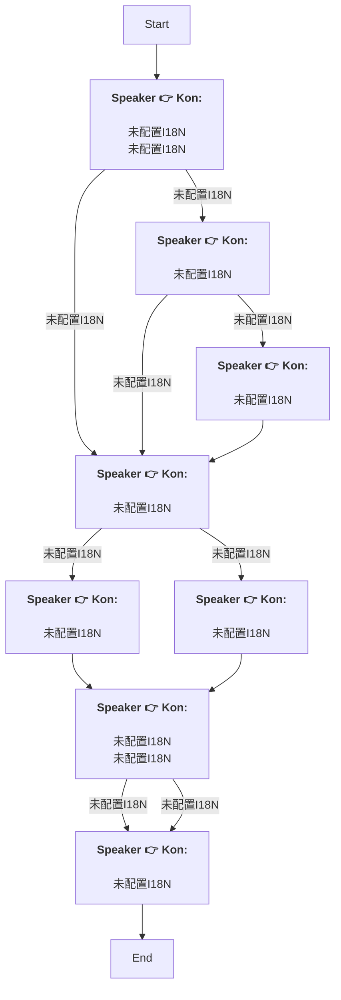

```mermaid
graph
Start -->1764841729323225[<b>Speaker 👉 Kon:</b>
\n未配置I18N\n未配置I18N]
1764841729323225 -->|未配置I18N|1764842615846127[<b>Speaker 👉 Kon:</b>
\n未配置I18N]
1764841729323225 -->|未配置I18N|1764842203973857[<b>Speaker 👉 Kon:</b>
\n未配置I18N]
1764842203973857 -->|未配置I18N|1764842615846127[<b>Speaker 👉 Kon:</b>
\n未配置I18N]
1764842203973857 -->|未配置I18N|1764842298457319[<b>Speaker 👉 Kon:</b>
\n未配置I18N]
1764842298457319 -->1764842615846127[<b>Speaker 👉 Kon:</b>
\n未配置I18N]
1764842615846127 -->|未配置I18N|1764842519520494[<b>Speaker 👉 Kon:</b>
\n未配置I18N]
1764842615846127 -->|未配置I18N|1764842514911469[<b>Speaker 👉 Kon:</b>
\n未配置I18N]
1764842514911469 -->1764842711232753[<b>Speaker 👉 Kon:</b>
\n未配置I18N\n未配置I18N]
1764842711232753 -->|未配置I18N|1764842961630455[<b>Speaker 👉 Kon:</b>
\n未配置I18N]
1764842711232753 -->|未配置I18N|1764842961630455[<b>Speaker 👉 Kon:</b>
\n未配置I18N]
1764842961630455 -->1764843035060472[End]
1764842519520494 -->1764842711232753[<b>Speaker 👉 Kon:</b>
\n未配置I18N\n未配置I18N]

```