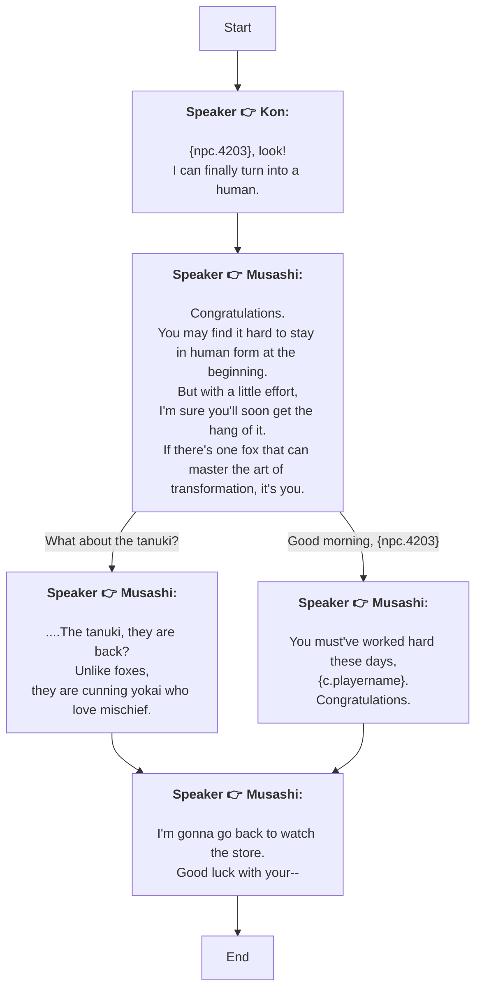

```mermaid
graph
Start -->1764896149598957[<b>Speaker 👉 Kon:</b>
\n&lbrace;npc.4203&rbrace;, look!
I can finally turn into a human.]
1764896149598957 -->1764896206404334[<b>Speaker 👉 Musashi:</b>
\nCongratulations.
You may find it hard to stay in human form at the beginning.\nBut with a little effort,
I'm sure you'll soon get the hang of it.
If there's one fox that can master the art of transformation, it's you.]
1764896206404334 -->|What about the tanuki?|1764896485678837[<b>Speaker 👉 Musashi:</b>
\n....The tanuki, they are back?
Unlike foxes,
they are cunning yokai who love mischief.]
1764896206404334 -->|Good morning, &lbrace;npc.4203&rbrace;|1764896819869430[<b>Speaker 👉 Musashi:</b>
\nYou must've worked hard these days,
&lbrace;c.playername&rbrace;.
Congratulations.]
1764896485678837 -->1764897063259897[<b>Speaker 👉 Musashi:</b>
\nI'm gonna go back to watch the store.
Good luck with your--]
1764897063259897 -->1764897053379320[End]
1764896819869430 -->1764897063259897[<b>Speaker 👉 Musashi:</b>
\nI'm gonna go back to watch the store.
Good luck with your--]

```