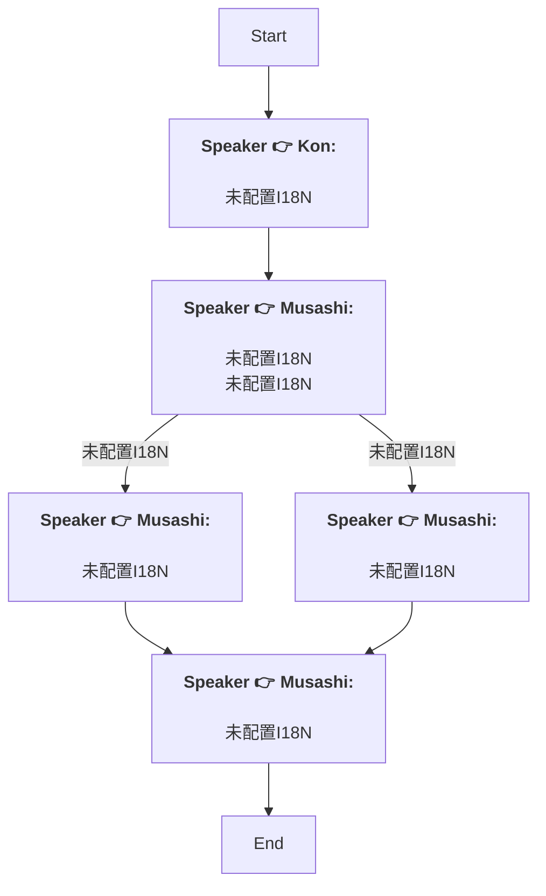

```mermaid
graph
Start -->1764896149598957[<b>Speaker 👉 Kon:</b>
\n未配置I18N]
1764896149598957 -->1764896206404334[<b>Speaker 👉 Musashi:</b>
\n未配置I18N\n未配置I18N]
1764896206404334 -->|未配置I18N|1764896819869430[<b>Speaker 👉 Musashi:</b>
\n未配置I18N]
1764896206404334 -->|未配置I18N|1764896485678837[<b>Speaker 👉 Musashi:</b>
\n未配置I18N]
1764896485678837 -->1764897063259897[<b>Speaker 👉 Musashi:</b>
\n未配置I18N]
1764897063259897 -->1764897053379320[End]
1764896819869430 -->1764897063259897[<b>Speaker 👉 Musashi:</b>
\n未配置I18N]

```