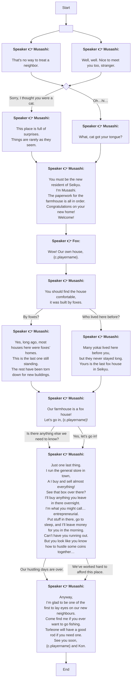

```mermaid
graph
Start -->1775423896390413[ ]
1775423896390413 -->1775423992003348[<b>Speaker 👉 Musashi:</b>
\nWell, well. Nice to meet you too, stranger.]
1775423896390413 -->1768547359690886[<b>Speaker 👉 Musashi:</b>
\nThat's no way to treat a neighbor.]
1768547359690886 -->442136839922721{ }
1768547359692938 -->1768547359696011[<b>Speaker 👉 Musashi:</b>
\nYou must be the new resident of Seikyu.
I'm Musashi.\nThe paperwork for the farmhouse is all in order. 
Congratulations on your new home!
Welcome!]
1768547359696011 -->1775424439715171[<b>Speaker 👉 Fox:</b>
\nWow! Our own house, &lbrace;c.playername&rbrace;.]
1775424439715171 -->1776854193670617[<b>Speaker 👉 Musashi:</b>
\nYou should find the house comfortable,
it was built by foxes.]
1776854193670617 -->|Who lived here before?|1776854247976419[<b>Speaker 👉 Musashi:</b>
\nMany yokai lived here before you,
but they never stayed long.
Yours is the last fox house in Seikyu.]
1776854193670617 -->|By foxes?|1776854244241889[<b>Speaker 👉 Musashi:</b>
\nYes, long ago, most houses here were foxes’ homes.
This is the last one still standing.
The rest have been torn down for new buildings.]
1776854244241889 -->1776854296103398[<b>Speaker 👉 Musashi:</b>
\nOur farmhouse is a fox house!
Let’s go in, &lbrace;c.playername&rbrace;!]
1776854296103398 -->|Is there anything else we need to know?|1776854347817458[<b>Speaker 👉 Musashi:</b>
\nJust one last thing.\nI run the general store in town,
A I buy and sell almost everything!\nSee that box over there?
I’ll buy anything you leave in there overnight. 
I’m what you might call… entrepreneurial.\nPut stuff in there, go to sleep, and I’ll leave money for you in the morning.
Can’t have you running out.
But you look like you know how to hustle some coins together…]
1776854296103398 -->|Yes, let’s go in!|1776854347817458[<b>Speaker 👉 Musashi:</b>
\nJust one last thing.\nI run the general store in town,
A I buy and sell almost everything!\nSee that box over there?
I’ll buy anything you leave in there overnight. 
I’m what you might call… entrepreneurial.\nPut stuff in there, go to sleep, and I’ll leave money for you in the morning.
Can’t have you running out.
But you look like you know how to hustle some coins together…]
1776854347817458 -->|Our hustling days are over.|1776854428645884[<b>Speaker 👉 Musashi:</b>
\nAnyway,
I’m glad to be one of the first to lay eyes on our new neighbours.\nCome find me if you ever want to go fishing.
Torleone will have a good rod if you need one.\nSee you soon, &lbrace;c.playername&rbrace; and Kon.]
1776854347817458 -->|We’ve worked hard to afford this place.|1776854428645884[<b>Speaker 👉 Musashi:</b>
\nAnyway,
I’m glad to be one of the first to lay eyes on our new neighbours.\nCome find me if you ever want to go fishing.
Torleone will have a good rod if you need one.\nSee you soon, &lbrace;c.playername&rbrace; and Kon.]
1776854428645884 -->1768547372003494[End]
1776854247976419 -->1776854296103398[<b>Speaker 👉 Musashi:</b>
\nOur farmhouse is a fox house!
Let’s go in, &lbrace;c.playername&rbrace;!]
1768547359707287 -->1768547359696011[<b>Speaker 👉 Musashi:</b>
\nYou must be the new resident of Seikyu.
I'm Musashi.\nThe paperwork for the farmhouse is all in order. 
Congratulations on your new home!
Welcome!]
1775423992003348 -->442136839922721{ }
442136839922721 -->|Oh…hi…|1768547359707287[<b>Speaker 👉 Musashi:</b>
\nWhat, cat got your tongue?]
442136839922721 -->|Sorry, I thought you were a cat.|1768547359692938[<b>Speaker 👉 Musashi:</b>
\nThis place is full of surprises.
Things are rarely as they seem.]

```