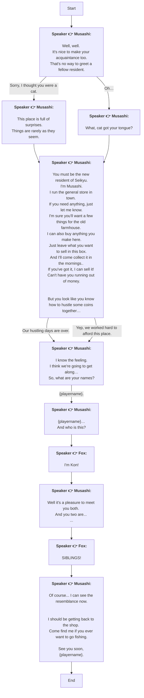

```mermaid
graph
Start -->1768547359690886[<b>Speaker 👉 Musashi:</b>
\nWell, well. 
It's nice to make your acquaintance too.\nThat's no way to greet a fellow resident.]
1768547359690886 -->|Sorry, I thought you were a cat.|1768547359692938[<b>Speaker 👉 Musashi:</b>
\nThis place is full of surprises.
Things are rarely as they seem.]
1768547359690886 -->|Oh…|1768547359707287[<b>Speaker 👉 Musashi:</b>
\nWhat, cat got your tongue?]
1768547359692938 -->1768547359696011[<b>Speaker 👉 Musashi:</b>
\nYou must be the new resident of Seikyu.
I'm Musashi.\nI run the general store in town. 
If you need anything, just let me know.\nI'm sure you'll want a few things for the old farmhouse. 
I can also buy anything you make here.\nJust leave what you want to sell in this box.
And I'll come collect it in the mornings.. 
If you've got it, I can sell it! Can't have you running out of money.

\nBut you look like you know how to hustle some coins together…]
1768547359696011 -->|Our hustling days are over.|1768547359698063[<b>Speaker 👉 Musashi:</b>
\nI know the feeling.
I think we're going to get along…
So, what are your names?]
1768547359696011 -->|Yep, we worked hard to afford this place.|1768547359698063[<b>Speaker 👉 Musashi:</b>
\nI know the feeling.
I think we're going to get along…
So, what are your names?]
1768547359698063 -->|&lbrace;playername&rbrace;.|1768547359701138[<b>Speaker 👉 Musashi:</b>
\n&lbrace;playername&rbrace;…
And who is this?
]
1768547359701138 -->1768547359702163[<b>Speaker 👉 Fox:</b>
\nI'm Kon!]
1768547359702163 -->1768547359703188[<b>Speaker 👉 Musashi:</b>
\nWell it's a pleasure to meet you both. 
And you two are... 
...]
1768547359703188 -->1768547359704213[<b>Speaker 👉 Fox:</b>
\nSIBLINGS!]
1768547359704213 -->1768547359706262[<b>Speaker 👉 Musashi:</b>
\nOf course... I can see the resemblance now.

\nI should be getting back to the shop. 
Come find me if you ever want to go fishing.
\nSee you soon, &lbrace;playername&rbrace;.]
1768547359706262 -->1768547372003494[End]
1768547359707287 -->1768547359696011[<b>Speaker 👉 Musashi:</b>
\nYou must be the new resident of Seikyu.
I'm Musashi.\nI run the general store in town. 
If you need anything, just let me know.\nI'm sure you'll want a few things for the old farmhouse. 
I can also buy anything you make here.\nJust leave what you want to sell in this box.
And I'll come collect it in the mornings.. 
If you've got it, I can sell it! Can't have you running out of money.

\nBut you look like you know how to hustle some coins together…]

```