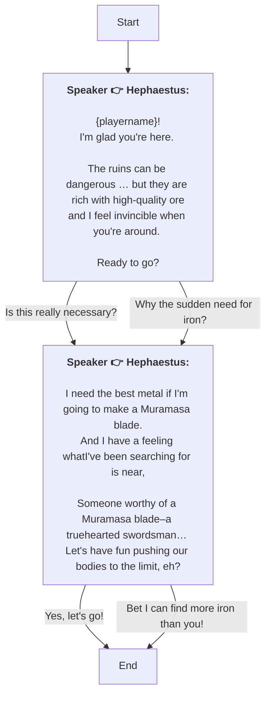

```mermaid
graph
Start -->1772334692918394[<b>Speaker 👉 Hephaestus:</b>
\n &lbrace;playername&rbrace;! 
I'm glad you're here. 
\nThe ruins can be dangerous … but they are rich with high-quality ore
and I feel invincible when you're around. 
\nReady to go?]
1772334692918394 -->|Is this really necessary?  |1772334834369665[<b>Speaker 👉 Hephaestus:</b>
\nI need the best metal if I'm going to make a Muramasa blade.
And I have a feeling whatI've been searching for is near,
\nSomeone worthy of a Muramasa blade–a truehearted swordsman… 
Let's have fun pushing our bodies to the limit, eh?]
1772334692918394 -->|Why the sudden need for iron? |1772334834369665[<b>Speaker 👉 Hephaestus:</b>
\nI need the best metal if I'm going to make a Muramasa blade.
And I have a feeling whatI've been searching for is near,
\nSomeone worthy of a Muramasa blade–a truehearted swordsman… 
Let's have fun pushing our bodies to the limit, eh?]
1772334834369665 -->|Yes, let's go!|1772334909400199[End]
1772334834369665 -->|Bet I can find more iron than you!|1772334909400199[End]

```