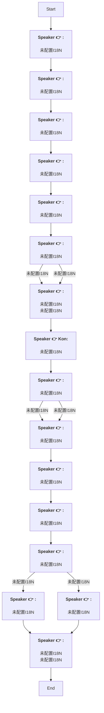

```mermaid
graph
Start -->1773670478670116[<b>Speaker 👉 :</b>
\n未配置I18N]
1773670478670116 -->1773670603857175[<b>Speaker 👉 :</b>
\n未配置I18N]
1773670603857175 -->1773670628027672[<b>Speaker 👉 :</b>
\n未配置I18N]
1773670628027672 -->1773670671490329[<b>Speaker 👉 :</b>
\n未配置I18N]
1773670671490329 -->1773670691671322[<b>Speaker 👉 :</b>
\n未配置I18N]
1773670691671322 -->1773670707122459[<b>Speaker 👉 :</b>
\n未配置I18N]
1773670707122459 -->|未配置I18N|1773670753935650[<b>Speaker 👉 :</b>
\n未配置I18N\n未配置I18N]
1773670707122459 -->|未配置I18N|1773670753935650[<b>Speaker 👉 :</b>
\n未配置I18N\n未配置I18N]
1773670753935650 -->1773670780608803[<b>Speaker 👉 Kon:</b>
\n未配置I18N]
1773670780608803 -->1773670908925220[<b>Speaker 👉 :</b>
\n未配置I18N]
1773670908925220 -->|未配置I18N|1773670944226602[<b>Speaker 👉 :</b>
\n未配置I18N]
1773670908925220 -->|未配置I18N|1773670944226602[<b>Speaker 👉 :</b>
\n未配置I18N]
1773670944226602 -->1773670967830827[<b>Speaker 👉 :</b>
\n未配置I18N]
1773670967830827 -->1773670983003436[<b>Speaker 👉 :</b>
\n未配置I18N]
1773670983003436 -->1773671000695085[<b>Speaker 👉 :</b>
\n未配置I18N]
1773671000695085 -->|未配置I18N|1773671054445876[<b>Speaker 👉 :</b>
\n未配置I18N]
1773671000695085 -->|未配置I18N|1773671035185459[<b>Speaker 👉 :</b>
\n未配置I18N]
1773671035185459 -->1773671072900405[<b>Speaker 👉 :</b>
\n未配置I18N\n未配置I18N]
1773671072900405 -->1773671109589302[End]
1773671054445876 -->1773671072900405[<b>Speaker 👉 :</b>
\n未配置I18N\n未配置I18N]

```