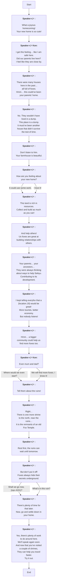

```mermaid
graph
Start -->1773744431841627[<b>Speaker 👉 :</b>
\nWhat a joyous homecoming!
Your new home is so cute!]
1773744431841627 -->1773744461506909[<b>Speaker 👉 Kon:</b>
\nI get this feeling… like I am safe here.
Did our parents live here? 
I feel like they are close by.]
1773744461506909 -->1773744489285983[<b>Speaker 👉 :</b>
\nThere were many houses here in the past…
all full of foxes.
Hmm… this could’ve been your parents’ home.]
1773744489285983 -->1773744509186401[<b>Speaker 👉 :</b>
\nNo. They wouldn’t have lived in a dump.
This place is a dump.
It must’ve been another house that didn’t survive the test of time.]
1773744509186401 -->1773744520711523[<b>Speaker 👉 :</b>
\nDon’t listen to him.
Your farmhouse is beautiful.]
1773744520711523 -->1773744537183589[<b>Speaker 👉 :</b>
\nHow are you feeling about your new home?]
1773744537183589 -->|It could use some work.|1773744587507055[<b>Speaker 👉 :</b>
\nThis land is rich in resources.
Collect and build as much as you can!]
1773744537183589 -->|I love it!|1773744587507055[<b>Speaker 👉 :</b>
\nThis land is rich in resources.
Collect and build as much as you can!]
1773744587507055 -->1775688220895638[<b>Speaker 👉 :</b>
\nAnd help others!
Us foxes are great at building relationships with others.]
1775688220895638 -->1776855520467472[<b>Speaker 👉 :</b>
\nYour parents… your ancestors…
They were always thinking about ways to help Seikyu.
Contributing to its development.]
1776855520467472 -->1778534250561192[<b>Speaker 👉 :</b>
\nI kept telling everyfox that a &lbrace;location.19&rbrace; would be great! 
More tourists, better economy.
But nobody listens!]
1778534250561192 -->1776855534956051[<b>Speaker 👉 :</b>
\nHmm… a bigger community could help us find more foxes too.]
1776855534956051 -->1776855745777174[<b>Speaker 👉 Kon:</b>
\nEven mum and dad?]
1776855745777174 -->|Where would we even start?|1773744688807293[<b>Speaker 👉 :</b>
\nTell them about the ruins!]
1776855745777174 -->|We will find more foxes. I know it!|1773744688807293[<b>Speaker 👉 :</b>
\nTell them about the ruins!]
1773744688807293 -->1773744707674495[<b>Speaker 👉 :</b>
\nRight…
There is one more shrine to the north, near the ruins…
It is the remnants of an old Fox Temple.]
1773744707674495 -->1773744725590401[<b>Speaker 👉 :</b>
\nRest first, the ruins can wait until tomorrow.]
1773744725590401 -->1773744740950403[<b>Speaker 👉 :</b>
\nBut don’t put it off!
Foxes always hide their secrets underground.]
1773744740950403 -->|Shall we go now, &lbrace;npc.4101&rbrace;?|1773744773925260[<b>Speaker 👉 :</b>
\nThere’s plenty of time for that later.
Now, go and settle down in your home.]
1773744740950403 -->|What’s in this ruin?|1773744773925260[<b>Speaker 👉 :</b>
\nThere’s plenty of time for that later.
Now, go and settle down in your home.]
1773744773925260 -->1773744796606864[<b>Speaker 👉 :</b>
\nYes, there’s plenty of work to do around here.
We’ll speak again soon.\nAnd now that you’ve visited a couple of shrines, 
They can help you travel faster.
Try it out.]
1773744796606864 -->1773744829217171[End]

```