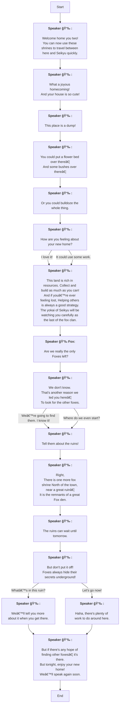

```mermaid
graph
Start -->1773744431841627[<b>Speaker 👉 :</b>
\nWelcome home you two!
You can now use these shrines to travel between here and Seikyu quickly.]
1773744431841627 -->1773744461506909[<b>Speaker 👉 :</b>
\nWhat a joyous homecoming! 
And your house is so cute!]
1773744461506909 -->1773744489285983[<b>Speaker 👉 :</b>
\nThis place is a dump!]
1773744489285983 -->1773744509186401[<b>Speaker 👉 :</b>
\nYou could put a flower bed over there…
And some bushes over there…]
1773744509186401 -->1773744520711523[<b>Speaker 👉 :</b>
\nOr you could bulldoze the whole thing.]
1773744520711523 -->1773744537183589[<b>Speaker 👉 :</b>
\nHow are you feeling about your new home?]
1773744537183589 -->|I love it!|1773744587507055[<b>Speaker 👉 :</b>
\nThis land is rich in resources. Collect and build as much as you can!
And if you’re ever feeling lost, Helping others is always a good strategy.\nThe yokai of Seikyu will be watching you carefully as the last of the fox clan.]
1773744537183589 -->|It could use some work.|1773744587507055[<b>Speaker 👉 :</b>
\nThis land is rich in resources. Collect and build as much as you can!
And if you’re ever feeling lost, Helping others is always a good strategy.\nThe yokai of Seikyu will be watching you carefully as the last of the fox clan.]
1773744587507055 -->1773744627233138[<b>Speaker 👉 Fox:</b>
\nAre we really the only Foxes left?]
1773744627233138 -->1773744643501428[<b>Speaker 👉 :</b>
\nWe don't know. 
That's another reason we led you here…
To look for the other foxes.]
1773744643501428 -->|We’re going to find them. I know it!|1773744688807293[<b>Speaker 👉 :</b>
\nTell them about the ruins!]
1773744643501428 -->|Where do we even start?|1773744688807293[<b>Speaker 👉 :</b>
\nTell them about the ruins!]
1773744688807293 -->1773744707674495[<b>Speaker 👉 :</b>
\nRight,
There is one more fox shrine North of the town, near a great ruin…
It is the remnants of a great Fox den.]
1773744707674495 -->1773744725590401[<b>Speaker 👉 :</b>
\nThe ruins can wait until tomorrow.]
1773744725590401 -->1773744740950403[<b>Speaker 👉 :</b>
\nBut don't put it off!
Foxes always hide their secrets underground!]
1773744740950403 -->|What’s in this ruin?|1773744773925260[<b>Speaker 👉 :</b>
\nWe’ll tell you more about it when you get there.]
1773744740950403 -->|Let's go now!|1773744786113934[<b>Speaker 👉 :</b>
\nHaha, there's plenty of work to do around here.]
1773744773925260 -->1773744796606864[<b>Speaker 👉 :</b>
\nBut if there's any hope of finding other foxes… it's there.\nBut tonight, enjoy your new home!
We’ll speak again soon.]
1773744796606864 -->1773744829217171[End]
1773744786113934 -->1773744796606864[<b>Speaker 👉 :</b>
\nBut if there's any hope of finding other foxes… it's there.\nBut tonight, enjoy your new home!
We’ll speak again soon.]

```