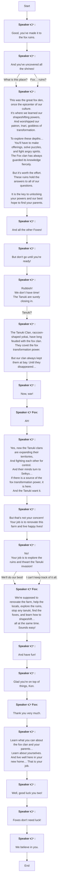

```mermaid
graph
Start -->1773747748356434[<b>Speaker 👉 :</b>
\nGood, you’ve made it to the fox ruins. ]
1773747748356434 -->1773747758125396[<b>Speaker 👉 :</b>
\nAnd you've uncovered all the shrines!]
1773747758125396 -->|What is this place?|1773747798718818[<b>Speaker 👉 :</b>
\nThis was the great fox den, once the epicenter of our culture. 
It’s where we learned our shapeshifting powers, 
And worshipped our patron, Inari, goddess of transformation.  
\nTo explore these depths…
You'll have to make offerings, solve puzzles, and fight angry spirits.
The Fox clan has always guarded its knowledge fiercely. 
\nBut it’s worth the effort.
These ruins hold the answers to all of our questions. 
\nIt is the key to unlocking your powers and our best hope to find your parents. ]
1773747758125396 -->|Fox… ruins?|1773747798718818[<b>Speaker 👉 :</b>
\nThis was the great fox den, once the epicenter of our culture. 
It’s where we learned our shapeshifting powers, 
And worshipped our patron, Inari, goddess of transformation.  
\nTo explore these depths…
You'll have to make offerings, solve puzzles, and fight angry spirits.
The Fox clan has always guarded its knowledge fiercely. 
\nBut it’s worth the effort.
These ruins hold the answers to all of our questions. 
\nIt is the key to unlocking your powers and our best hope to find your parents. ]
1773747798718818 -->1773747869768039[<b>Speaker 👉 :</b>
\nAnd all the other Foxes!]
1773747869768039 -->1773747882534249[<b>Speaker 👉 :</b>
\nBut don't go until you're ready!]
1773747882534249 -->1773747897458027[<b>Speaker 👉 :</b>
\nRubbish!
We don’t have time!
The Tanuki are surely closing in. 

]
1773747897458027 -->|Tanuki?|1773747939191155[<b>Speaker 👉 :</b>
\nThe Tanuki Clan, raccoon-shaped yokai, have long feuded with the fox clan. 
They covet the fox transformation power. 
\nBut our clan always kept them at bay. Until they disappeared…]
1773747939191155 -->1773747965848950[<b>Speaker 👉 :</b>
\nNow, war!]
1773747965848950 -->1773747978007928[<b>Speaker 👉 Fox:</b>
\nAh!]
1773747978007928 -->1773747994449274[<b>Speaker 👉 :</b>
\nYes, now the Tanuki clans are expanding their territories,
And fighting each other for control. 
And their minds turn to Seikyu…\nIf there is a source of the fox transformation power, it is here.
And the Tanuki want it. 
]
1773747994449274 -->1773748021377405[<b>Speaker 👉 :</b>
\nBut that's not your concern! 
Your job is to renovate this farm and live happy lives!]
1773748021377405 -->1773748035614079[<b>Speaker 👉 :</b>
\nNo! 
Your job is to explore the ruins and thwart the Tanuki invasion!]
1773748035614079 -->|We'll do our best!|1773748070053257[<b>Speaker 👉 Fox:</b>
\nWe're supposed to renovate the farm, help the locals, explore the ruins,
stop any tanuki, find the foxes, and learn how to shapeshift…
all at the same time.\nSounds easy!]
1773748035614079 -->|I can't keep track of it all. |1773748070053257[<b>Speaker 👉 Fox:</b>
\nWe're supposed to renovate the farm, help the locals, explore the ruins,
stop any tanuki, find the foxes, and learn how to shapeshift…
all at the same time.\nSounds easy!]
1773748070053257 -->1773748102524300[<b>Speaker 👉 :</b>
\nAnd have fun!]
1773748102524300 -->1773748132730254[<b>Speaker 👉 :</b>
\nGlad you're on top of things, Kon. ]
1773748132730254 -->1773748148602256[<b>Speaker 👉 Fox:</b>
\nThank you very much. ]
1773748148602256 -->1773748161052050[<b>Speaker 👉 :</b>
\nLearn what you can about the fox clan and your parents…
Learn about yourselves. 
And live well here in your new home… That is your job. 
]
1773748161052050 -->1773748175470996[<b>Speaker 👉 :</b>
\nWell, good luck you two!]
1773748175470996 -->1773748191069590[<b>Speaker 👉 :</b>
\nFoxes don't need luck! ]
1773748191069590 -->1773748221799833[<b>Speaker 👉 :</b>
\nWe believe in you. ]
1773748221799833 -->1773748233509275[End]

```