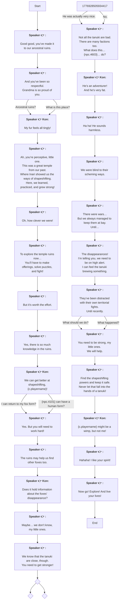

```mermaid
graph
Start -->1773747748356434[<b>Speaker 👉 :</b>
\nGood good, you’ve made it to our ancestral ruins.]
1773747748356434 -->1773747758125396[<b>Speaker 👉 :</b>
\nAnd you’ve been so respectful.
Grandma is so proud of you.]
1773747758125396 -->|Ancestral ruins?|1776927548363326[<b>Speaker 👉 Kon:</b>
\nMy fur feels all tingly!]
1773747758125396 -->|What is this place?|1776927548363326[<b>Speaker 👉 Kon:</b>
\nMy fur feels all tingly!]
1776927548363326 -->1773747798718818[<b>Speaker 👉 :</b>
\nAh, you’re perceptive, little one.\nThis was a great temple from our past.
Where Inari showed us the ways of shapeshifting.
Here, we learned, practiced, and grew strong!]
1773747798718818 -->1773747869768039[<b>Speaker 👉 :</b>
\nOh, how clever we were!]
1773747869768039 -->1773747882534249[<b>Speaker 👉 :</b>
\nTo explore the temple ruins now…
You’ll have to make offerings, solve puzzles, and fight!]
1773747882534249 -->1773747897458027[<b>Speaker 👉 :</b>
\nBut it’s worth the effort.]
1773747897458027 -->1773747939191155[<b>Speaker 👉 :</b>
\nYes, there is so much knowledge in the ruins.]
1773747939191155 -->1773747965848950[<b>Speaker 👉 Kon:</b>
\nWe can get better at shapeshifting, &lbrace;c.playername&rbrace;!]
1773747965848950 -->|I can return to my fox form?|1773747978007928[<b>Speaker 👉 :</b>
\nYes. But you will need to work hard!]
1773747965848950 -->|&lbrace;npc.4101&rbrace; can have a human form?|1773747978007928[<b>Speaker 👉 :</b>
\nYes. But you will need to work hard!]
1773747978007928 -->1773747994449274[<b>Speaker 👉 :</b>
\nThe ruins may help us find other foxes too.]
1773747994449274 -->1773748021377405[<b>Speaker 👉 Kon:</b>
\nDoes it hold information about the foxes’ disappearance?]
1773748021377405 -->1773748035614079[<b>Speaker 👉 :</b>
\nMaybe… we don’t know, my little ones.]
1773748035614079 -->1776927835955780[<b>Speaker 👉 :</b>
\nWe know that the tanuki are close, though.
You need to get stronger!]
1776927835955780 -->1776928413621831{ }
1776928413621831 -->1776928458697292{ }
1776928413621831 -->1773748053921154{ }
1773748070053257 -->1773748102524300[<b>Speaker 👉 :</b>
\nThere were wars…
But we always managed to keep them at bay.\nUntil…]
1773748102524300 -->1773748132730254[<b>Speaker 👉 :</b>
\nThe disappearances!
I’m telling you, we need to be on high alert.
I can feel the tanuki brewing something.]
1773748132730254 -->1773748148602256[<b>Speaker 👉 :</b>
\nThey’ve been distracted with their own territorial fights.
Until recently.]
1773748148602256 -->|What should we do?|1773748161052050[<b>Speaker 👉 :</b>
\nYou need to be strong, my little ones. 
We will help.]
1773748148602256 -->|What happened?|1773748161052050[<b>Speaker 👉 :</b>
\nYou need to be strong, my little ones. 
We will help.]
1773748161052050 -->1773748175470996[<b>Speaker 👉 :</b>
\nFind the shapeshifting powers and keep it safe.
Never let that fall into the hands of a tanuki!]
1773748175470996 -->1773748191069590[<b>Speaker 👉 Kon:</b>
\n&lbrace;c.playername&rbrace; might be a wimp, but not me!]
1773748191069590 -->1773748221799833[<b>Speaker 👉 :</b>
\nHahaha! I like your spirit!]
1773748221799833 -->1776929078450796[<b>Speaker 👉 :</b>
\nNow go! Explore! And live your lives!]
1776929078450796 -->1773748233509275[End]
1776928505934417 -->|He was actually very nice.|1776928635325019[<b>Speaker 👉 :</b>
\nNot all the tanuki are bad.
There are many factions too.
What does this… &lbrace;npc.4603&rbrace;… do?]
1776928505934417 -->|No.|1776928635325019[<b>Speaker 👉 :</b>
\nNot all the tanuki are bad.
There are many factions too.
What does this… &lbrace;npc.4603&rbrace;… do?]
1776928635325019 -->1776928659494494[<b>Speaker 👉 Kon:</b>
\nHe’s an adventurer!
And he’s very fat.]
1776928659494494 -->1776928692663905[<b>Speaker 👉 :</b>
\nHa ha! He sounds harmless.]
1776928692663905 -->1773748070053257[<b>Speaker 👉 :</b>
\nWe were blind to their scheming ways.]

```