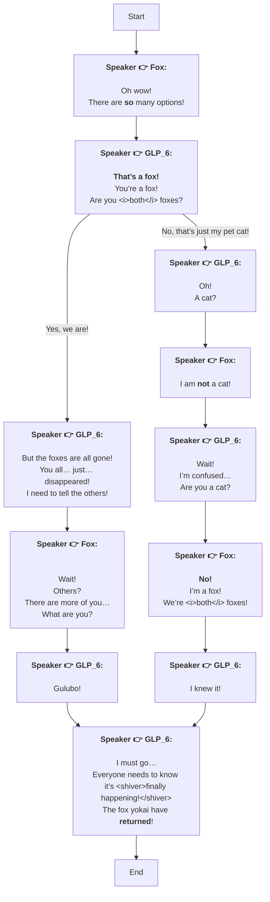

```mermaid
graph
Start -->1776325331652058[<b>Speaker 👉 Fox:</b>
\nOh wow!
There are <b>so</b> many options!]
1776325331652058 -->1776325352911324[<b>Speaker 👉 GLP_6:</b>
\n<b>That’s a fox!</b>\nYou’re a fox!
Are you &lt;i&gt;both&lt;/i&gt; foxes?]
1776325352911324 -->|No, that’s just my pet cat!|1776325520416240[<b>Speaker 👉 GLP_6:</b>
\nOh! 
A cat?]
1776325352911324 -->|Yes, we are!|1776325424690664[<b>Speaker 👉 GLP_6:</b>
\nBut the foxes are all gone!
You all… just… disappeared!\nI need to tell the others!]
1776325424690664 -->1776325466143211[<b>Speaker 👉 Fox:</b>
\n
Wait! 
Others?\nThere are more of you… 
What are you?]
1776325466143211 -->1776325500970478[<b>Speaker 👉 GLP_6:</b>
\nGulubo!]
1776325500970478 -->1776325669808635[<b>Speaker 👉 GLP_6:</b>
\nI must go…
Everyone needs to know it’s &lt;shiver&gt;finally happening!&lt;/shiver&gt;
The fox yokai have <b>returned</b>!]
1776325669808635 -->1776325711317501[End]
1776325520416240 -->1776325553373682[<b>Speaker 👉 Fox:</b>
\nI am <b>not</b> a cat!]
1776325553373682 -->1776325574573556[<b>Speaker 👉 GLP_6:</b>
\nWait!
I’m confused…
Are you a cat?]
1776325574573556 -->1776325607707126[<b>Speaker 👉 Fox:</b>
\n<b>No!</b>\nI’m a fox!
We’re &lt;i&gt;both&lt;/i&gt; foxes!]
1776325607707126 -->1776325643327993[<b>Speaker 👉 GLP_6:</b>
\nI knew it!]
1776325643327993 -->1776325669808635[<b>Speaker 👉 GLP_6:</b>
\nI must go…
Everyone needs to know it’s &lt;shiver&gt;finally happening!&lt;/shiver&gt;
The fox yokai have <b>returned</b>!]

```