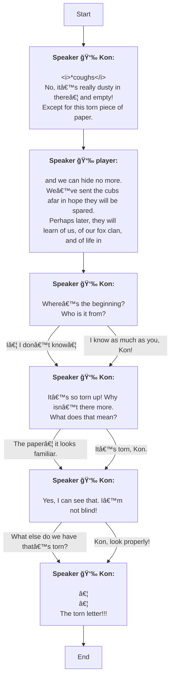

```mermaid
graph
Start -->1777231742861598[<b>Speaker 👉 Kon:</b>
\n&lt;i&gt;*coughs&lt;/i&gt;
No, it’s really dusty in there… and empty!
Except for this torn piece of paper.]
1777231742861598 -->1777231788103967[<b>Speaker 👉 player:</b>
\nand we can hide no more.
We’ve sent the cubs afar in hope they will be spared.
Perhaps later, they will learn of us, of our fox clan, and of life in]
1777231788103967 -->1777231875552544[<b>Speaker 👉 Kon:</b>
\nWhere’s the beginning?
Who is it from?]
1777231875552544 -->|I… I don’t know…|1777231925755176[<b>Speaker 👉 Kon:</b>
\nIt’s so torn up! Why isn’t there more.\nWhat does that mean?]
1777231875552544 -->|I know as much as you, Kon!|1777231925755176[<b>Speaker 👉 Kon:</b>
\nIt’s so torn up! Why isn’t there more.\nWhat does that mean?]
1777231925755176 -->|The paper… it looks familiar.|1777231966122290[<b>Speaker 👉 Kon:</b>
\nYes, I can see that. I’m not blind!]
1777231925755176 -->|It’s torn, Kon.|1777231966122290[<b>Speaker 👉 Kon:</b>
\nYes, I can see that. I’m not blind!]
1777231966122290 -->|What else do we have that’s torn?|1777232003859773[<b>Speaker 👉 Kon:</b>
\n…\n…\nThe torn letter!!!]
1777231966122290 -->|Kon, look properly!|1777232003859773[<b>Speaker 👉 Kon:</b>
\n…\n…\nThe torn letter!!!]
1777232003859773 -->1777232031169856[End]

```