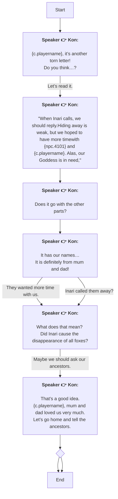

```mermaid
graph
Start -->1777831895210587[<b>Speaker 👉 Kon:</b>
\n&lbrace;c.playername&rbrace;, it’s another torn letter!
Do you think…?]
1777831895210587 -->|Let’s read it.|1777831980477028[<b>Speaker 👉 Kon:</b>
\n&quot;When Inari calls, we should reply.Hiding away is weak, but we hoped to have more timewith &lbrace;npc.4101&rbrace; and &lbrace;c.playername&rbrace;. Alas, our Goddess is in need,&quot;]
1777831980477028 -->1777831898627676[<b>Speaker 👉 Kon:</b>
\nDoes it go with the other parts?]
1777831898627676 -->1777832097443430[<b>Speaker 👉 Kon:</b>
\nIt has our names…
It is definitely from mum and dad!]
1777832097443430 -->|They wanted more time with us.|1777832141643374[<b>Speaker 👉 Kon:</b>
\nWhat does that mean? 
Did Inari cause the disappearance of all foxes?]
1777832097443430 -->|Inari called them away?|1777832141643374[<b>Speaker 👉 Kon:</b>
\nWhat does that mean? 
Did Inari cause the disappearance of all foxes?]
1777832141643374 -->|Maybe we should ask our ancestors.|1777832175603318[<b>Speaker 👉 Kon:</b>
\nThat’s a good idea.\n&lbrace;c.playername&rbrace;, mum and dad loved us very much.
Let’s go home and tell the ancestors.]
1777832175603318 -->1779054340422688{ }
1779054340422688 -->1777832202099320[End]
1779054340422688 -->1777832202099320[End]

```