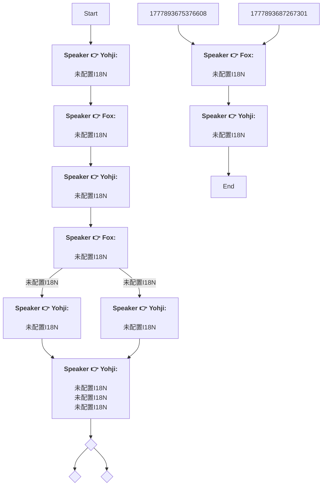

```mermaid
graph
Start -->1777893341258693[<b>Speaker 👉 Yohji:</b>
\n未配置I18N]
1777893341258693 -->1777893356322758[<b>Speaker 👉 Fox:</b>
\n未配置I18N]
1777893356322758 -->1777893447011272[<b>Speaker 👉 Yohji:</b>
\n未配置I18N]
1777893447011272 -->1777893459127242[<b>Speaker 👉 Fox:</b>
\n未配置I18N]
1777893459127242 -->|未配置I18N|1777893489737682[<b>Speaker 👉 Yohji:</b>
\n未配置I18N]
1777893459127242 -->|未配置I18N|1777893499853781[<b>Speaker 👉 Yohji:</b>
\n未配置I18N]
1777893489737682 -->1777893600713688[<b>Speaker 👉 Yohji:</b>
\n未配置I18N\n未配置I18N\n未配置I18N]
1777893600713688 -->1778080121672287{ }
1778080121672287 -->1777893657707483{ }
1778080121672287 -->1778080441942628{ }
1777893675376608 -->1777893706327016[<b>Speaker 👉 Fox:</b>
\n未配置I18N]
1777893706327016 -->1777893731027947[<b>Speaker 👉 Yohji:</b>
\n未配置I18N]
1777893731027947 -->1777893747187694[End]
1777893687267301 -->1777893706327016[<b>Speaker 👉 Fox:</b>
\n未配置I18N]
1777893499853781 -->1777893600713688[<b>Speaker 👉 Yohji:</b>
\n未配置I18N\n未配置I18N\n未配置I18N]

```