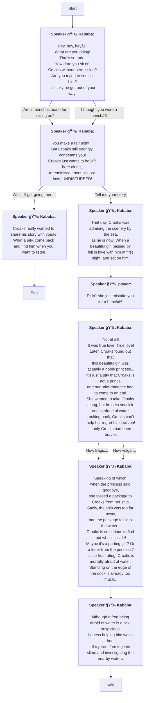

```mermaid
graph
Start -->1737561216085206[<b>Speaker 👉 Kababa:</b>
\nHey, hey, hey—
What are you doing!
That's so rude!\nHow dare you sit on Croaks without permission?
Are you trying to squish him?
It's lucky he got out of your way!]
1737561216085206 -->|Aren't benches made for sitting on?|1737561216085210[<b>Speaker 👉 Kababa:</b>
\nYou make a fair point...
But Croaks still strongly condemns you!\nCroaks just wants to be left here alone, 
to reminisce about his lost love, UNDISTURBED!]
1737561216085206 -->|I thought you were a bench…|1737561216085210[<b>Speaker 👉 Kababa:</b>
\nYou make a fair point...
But Croaks still strongly condemns you!\nCroaks just wants to be left here alone, 
to reminisce about his lost love, UNDISTURBED!]
1737561216085210 -->|Tell me your story.|1737561216086240[<b>Speaker 👉 Kababa:</b>
\nThat day, Croaks was admiring the scenery by the sea,
as he is now. When a beautiful girl passed by,
fell in love with him at first sight, and sat on him.]
1737561216085210 -->|Well, I'll get going then...|1737561216086238[<b>Speaker 👉 Kababa:</b>
\nCroaks really wanted to share his story with you…
What a pity, come back and find him when you want to listen.]
1737561216086238 -->1737561216086239[End]
1737561216086240 -->1737561216087265[<b>Speaker 👉 player:</b>
\nDidn't she just mistake you for a bench…]
1737561216087265 -->1737561216087266[<b>Speaker 👉 Kababa:</b>
\nNot at all!
It was true love! True love!\nLater, Croaks found out that 
this beautiful girl was actually a noble princess...\nIt's just a pity that Croaks is not a prince,
and our brief romance had to come to an end.\nShe wanted to take Croaks along, but he gets seasick and is afraid of water.
Looking back, Croaks can't help but regret his decision!\nIf only Croaks had been braver.]
1737561216087266 -->|How tragic...|1737561216088294[<b>Speaker 👉 Kababa:</b>
\nSpeaking of which,
when the princess said goodbye,
she tossed a package to Croaks from her ship.\nSadly, the ship was too far away,
and the package fell into the water...
Croaks is so curious to find out what's inside!\nMaybe it's a parting gift? Or a letter from the princess?
It's so frustrating! Croaks is mortally afraid of water. 
Standing on the edge of the dock is already too much...]
1737561216087266 -->|How vulgar...|1737561216088294[<b>Speaker 👉 Kababa:</b>
\nSpeaking of which,
when the princess said goodbye,
she tossed a package to Croaks from her ship.\nSadly, the ship was too far away,
and the package fell into the water...
Croaks is so curious to find out what's inside!\nMaybe it's a parting gift? Or a letter from the princess?
It's so frustrating! Croaks is mortally afraid of water. 
Standing on the edge of the dock is already too much...]
1737561216088294 -->1737561829208314[<b>Speaker 👉 Kababa:</b>
\nAlthough a frog being afraid of water is a little suspicious,
I guess helping him won't hurt.
I'll try transforming into slime and investigating the nearby waters.]
1737561829208314 -->1737561216088295[End]

```