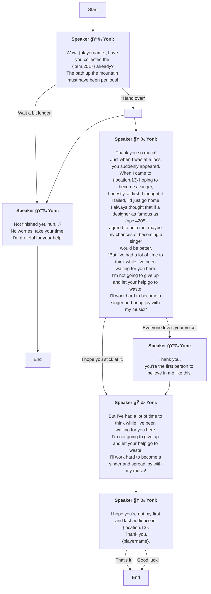

```mermaid
graph
Start -->1738289650856011[<b>Speaker 👉 Yoni:</b>
\nWow! &lbrace;playername&rbrace;, have you collected the &lbrace;item.2517&rbrace; already?
The path up the mountain must have been perilous!]
1738289650856011 -->|Wait a bit longer.|1738289799830612[<b>Speaker 👉 Yoni:</b>
\nNot finished yet, huh...?
No worries, take your time.
I'm grateful for your help.]
1738289650856011 -->|*Hand over*|1738289895128150[ ]
1738289799830612 -->1742092930830630[End]
1738289895128150 -->1738289799830612[<b>Speaker 👉 Yoni:</b>
\nNot finished yet, huh...?
No worries, take your time.
I'm grateful for your help.]
1738289895128150 -->1738289927962711[<b>Speaker 👉 Yoni:</b>
\nThank you so much!
Just when I was at a loss,
you suddenly appeared.\nWhen I came to &lbrace;location.13&rbrace; hoping to become a singer,
honestly, at first, I thought if I failed, I'd just go home.\nI always thought that if a designer as famous as &lbrace;npc.4205&rbrace;
agreed to help me, maybe my chances of becoming a singer
would be better.\n&quot;But I've had a lot of time to think while I've been waiting for you here.
I'm not going to give up and let your help go to waste.
I'll work hard to become a singer and bring joy with my music!&quot;]
1738289927962711 -->|I hope you stick at it.|1738290662682717[<b>Speaker 👉 Yoni:</b>
\nBut I've had a lot of time to think while I've been waiting for you here.
I'm not going to give up and let your help go to waste.
I'll work hard to become a singer and spread joy with my music!]
1738289927962711 -->|Everyone loves your voice.|1738290723810398[<b>Speaker 👉 Yoni:</b>
\nThank you,
you're the first person to believe in me like this.]
1738290662682717 -->1738290829012063[<b>Speaker 👉 Yoni:</b>
\nI hope you're not my first and last audience in &lbrace;location.13&rbrace;.\nThank you,
&lbrace;playername&rbrace;.]
1738290829012063 -->|That's it!|1738290998103141[End]
1738290829012063 -->|Good luck!|1738290998103141[End]
1738290723810398 -->1738290662682717[<b>Speaker 👉 Yoni:</b>
\nBut I've had a lot of time to think while I've been waiting for you here.
I'm not going to give up and let your help go to waste.
I'll work hard to become a singer and spread joy with my music!]

```