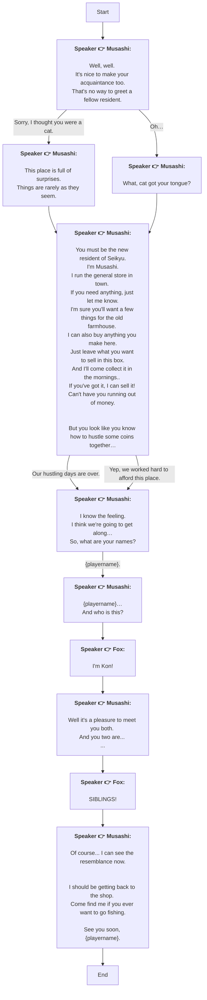

```mermaid
graph
Start -->1738369447807100[<b>Speaker 👉 Musashi:</b>
\nWell, well. 
It's nice to make your acquaintance too.\nThat's no way to greet a fellow resident.]
1738369447807100 -->|Sorry, I thought you were a cat.|1738369514544259[<b>Speaker 👉 Musashi:</b>
\nThis place is full of surprises.
Things are rarely as they seem.]
1738369447807100 -->|Oh…|1738369637289097[<b>Speaker 👉 Musashi:</b>
\nWhat, cat got your tongue?]
1738369514544259 -->1742696668586266[<b>Speaker 👉 Musashi:</b>
\nYou must be the new resident of Seikyu.
I'm Musashi.\nI run the general store in town. 
If you need anything, just let me know.\nI'm sure you'll want a few things for the old farmhouse. 
I can also buy anything you make here.\nJust leave what you want to sell in this box.
And I'll come collect it in the mornings.. 
If you've got it, I can sell it! Can't have you running out of money.

\nBut you look like you know how to hustle some coins together…]
1742696668586266 -->|Our hustling days are over.|1738369892088971[<b>Speaker 👉 Musashi:</b>
\nI know the feeling.
I think we're going to get along…
So, what are your names?]
1742696668586266 -->|Yep, we worked hard to afford this place.|1738369892088971[<b>Speaker 👉 Musashi:</b>
\nI know the feeling.
I think we're going to get along…
So, what are your names?]
1738369892088971 -->|&lbrace;playername&rbrace;.|1741542909956340[<b>Speaker 👉 Musashi:</b>
\n&lbrace;playername&rbrace;…
And who is this?
]
1741542909956340 -->1738369888274570[<b>Speaker 👉 Fox:</b>
\nI'm Kon!]
1738369888274570 -->1768545209125798[<b>Speaker 👉 Musashi:</b>
\nWell it's a pleasure to meet you both. 
And you two are... 
...]
1768545209125798 -->1768545232629671[<b>Speaker 👉 Fox:</b>
\nSIBLINGS!]
1768545232629671 -->1768545250768808[<b>Speaker 👉 Musashi:</b>
\nOf course... I can see the resemblance now.

\nI should be getting back to the shop. 
Come find me if you ever want to go fishing.
\nSee you soon, &lbrace;playername&rbrace;.]
1768545250768808 -->1738370113018005[End]
1738369637289097 -->1742696668586266[<b>Speaker 👉 Musashi:</b>
\nYou must be the new resident of Seikyu.
I'm Musashi.\nI run the general store in town. 
If you need anything, just let me know.\nI'm sure you'll want a few things for the old farmhouse. 
I can also buy anything you make here.\nJust leave what you want to sell in this box.
And I'll come collect it in the mornings.. 
If you've got it, I can sell it! Can't have you running out of money.

\nBut you look like you know how to hustle some coins together…]

```