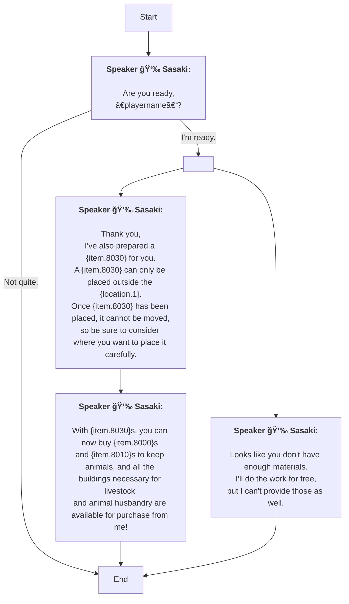

```mermaid
graph
Start -->1741371176241438[<b>Speaker 👉 Sasaki:</b>
\nAre you ready,
ã€playername】?]
1741371176241438 -->|I'm ready.|1756425024283146[ ]
1741371176241438 -->|Not quite.|1756425180201483[End]
1756425024283146 -->1741371646951720[<b>Speaker 👉 Sasaki:</b>
\nThank you,
I've also prepared a &lbrace;item.8030&rbrace; for you.
A &lbrace;item.8030&rbrace; can only be placed outside the &lbrace;location.1&rbrace;.\nOnce &lbrace;item.8030&rbrace; has been placed, it cannot be moved,
so be sure to consider where you want to place it carefully.]
1756425024283146 -->1741371496490279[<b>Speaker 👉 Sasaki:</b>
\nLooks like you don't have enough materials.
I'll do the work for free,
but I can't provide those as well.]
1741371646951720 -->1741372937941290[<b>Speaker 👉 Sasaki:</b>
\nWith &lbrace;item.8030&rbrace;s, you can now buy &lbrace;item.8000&rbrace;s 
and &lbrace;item.8010&rbrace;s to keep animals, and all the buildings necessary for livestock 
and animal husbandry are available for purchase from me!]
1741372937941290 -->1756425180201483[End]
1741371496490279 -->1756425180201483[End]

```