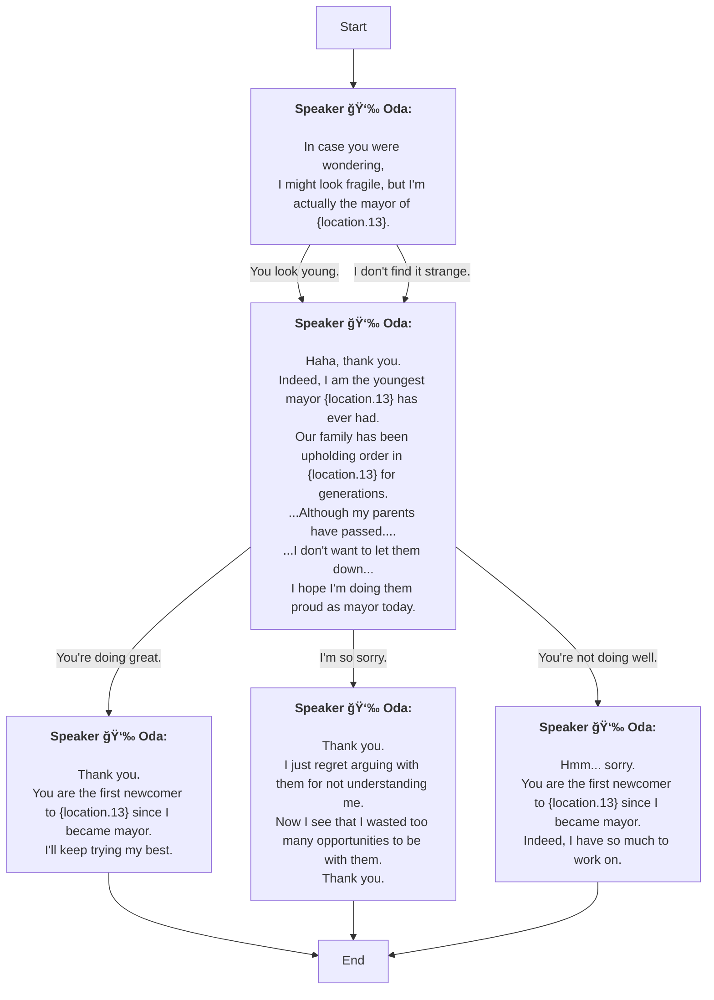

```mermaid
graph
Start -->1741756751534367[<b>Speaker 👉 Oda:</b>
\nIn case you were wondering,
I might look fragile, but I'm actually the mayor of &lbrace;location.13&rbrace;.]
1741756751534367 -->|You look young.|1741756751534371[<b>Speaker 👉 Oda:</b>
\nHaha, thank you.
Indeed, I am the youngest mayor &lbrace;location.13&rbrace; has ever had.
Our family has been upholding order in &lbrace;location.13&rbrace; for generations.\n...Although my parents have passed....
...I don't want to let them down...
I hope I'm doing them proud as mayor today.]
1741756751534367 -->|I don't find it strange.|1741756751534371[<b>Speaker 👉 Oda:</b>
\nHaha, thank you.
Indeed, I am the youngest mayor &lbrace;location.13&rbrace; has ever had.
Our family has been upholding order in &lbrace;location.13&rbrace; for generations.\n...Although my parents have passed....
...I don't want to let them down...
I hope I'm doing them proud as mayor today.]
1741756751534371 -->|You're doing great.|1741756751534375[<b>Speaker 👉 Oda:</b>
\nThank you.
You are the first newcomer to &lbrace;location.13&rbrace; since I became mayor.\nI'll keep trying my best.]
1741756751534371 -->|I'm so sorry.|1741757998477647[<b>Speaker 👉 Oda:</b>
\nThank you.
I just regret arguing with them for not understanding me.\nNow I see that I wasted too many opportunities to be with them.
Thank you.]
1741756751534371 -->|You're not doing well.|1741758102220112[<b>Speaker 👉 Oda:</b>
\nHmm... sorry.
You are the first newcomer to &lbrace;location.13&rbrace; since I became mayor.\nIndeed, I have so much to work on.]
1741756751534375 -->1741757982916940[End]
1741757998477647 -->1741757982916940[End]
1741758102220112 -->1741757982916940[End]

```