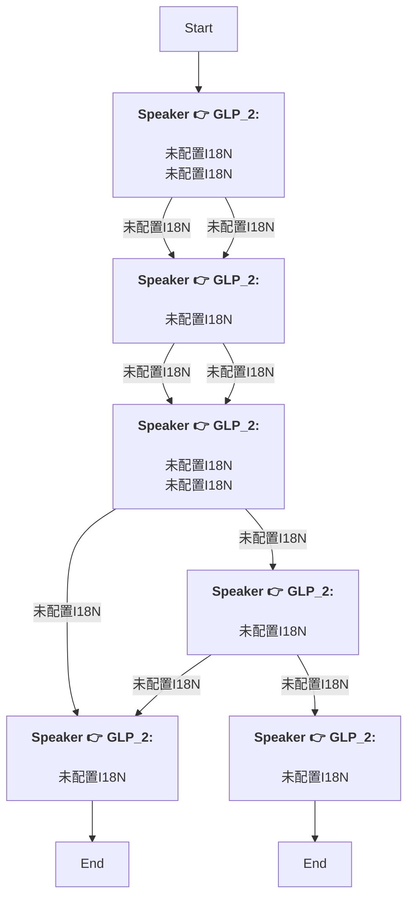

```mermaid
graph
Start -->1761998885248731[<b>Speaker 👉 GLP_2:</b>
\n未配置I18N\n未配置I18N]
1761998885248731 -->|未配置I18N|1761999334936289[<b>Speaker 👉 GLP_2:</b>
\n未配置I18N]
1761998885248731 -->|未配置I18N|1761999334936289[<b>Speaker 👉 GLP_2:</b>
\n未配置I18N]
1761999334936289 -->|未配置I18N|1761999398122215[<b>Speaker 👉 GLP_2:</b>
\n未配置I18N\n未配置I18N]
1761999334936289 -->|未配置I18N|1761999398122215[<b>Speaker 👉 GLP_2:</b>
\n未配置I18N\n未配置I18N]
1761999398122215 -->|未配置I18N|1761999863779073[<b>Speaker 👉 GLP_2:</b>
\n未配置I18N]
1761999398122215 -->|未配置I18N|1761999809644288[<b>Speaker 👉 GLP_2:</b>
\n未配置I18N]
1761999809644288 -->|未配置I18N|1761999976316682[<b>Speaker 👉 GLP_2:</b>
\n未配置I18N]
1761999809644288 -->|未配置I18N|1761999863779073[<b>Speaker 👉 GLP_2:</b>
\n未配置I18N]
1761999863779073 -->1761999770123007[End]
1761999976316682 -->1761999964552969[End]

```