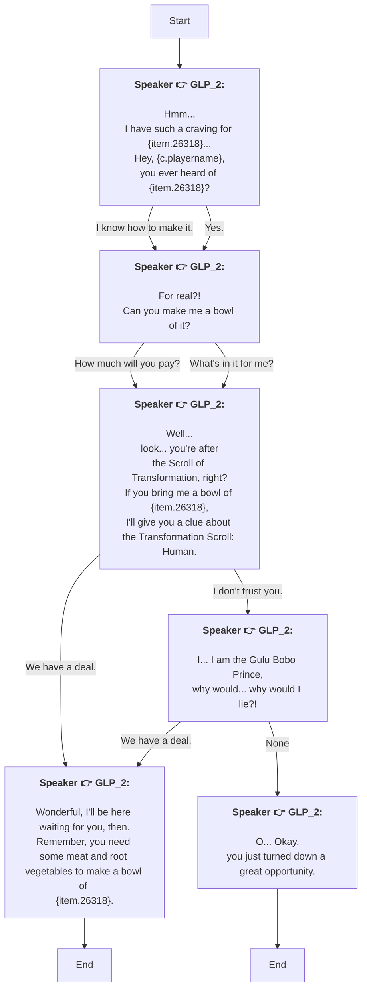

```mermaid
graph
Start -->1761998885248731[<b>Speaker 👉 GLP_2:</b>
\nHmm...
I have such a craving for &lbrace;item.26318&rbrace;...\nHey, &lbrace;c.playername&rbrace;,
you ever heard of &lbrace;item.26318&rbrace;?]
1761998885248731 -->|I know how to make it.|1761999334936289[<b>Speaker 👉 GLP_2:</b>
\nFor real?!
Can you make me a bowl of it?]
1761998885248731 -->|Yes.|1761999334936289[<b>Speaker 👉 GLP_2:</b>
\nFor real?!
Can you make me a bowl of it?]
1761999334936289 -->|How much will you pay?|1761999398122215[<b>Speaker 👉 GLP_2:</b>
\nWell...
look... you're after
the Scroll of Transformation, right?\nIf you bring me a bowl of &lbrace;item.26318&rbrace;,
I'll give you a clue about the Transformation Scroll: Human.]
1761999334936289 -->|What's in it for me?|1761999398122215[<b>Speaker 👉 GLP_2:</b>
\nWell...
look... you're after
the Scroll of Transformation, right?\nIf you bring me a bowl of &lbrace;item.26318&rbrace;,
I'll give you a clue about the Transformation Scroll: Human.]
1761999398122215 -->|We have a deal.|1761999863779073[<b>Speaker 👉 GLP_2:</b>
\nWonderful, I'll be here waiting for you, then.
Remember, you need some meat and root vegetables to make a bowl of 
&lbrace;item.26318&rbrace;.]
1761999398122215 -->|I don't trust you.|1761999809644288[<b>Speaker 👉 GLP_2:</b>
\nI... I am the Gulu Bobo Prince,
why would... why would I lie?!]
1761999809644288 -->|None|1761999976316682[<b>Speaker 👉 GLP_2:</b>
\nO... Okay,
you just turned down a great opportunity.]
1761999809644288 -->|We have a deal.|1761999863779073[<b>Speaker 👉 GLP_2:</b>
\nWonderful, I'll be here waiting for you, then.
Remember, you need some meat and root vegetables to make a bowl of 
&lbrace;item.26318&rbrace;.]
1761999863779073 -->1761999770123007[End]
1761999976316682 -->1761999964552969[End]

```