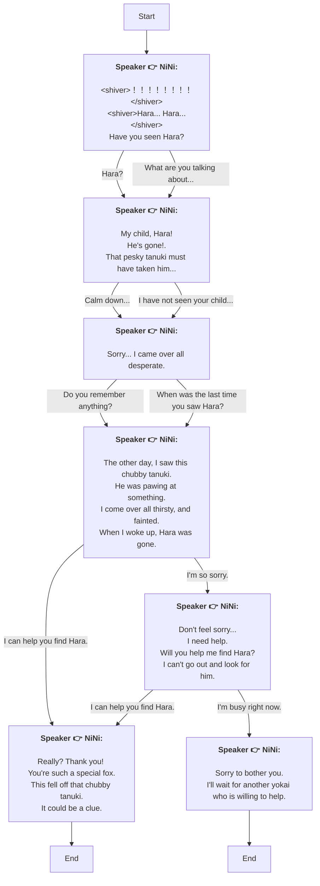

```mermaid
graph
Start -->1766053515595483[<b>Speaker 👉 NiNi:</b>
\n&lt;shiver&gt;！！！！！！！！&lt;/shiver&gt;\n&lt;shiver&gt;Hara... Hara...&lt;/shiver&gt;\nHave you seen Hara?]
1766053515595483 -->|Hara?|1766055012627169[<b>Speaker 👉 NiNi:</b>
\nMy child, Hara!
He's gone!.\nThat pesky tanuki must have taken him...]
1766053515595483 -->|What are you talking about...|1766055012627169[<b>Speaker 👉 NiNi:</b>
\nMy child, Hara!
He's gone!.\nThat pesky tanuki must have taken him...]
1766055012627169 -->|Calm down...|1766056153452252[<b>Speaker 👉 NiNi:</b>
\nSorry... I came over all desperate.]
1766055012627169 -->|I have not seen your child...|1766056153452252[<b>Speaker 👉 NiNi:</b>
\nSorry... I came over all desperate.]
1766056153452252 -->|Do you remember anything?|1766056200126178[<b>Speaker 👉 NiNi:</b>
\nThe other day, I saw this chubby tanuki.
He was pawing at something.\nI come over all thirsty, and fainted.
When I woke up, Hara was gone.]
1766056153452252 -->|When was the last time you saw Hara?|1766056200126178[<b>Speaker 👉 NiNi:</b>
\nThe other day, I saw this chubby tanuki.
He was pawing at something.\nI come over all thirsty, and fainted.
When I woke up, Hara was gone.]
1766056200126178 -->|I can help you find Hara.|1766056269282024[<b>Speaker 👉 NiNi:</b>
\nReally? Thank you! 
You're such a special fox.\nThis fell off that chubby tanuki.
It could be a clue.]
1766056200126178 -->|I'm so sorry.|1766056329715434[<b>Speaker 👉 NiNi:</b>
\nDon't feel sorry...
I need help.\nWill you help me find Hara?
I can't go out and look for him.]
1766056269282024 -->1766056308926185[End]
1766056329715434 -->|I can help you find Hara.|1766056269282024[<b>Speaker 👉 NiNi:</b>
\nReally? Thank you! 
You're such a special fox.\nThis fell off that chubby tanuki.
It could be a clue.]
1766056329715434 -->|I'm busy right now.|1766056401217265[<b>Speaker 👉 NiNi:</b>
\nSorry to bother you.
I'll wait for another yokai who is willing to help.]
1766056401217265 -->1766056390392560[End]

```