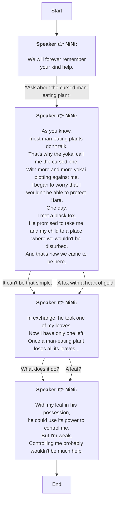

```mermaid
graph
Start -->1766067178303239[<b>Speaker 👉 NiNi:</b>
\nWe will forever remember
your kind help.]
1766067178303239 -->|*Ask about the cursed man-eating plant*|1766067230958349[<b>Speaker 👉 NiNi:</b>
\nAs you know,
most man-eating plants don't talk.\nThat's why the yokai call me the cursed one.\nWith more and more yokai plotting against me,
I began to worry that I wouldn't be able to protect Hara.\nOne day.
I met a black fox.\nHe promised to take me and my child to a place 
where we wouldn't be disturbed.
And that's how we came to be here.]
1766067230958349 -->|It can't be that simple.|1766067445982995[<b>Speaker 👉 NiNi:</b>
\nIn exchange, he took one of my leaves.
Now I have only one left.
Once a man-eating plant loses all its leaves...]
1766067230958349 -->|A fox with a heart of gold.|1766067445982995[<b>Speaker 👉 NiNi:</b>
\nIn exchange, he took one of my leaves.
Now I have only one left.
Once a man-eating plant loses all its leaves...]
1766067445982995 -->|What does it do?|1766067522114329[<b>Speaker 👉 NiNi:</b>
\nWith my leaf in his possession,
he could use its power to control me.\nBut I'm weak.
Controlling me probably wouldn't be much help.]
1766067445982995 -->|A leaf?|1766067522114329[<b>Speaker 👉 NiNi:</b>
\nWith my leaf in his possession,
he could use its power to control me.\nBut I'm weak.
Controlling me probably wouldn't be much help.]
1766067522114329 -->1766067559968538[End]

```