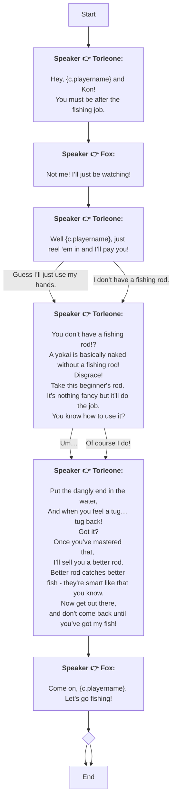

```mermaid
graph
Start -->1775069557225824[<b>Speaker 👉 Torleone:</b>
\nHey, &lbrace;c.playername&rbrace; and Kon!
You must be after the fishing job.]
1775069557225824 -->1775522074034531[<b>Speaker 👉 Fox:</b>
\nNot me! I’ll just be watching!]
1775522074034531 -->1775522096169318[<b>Speaker 👉 Torleone:</b>
\nWell &lbrace;c.playername&rbrace;, just reel ‘em in and I’ll pay you!]
1775522096169318 -->|Guess I’ll just use my hands.|1775069618806121[<b>Speaker 👉 Torleone:</b>
\nYou don’t have a fishing rod!?
A yokai is basically naked without a fishing rod!
Disgrace!\nTake this beginner's rod. 
It’s nothing fancy but it’ll do the job.
You know how to use it?]
1775522096169318 -->|I don’t have a fishing rod.|1775069618806121[<b>Speaker 👉 Torleone:</b>
\nYou don’t have a fishing rod!?
A yokai is basically naked without a fishing rod!
Disgrace!\nTake this beginner's rod. 
It’s nothing fancy but it’ll do the job.
You know how to use it?]
1775069618806121 -->|Um…|1775069677011315[<b>Speaker 👉 Torleone:</b>
\nPut the dangly end in the water,
And when you feel a tug… tug back!
Got it?\nOnce you’ve mastered that, 
I’ll sell you a better rod.
Better rod catches better fish - they’re smart like that you know.\nNow get out there,
and don't come back until you’ve got my fish!]
1775069618806121 -->|Of course I do!|1775069677011315[<b>Speaker 👉 Torleone:</b>
\nPut the dangly end in the water,
And when you feel a tug… tug back!
Got it?\nOnce you’ve mastered that, 
I’ll sell you a better rod.
Better rod catches better fish - they’re smart like that you know.\nNow get out there,
and don't come back until you’ve got my fish!]
1775069677011315 -->1775522243598698[<b>Speaker 👉 Fox:</b>
\nCome on, &lbrace;c.playername&rbrace;. Let’s go fishing!]
1775522243598698 -->1775082405283153{ }
1775082405283153 -->1775069712328055[End]
1775082405283153 -->1775069712328055[End]

```