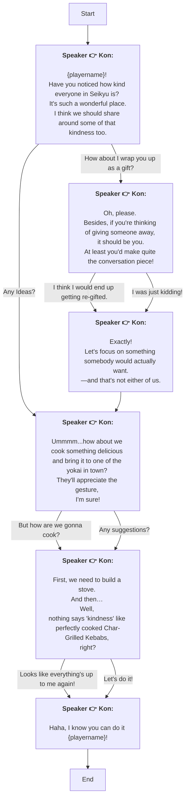

```mermaid
graph
Start -->1768888116997105[<b>Speaker 👉 Kon:</b>
\n&lbrace;playername&rbrace;! 
Have you noticed how kind everyone in Seikyu is? \nIt's such a wonderful place.
I think we should share around some of that kindness too. ]
1768888116997105 -->|How about I wrap you up as a gift?|1768888249640951[<b>Speaker 👉 Kon:</b>
\nOh, please. 
Besides, if you're thinking of giving someone away, 
it should be you.\nAt least you'd make quite the conversation piece!]
1768888116997105 -->|Any Ideas?|1768888622659582[<b>Speaker 👉 Kon:</b>
\nUmmmm...how about we cook something delicious 
and bring it to one of the yokai in town? \nThey'll appreciate the gesture, 
I'm sure! ]
1768888249640951 -->|I think I would end up getting re-gifted.|1768888572405757[<b>Speaker 👉 Kon:</b>
\nExactly!
Let's focus on something somebody would actually want.
—and that's not either of us.]
1768888249640951 -->|I was just kidding!|1768888572405757[<b>Speaker 👉 Kon:</b>
\nExactly!
Let's focus on something somebody would actually want.
—and that's not either of us.]
1768888572405757 -->1768888622659582[<b>Speaker 👉 Kon:</b>
\nUmmmm...how about we cook something delicious 
and bring it to one of the yokai in town? \nThey'll appreciate the gesture, 
I'm sure! ]
1768888622659582 -->|But how are we gonna cook?|1768890070932465[<b>Speaker 👉 Kon:</b>
\nFirst, we need to build a stove. 
And then… \nWell, 
nothing says 'kindness' like perfectly cooked Char-Grilled Kebabs, 
right?]
1768888622659582 -->|Any suggestions?|1768890070932465[<b>Speaker 👉 Kon:</b>
\nFirst, we need to build a stove. 
And then… \nWell, 
nothing says 'kindness' like perfectly cooked Char-Grilled Kebabs, 
right?]
1768890070932465 -->|Looks like everything's up to me again!|1768890198376444[<b>Speaker 👉 Kon:</b>
\nHaha, I know you can do it &lbrace;playername&rbrace;!]
1768890070932465 -->|Let's do it!|1768890198376444[<b>Speaker 👉 Kon:</b>
\nHaha, I know you can do it &lbrace;playername&rbrace;!]
1768890198376444 -->1768890222491645[End]

```