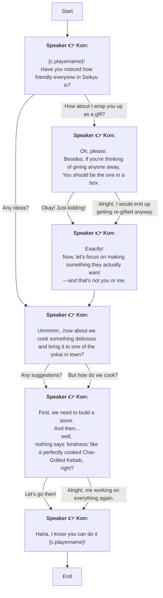

```mermaid
graph
Start -->1768888116997105[<b>Speaker 👉 Kon:</b>
\n&lbrace;c.playername&rbrace;! 
Have you noticed how friendly everyone in Seikyu is?]
1768888116997105 -->|Any Ideas?|1768888622659582[<b>Speaker 👉 Kon:</b>
\nUmmmm...how about we cook something delicious 
and bring it to one of the yokai in town?]
1768888116997105 -->|How about I wrap you up as a gift?|1768888249640951[<b>Speaker 👉 Kon:</b>
\nOh, please. 
Besides, if you're thinking of giving anyone away, 
You should be the one in a box.]
1768888249640951 -->|Okay! Just kidding!|1768888572405757[<b>Speaker 👉 Kon:</b>
\nExactly!
Now, let's focus on making something they actually want
—and that's not you or me.]
1768888249640951 -->|Alright, I would end up getting re-gifted anyway.|1768888572405757[<b>Speaker 👉 Kon:</b>
\nExactly!
Now, let's focus on making something they actually want
—and that's not you or me.]
1768888572405757 -->1768888622659582[<b>Speaker 👉 Kon:</b>
\nUmmmm...how about we cook something delicious 
and bring it to one of the yokai in town?]
1768888622659582 -->|Any suggestions?|1768890070932465[<b>Speaker 👉 Kon:</b>
\nFirst, we need to build a stove. 
And then…\nwell, 
nothing says 'kindness' like a perfectly cooked Char-Grilled Kebab, 
right?]
1768888622659582 -->|But how do we cook?|1768890070932465[<b>Speaker 👉 Kon:</b>
\nFirst, we need to build a stove. 
And then…\nwell, 
nothing says 'kindness' like a perfectly cooked Char-Grilled Kebab, 
right?]
1768890070932465 -->|Let's go then!|1768890198376444[<b>Speaker 👉 Kon:</b>
\nHaha, I know you can do it &lbrace;c.playername&rbrace;!]
1768890070932465 -->|Alright, me working on everything again.|1768890198376444[<b>Speaker 👉 Kon:</b>
\nHaha, I know you can do it &lbrace;c.playername&rbrace;!]
1768890198376444 -->1768890222491645[End]

```