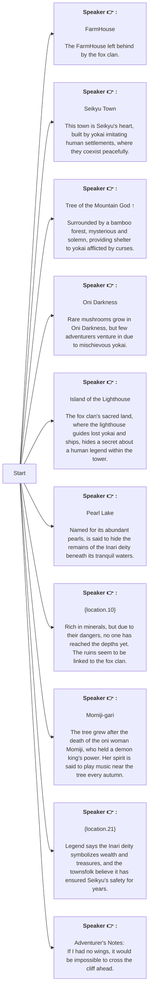

```mermaid
graph LR
Start -->1774189677612389[<b>Speaker 👉 :</b>
\nFarmHouse

The FarmHouse left behind by the fox clan.]
Start -->1774189691757927[<b>Speaker 👉 :</b>
\nSeikyu Town

This town is Seikyu's heart, built by yokai imitating human settlements, where they coexist peacefully.]
Start -->1774189705340265[<b>Speaker 👉 :</b>
\nTree of the Mountain God ↑

Surrounded by a bamboo forest, mysterious and solemn, providing shelter to yokai afflicted by curses.]
Start -->1774189719104875[<b>Speaker 👉 :</b>
\nOni Darkness

Rare mushrooms grow in Oni Darkness, but few adventurers venture in due to mischievous yokai.]
Start -->1774189780885869[<b>Speaker 👉 :</b>
\nIsland of the Lighthouse

The fox clan's sacred land, where the lighthouse guides lost yokai and ships, hides a secret about a human legend within the tower.]
Start -->1774189828753775[<b>Speaker 👉 :</b>
\nPearl Lake

Named for its abundant pearls, is said to hide the remains of the Inari deity beneath its tranquil waters.]
Start -->1774189835710833[<b>Speaker 👉 :</b>
\n&lbrace;location.10&rbrace;

Rich in minerals, but due to their dangers, no one has reached the depths yet. The ruins seem to be linked to the fox clan.]
Start -->1774190276512115[<b>Speaker 👉 :</b>
\nMomiji-gari

The tree grew after the death of the oni woman Momiji, who held a demon king's power. Her spirit is said to play music near the tree every autumn.]
Start -->1774190287572341[<b>Speaker 👉 :</b>
\n&lbrace;location.21&rbrace;

Legend says the Inari deity symbolizes wealth and treasures, and the townsfolk believe it has ensured Seikyu's safety for years.]
Start -->1775708742261136[<b>Speaker 👉 :</b>
\nAdventurer's Notes: 
If I had no wings, it would be impossible to cross the cliff ahead.]

```