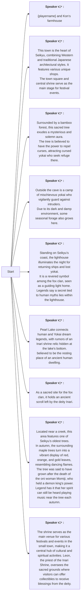

```mermaid
graph LR
Start -->1773857195941183[<b>Speaker 👉 :</b>
\n&lbrace;playername&rbrace; and Kon‘s farmhouse]
Start -->1773857442925891[<b>Speaker 👉 :</b>
\nThis town is the heart of Seikyu, combining Western and traditional Japanese architectural styles. It features various unique shops. \nThe town square and central shrine serve as the main stage for festival events.]
Start -->1773857482260806[<b>Speaker 👉 :</b>
\nSurrounded by a bamboo forest, this sacred tree exudes a mysterious and solemn aura. \nThe tree is believed to have the power to repel curses, attracting cursed yokai who seek refuge there.]
Start -->1773857565319497[<b>Speaker 👉 :</b>
\nOutside the cave is a camp of mischievous yokai who vigilantly guard against intruders. \nDue to its dark and damp environment, some seasonal forage also grows here.]
Start -->1773857617143116[<b>Speaker 👉 :</b>
\nStanding on Seikyu’s coast, the lighthouse illuminates the night for returning ships and lost yokai.\nIt is a revered symbol among the fox clan, seen as a guiding light home. Legends say a secret tied to human myths lies within the lighthouse.]
Start -->1773857702381903[<b>Speaker 👉 :</b>
\nPearl Lake connects human and Yokai dream legends, with rumors of an Inari shrine relic hidden at the lake's bottom.\nbelieved to be the resting place of an ancient human dwelling.]
Start -->1773857754189138[<b>Speaker 👉 :</b>
\nAs a sacred site for the fox clan, it holds an ancient scroll left by the deity Inari. ]
Start -->1773857821073749[<b>Speaker 👉 :</b>
\nLocated near a creek, this area features one of Seikyu’s oldest trees.
In autumn, the surrounding maple trees turn into a vibrant display of red, orange, and gold leaves, resembling dancing flames. \nThe tree was said to have grown after the death of the oni woman Momiji, who held a demon king's power.\nLegend has it that her spirit can still be heard playing music near the tree each autumn.]
Start -->1773857873172824[<b>Speaker 👉 :</b>
\nThe shrine serves as the main venue for various festivals and events in the small town, making it a central hub of cultural and spiritual activities. Leon, the priest of the Inari Shrine, oversees the sacred grounds where visitors can offer collectibles to receive blessings from the deity.]

```