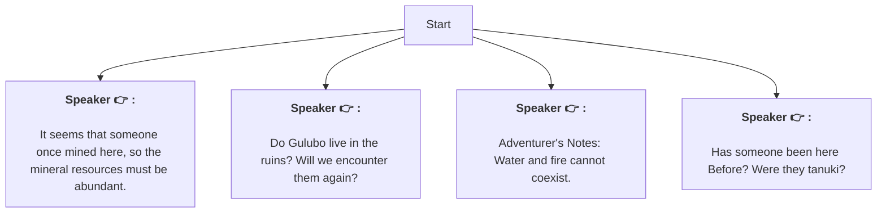

```mermaid
graph
Start -->1776048242323857[<b>Speaker 👉 :</b>
\nIt seems that someone once mined here, so the mineral resources must be abundant.]
Start -->1776048360993175[<b>Speaker 👉 :</b>
\nDo Gulubo live in the ruins? Will we encounter them again?]
Start -->1776244247815578[<b>Speaker 👉 :</b>
\nAdventurer's Notes: 
Water and fire cannot coexist.]
Start -->1776244421503390[<b>Speaker 👉 :</b>
\nHas someone been here Before? Were they tanuki?]

```