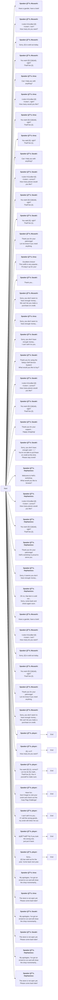

```mermaid
graph LR
Start -->1727829390893147[<b>Speaker 👉 Musashi:</b>
\nHave a gander, have a look!]
Start -->1727830019449949[<b>Speaker 👉 Musashi:</b>
\n&lt;color=#11cdbe&gt;&lbrace;0&rbrace;&lt;/color&gt;, huh?
How many do you want?]
Start -->1727831929241695[<b>Speaker 👉 Musashi:</b>
\nSorry, &lbrace;0&rbrace; is sold out today.]
Start -->1727832261254241[<b>Speaker 👉 Musashi:</b>
\nYou want &lbrace;0&rbrace; &lbrace;1&rbrace;&#40;s&#41;, right?
That'll be &lbrace;2&rbrace;.]
Start -->1727832493277283[<b>Speaker 👉 Ama:</b>
\nCan I help you with anything?]
Start -->1727832493277285[<b>Speaker 👉 Ama:</b>
\n&lt;color=#11cdbe&gt;&lbrace;0&rbrace;&lt;/color&gt;, right?
How many would you like?]
Start -->1727832493278313[<b>Speaker 👉 Ama:</b>
\nYou want &lbrace;0&rbrace; &lbrace;1&rbrace;&#40;s&#41;, right?
That'll be &lbrace;2&rbrace;.]
Start -->1727833939692651[<b>Speaker 👉 Ama:</b>
\nYou said &lbrace;0&rbrace;, right?
That'll be &lbrace;1&rbrace;.]
Start -->1727834138646637[<b>Speaker 👉 Sasaki:</b>
\nCan I help you with anything?]
Start -->1727834138646639[<b>Speaker 👉 Sasaki:</b>
\n&lt;color=#11cdbe&gt;&lbrace;0&rbrace;&lt;/color&gt;, correct?
How many pieces would you like?]
Start -->1727834138646641[<b>Speaker 👉 Sasaki:</b>
\nYou want &lbrace;0&rbrace; &lbrace;1&rbrace;&#40;s&#41;, right?
That'll be &lbrace;2&rbrace;.]
Start -->1727834138647667[<b>Speaker 👉 Sasaki:</b>
\nYou said &lbrace;0&rbrace;, right?
That'll be &lbrace;1&rbrace;.]
Start -->1729508894343259[<b>Speaker 👉 Musashi:</b>
\nThank you for your patronage!
Let me know if you need anything.]
Start -->1729512141517917[<b>Speaker 👉 Ama:</b>
\nExcellent choice!
This outfit is very popular...
I'll wrap it up for you!]
Start -->1729512833950815[<b>Speaker 👉 Sasaki:</b>
\nThank you...]
Start -->1730477251294303[<b>Speaker 👉 Musashi:</b>
\nSorry, you don't seem to have enough money...
We can't let you make a purchase on credit.]
Start -->1730478022444129[<b>Speaker 👉 Ama:</b>
\nSorry, you don't seem to have enough money...]
Start -->1730478496434275[<b>Speaker 👉 Sasaki:</b>
\nSorry, you don't have enough money...
I can't sell it to you.]
Start -->1741624125510916[<b>Speaker 👉 Sasaki:</b>
\nThank you for using the Seikyu Self-Service System!
What would you like to buy?]
Start -->1741624125510918[<b>Speaker 👉 Sasaki:</b>
\n&lt;color=#11cdbe&gt;&lbrace;0&rbrace;&lt;/color&gt;, correct?
How many pieces would you like?]
Start -->1741624125511944[<b>Speaker 👉 Sasaki:</b>
\nYou want &lbrace;0&rbrace; &lbrace;1&rbrace;&#40;s&#41;, right?
That'll be &lbrace;2&rbrace;.]
Start -->1741624125511948[<b>Speaker 👉 Sasaki:</b>
\nThank you for your support...
Happy shopping!]
Start -->1741624125512974[<b>Speaker 👉 Sasaki:</b>
\nSorry, you don't have enough cash. ^_^
You're not able to purchase on credit at this time.
Please stay tuned!]
Start -->1753747308161452[<b>Speaker 👉 Hephaestus:</b>
\nWelcome to Hefi's workshop.
What would you like to browse?]
Start -->1753748606761390[<b>Speaker 👉 Hephaestus:</b>
\n&lt;color=#11cdbe&gt;&lbrace;0&rbrace;&lt;/color&gt;, correct?
How many pieces would you like?]
Start -->1753748769646000[<b>Speaker 👉 Hephaestus:</b>
\nYou want &lbrace;0&rbrace; &lbrace;1&rbrace;&#40;s&#41;, right?
That'll be &lbrace;2&rbrace;.]
Start -->1753749316061618[<b>Speaker 👉 Hephaestus:</b>
\nThank you for your patronage!
Hefi's workshop is proud to serve you.]
Start -->1753749485628853[<b>Speaker 👉 Hephaestus:</b>
\nSorry, it seems you don't have enough money...]
Start -->1753749642379703[<b>Speaker 👉 Hephaestus:</b>
\nOh no, that item is sold out...
Sorry, come back and check again soon.]
Start -->1760740275081861[<b>Speaker 👉 Musashi:</b>
\nHave a gander, have a look!]
Start -->1760740275082887[<b>Speaker 👉 Musashi:</b>
\n&lt;color=#11cdbe&gt;&lbrace;0&rbrace;&lt;/color&gt;, huh?
How many do you want?]
Start -->1760740275082889[<b>Speaker 👉 Musashi:</b>
\nSorry, &lbrace;0&rbrace; is sold out today.]
Start -->1760740275083915[<b>Speaker 👉 Musashi:</b>
\nYou want &lbrace;0&rbrace; &lbrace;1&rbrace;&#40;s&#41;, right?
That'll be &lbrace;2&rbrace;.]
Start -->1760740275084941[<b>Speaker 👉 Musashi:</b>
\nThank you for your patronage!
Let me know if you need anything.]
Start -->1760740275085967[<b>Speaker 👉 Musashi:</b>
\nSorry, you don't seem to have enough money...
We can't let you make a purchase on credit.]
Start -->1762957098140370[<b>Speaker 👉 player:</b>
\n]
1762957098140370 -->1762957098140371[End]
Start -->1762957098141397[<b>Speaker 👉 player:</b>
\n&lbrace;0&rbrace;, is it?
How many do you want?]
1762957098141397 -->1762957098141398[End]
Start -->1762957098142424[<b>Speaker 👉 player:</b>
\nYou want &lbrace;0&rbrace; &lbrace;1&rbrace;, correct?
Let me do the math...
That'll be &lbrace;2&rbrace;. Run it yourself to make sure.]
1762957098142424 -->1762957098142425[End]
Start -->1762957098143451[<b>Speaker 👉 player:</b>
\nHave fun.
Don't forget to visit your uncle and check out the Carp Flag Challenge!]
1762957098143451 -->1762957098143452[End]
Start -->1762957098144478[<b>Speaker 👉 player:</b>
\nI can't sell it to you...
If I sell the wrong goods, my uncle will chew me out.]
1762957098144478 -->1762957098144479[End]
Start -->1762957098145505[<b>Speaker 👉 player:</b>
\n&#40;⊙o⊙&#41; If you took the wrong one,
just put it back.]
1762957098145505 -->1762957098145506[End]
Start -->1762957098146532[<b>Speaker 👉 player:</b>
\nSorry...
&lbrace;0&rbrace; has sold out for the year. Come back next year.]
1762957098146532 -->1762957098146533[End]
Start -->1766676794273589[<b>Speaker 👉 Ama:</b>
\nMy apologies, I've got an errand to run and will close the shop momentarily...]
Start -->1766676838374199[<b>Speaker 👉 Ama:</b>
\nThe store is not open yet. Please come back later!]
Start -->1766677063850809[<b>Speaker 👉 Sasaki:</b>
\nMy apologies, I've got an errand to run and will close the shop momentarily...]
Start -->1766677063851835[<b>Speaker 👉 Sasaki:</b>
\nThe store is not open yet. Please come back later!]
Start -->1766677094617917[<b>Speaker 👉 Hephaestus:</b>
\nMy apologies, I've got an errand to run and will close the shop momentarily...]
Start -->1766677094618943[<b>Speaker 👉 Hephaestus:</b>
\nThe store is not open yet. Please come back later!]

```