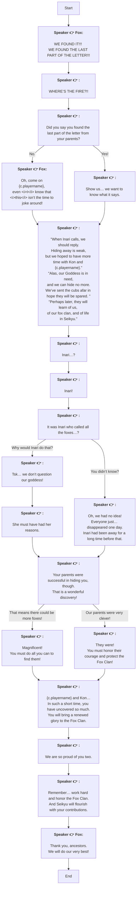

```mermaid
graph
Start -->1777836885899103[<b>Speaker 👉 Fox:</b>
\nWE FOUND IT!!! 
WE FOUND THE LAST PART OF THE LETTER!!!]
1777836885899103 -->1777836906481505[<b>Speaker 👉 :</b>
\nWHERE’S THE FIRE?!!]
1777836906481505 -->1777836918418274[<b>Speaker 👉 :</b>
\nDid you say you found the last part of the letter from your parents?]
1777836918418274 -->|Yes!|1777837201931117[<b>Speaker 👉 :</b>
\nShow us… we want to know what it says.]
1777836918418274 -->|No.|1777837179528042[<b>Speaker 👉 Fox:</b>
\nOh, come on &lbrace;c.playername&rbrace;, 
even &lt;i&gt;I&lt;/i&gt; know that &lt;i&gt;this&lt;/i&gt; isn’t the time to joke around!]
1777837179528042 -->1777837216346992[<b>Speaker 👉 :</b>
\n&quot;When Inari calls, we should reply.
Hiding away is weak,
but we hoped to have more time with Kon and &lbrace;c.playername&rbrace;.&quot;\n&quot;Alas, our Goddess is in need,
and we can hide no more.
We’ve sent the cubs afar in hope they will be spared. &quot;\n&quot;Perhaps later, they will learn of us, 
of our fox clan, and of life in Seikyu.&quot;]
1777837216346992 -->1777837292679027[<b>Speaker 👉 :</b>
\nInari…?]
1777837292679027 -->1777837304690552[<b>Speaker 👉 :</b>
\nInari!]
1777837304690552 -->1777837368982395[<b>Speaker 👉 :</b>
\nIt was Inari who called all the foxes…?]
1777837368982395 -->|You didn’t know?|1777837420970887[<b>Speaker 👉 :</b>
\nOh, we had no idea!
Everyone just… disappeared one day.\nInari had been away for a long time before that.]
1777837368982395 -->|Why would Inari do that?|1777837416798086[<b>Speaker 👉 :</b>
\nTsk… we don’t question our goddess!]
1777837416798086 -->1777837470131080[<b>Speaker 👉 :</b>
\nShe must have had her reasons.]
1777837470131080 -->1777837493260170[<b>Speaker 👉 :</b>
\nYour parents were successful in hiding you, though.
That is a wonderful discovery!]
1777837493260170 -->|That means there could be more foxes!|1777837531588500[<b>Speaker 👉 :</b>
\nMagnificent!
You must do all you can to find them!]
1777837493260170 -->|Our parents were very clever!|1777837558131607[<b>Speaker 👉 :</b>
\nThey were!
You must honor their courage and protect the Fox Clan!]
1777837531588500 -->1777837579829146[<b>Speaker 👉 :</b>
\n&lbrace;c.playername&rbrace; and Kon…
In such a short time, you have uncovered so much.
You will bring a renewed glory to the Fox Clan.]
1777837579829146 -->1777837600002973[<b>Speaker 👉 :</b>
\nWe are so proud of you two.]
1777837600002973 -->1777837609275296[<b>Speaker 👉 :</b>
\nRemember… work hard and honor the Fox Clan.
And Seikyu will flourish with your contributions.]
1777837609275296 -->1777837620232099[<b>Speaker 👉 Fox:</b>
\nThank you, ancestors.
We will do our very best!]
1777837620232099 -->1777837627815846[End]
1777837558131607 -->1777837579829146[<b>Speaker 👉 :</b>
\n&lbrace;c.playername&rbrace; and Kon…
In such a short time, you have uncovered so much.
You will bring a renewed glory to the Fox Clan.]
1777837420970887 -->1777837493260170[<b>Speaker 👉 :</b>
\nYour parents were successful in hiding you, though.
That is a wonderful discovery!]
1777837201931117 -->1777837216346992[<b>Speaker 👉 :</b>
\n&quot;When Inari calls, we should reply.
Hiding away is weak,
but we hoped to have more time with Kon and &lbrace;c.playername&rbrace;.&quot;\n&quot;Alas, our Goddess is in need,
and we can hide no more.
We’ve sent the cubs afar in hope they will be spared. &quot;\n&quot;Perhaps later, they will learn of us, 
of our fox clan, and of life in Seikyu.&quot;]

```