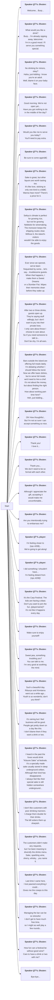

```mermaid
graph LR
Start -->1727383481015419[<b>Speaker 👉 Shuten:</b>
\nWelcome... Burp...]
Start -->1727383481015421[<b>Speaker 👉 Shuten:</b>
\nWhat would you like a drink?
Burp... I'm already sipping away, latecomer.
I'm in a good mood. I'll serve you something special.]
Start -->1727383481016453[<b>Speaker 👉 Shuten:</b>
\nNo drinking for minors, okay?
Haha, just kidding. I know you're an adult.
Well, blame it on your baby face.]
Start -->1727383481017481[<b>Speaker 👉 Shuten:</b>
\nGood morning. We're not open yet...
Have you got nothing to do in the middle of the day?]
Start -->1727383481017483[<b>Speaker 👉 Shuten:</b>
\nWould you like me to serve you today?
You'll need to pay extra.]
Start -->1727384006804621[<b>Speaker 👉 Shuten:</b>
\nBe sure to come again…]
Start -->1727384181215375[<b>Speaker 👉 Shuten:</b>
\nSake is great, but other liquors are worth tasting too.
It's like love, sticking to only one kind is a bit…
Wanna hear more? There's a price for it.]
Start -->1727384181216401[<b>Speaker 👉 Shuten:</b>
\nSeikyu's climate is perfect for growing rice,
but not for growing Nebbiolo for winemaking.\nThe monsoon keeps the shipping routes clear.
Without it, the island's visitors
wouldn't be able to enjoy the goods.]
Start -->1727384181216403[<b>Speaker 👉 Shuten:</b>
\nEver since we opened, we've been 
frequented by some... let's say... troublesome guests.\nWhen that happens, I make them a Sweet Dreams
or a Slumber Fist. Wipes their memories clean
before they wake up.]
Start -->1727384181217429[<b>Speaker 👉 Shuten:</b>
\nAfter two or three drinks, guests open up.
They're saying stuff willingly, but I don't
want to pry into their private lives.\nI only care about those I choose to care about.
So if you need someone to talk to...
Don't be shy, I'm all ears.]
Start -->1727384181217431[<b>Speaker 👉 Shuten:</b>
\nBars outside the island are offering full meals lately.
I'm debating whether I should follow the trend.\nNow we offer basic dishes, but to serve full meals
we'd need to hire a chef. It's not about the money,
but about finding the right person.\nHow about working part-time here?
Heh, just kidding...]
Start -->1727389726956635[<b>Speaker 👉 Shuten:</b>
\nOh! How thoughtful...
But I'm not so sure I can accept something so nice.]
Start -->1727389726957661[<b>Speaker 👉 Shuten:</b>
\nThank you!
I love it...]
Start -->1727389726957663[<b>Speaker 👉 Shuten:</b>
\nThank you...
We don't need to be so formal with each other.]
Start -->1727389726957665[<b>Speaker 👉 Shuten:</b>
\nAlthough I appreciate the gift, accepting it
would make me uncomfortable...]
Start -->1727389726957667[<b>Speaker 👉 Shuten:</b>
\nAre you intentionally trying to embarrass me?]
Start -->1727389726958693[<b>Speaker 👉 player:</b>
\nI'm feeling closer to &lbrace;npc.4208&rbrace;...
We're going to get along!]
Start -->1727389726958695[<b>Speaker 👉 player:</b>
\nI did something I shouldn't have...
I'm feeling distant from &lbrace;npc.4208&rbrace;!]
Start -->1753046481042233[<b>Speaker 👉 Shuten:</b>
\nIt's the Carp Festival. The kids are having a blast.
Don't you want to join the fun, &lbrace;playername&rbrace;?
It's not like it happens every day.]
Start -->1753046656492346[<b>Speaker 👉 Shuten:</b>
\nMake sure to enjoy yourself!]
Start -->1757099370372258[<b>Speaker 👉 Shuten:</b>
\nSweet pea, something troubling you?
You can talk to me.
I'm very good at soothing the mind.]
Start -->1757102886965417[<b>Speaker 👉 Shuten:</b>
\nSuch a beautiful day.
Ritsuryo and Kinntarou went out a while ago...
Youth is so wonderful, don't you think?]
Start -->1757103024217260[<b>Speaker 👉 Shuten:</b>
\nIt's raining but I feel business will be good.
People get pretty down on a day like this.
I don't blame them if they want a drink or two.]
Start -->1757999745494602[<b>Speaker 👉 Shuten:</b>
\nI heard in the past the foxes would drink 
&quot;Kitsune Sake&quot; at festivals. It's a specially made
sake usually stored in deep underground cellars.\nAlthough their kind has disappeared,
I always feel like their special sake is still 
hidden somewhere underground...]
Start -->1758001805515340[<b>Speaker 👉 Shuten:</b>
\nI don't like customers with poor drinking manners.
I charge them double for their drinks.
The bill sobers them up sharpish.]
Start -->1758002576105038[<b>Speaker 👉 Shuten:</b>
\nThe customers didn't make any requests,
but I've been meaning to diversify the drinks menu.
Sake, sparkling wine, sherry, whisky... you name it.]
Start -->1758164032445041[<b>Speaker 👉 Shuten:</b>
\nLast time I came here,
I lost pawned everything I could...
Gives me the creeps to this day.]
Start -->1758164106621555[<b>Speaker 👉 Shuten:</b>
\nManaging the bar can be so stressful.
I don't get to have much free time,
so I might as well play a few rounds...]
Start -->1758255376616042[<b>Speaker 👉 Shuten:</b>
\nHow fun can a festival be without good wine?
Care to have a drink or two with me?]
Start -->1758256348074604[<b>Speaker 👉 Shuten:</b>
\nBye-bye...]

```