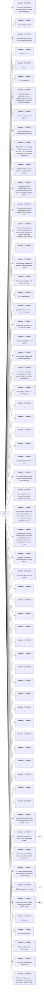

```mermaid
graph LR
Start -->1776659862024612[<b>Speaker 👉 Takichi:</b>
\nNo need to say farewell. We all end up in the same place eventually.]
Start -->1776659862025640[<b>Speaker 👉 Takichi:</b>
\nMmm, who are you?]
Start -->1776659862025644[<b>Speaker 👉 Takichi:</b>
\nGifts are given to bolster the ego. It is nice though!]
Start -->1776659862025648[<b>Speaker 👉 Takichi:</b>
\nHmmm... ok!]
Start -->1776659862025652[<b>Speaker 👉 Takichi:</b>
\nWhy?]
Start -->1776659862025656[<b>Speaker 👉 Takichi:</b>
\nCan I give it back?]
Start -->1776659862025660[<b>Speaker 👉 Takichi:</b>
\nYou bought a gift you would like to receive yourself, right? Like other lifeforms, we exist only to replicate ourselves.]
Start -->1776659862025664[<b>Speaker 👉 Takichi:</b>
\nHmmm, what day is it again?]
Start -->1776659862025668[<b>Speaker 👉 Takichi:</b>
\nI think I would like to be reborn as a fish one day!]
Start -->1776659862025672[<b>Speaker 👉 Takichi:</b>
\nSince there is no wrong or right, you just reap what you sow. I don't participate in activites that I have no interest in!]
Start -->1776659862025676[<b>Speaker 👉 Takichi:</b>
\nI have no need for rest when I have expanded no energy.]
Start -->1776659862025680[<b>Speaker 👉 Takichi:</b>
\nNo system has ever existed which did not involve the exploitation of some for the advantage of others.]
Start -->1776659862025684[<b>Speaker 👉 Takichi:</b>
\nFun fact: there is no one more dangerous than someone with nothing to lose.]
Start -->1776659862025688[<b>Speaker 👉 Takichi:</b>
\nThe laws of history tell us that only when the old is gone can the new take its place. Is that what happened to the foxes?]
Start -->1776659862025692[<b>Speaker 👉 Takichi:</b>
\n-]
Start -->1776659862025696[<b>Speaker 👉 Takichi:</b>
\nWhen the day ends we will return to eternal darkness! Yay!]
Start -->1776659862025700[<b>Speaker 👉 Takichi:</b>
\nThere is no sunshine, only darkness! Hehe!]
Start -->1776659862025704[<b>Speaker 👉 Takichi:</b>
\nNo! I don't think so!]
Start -->1776659862025708[<b>Speaker 👉 Takichi:</b>
\n&lbrace;npc.4214&rbrace; always bakes a cake... it's tasty!]
Start -->1776659862025712[<b>Speaker 👉 Takichi:</b>
\nI'll give this to &lbrace;npc.4215&rbrace;, I'm sure he'll like it.]
Start -->1776659862025716[<b>Speaker 👉 Takichi:</b>
\nI came outside for this - not worth it!]
Start -->1776659862025720[<b>Speaker 👉 Takichi:</b>
\nI'm just going to leave this here and walk away.]
Start -->1776659862025724[<b>Speaker 👉 Takichi:</b>
\nWhy do we celebrate birthdays but not death days? I shall save this for my death day!]
Start -->1776659862025728[<b>Speaker 👉 Takichi:</b>
\nThe point is there is no point. Bye now!]
Start -->1776659862025732[<b>Speaker 👉 Takichi:</b>
\n-]
Start -->1776659862025736[<b>Speaker 👉 Takichi:</b>
\n-]
Start -->1776659862025740[<b>Speaker 👉 Takichi:</b>
\n-]
Start -->1776659862025744[<b>Speaker 👉 Takichi:</b>
\n-]
Start -->1776659862025748[<b>Speaker 👉 Takichi:</b>
\nI must go inside. The sun is out.]
Start -->1776659862025752[<b>Speaker 👉 Takichi:</b>
\nThe cycle of life and death is never more so present than in autumn.]
Start -->1776659862025756[<b>Speaker 👉 Takichi:</b>
\nIf time, like hope, is an illusion, then do the seasons truly exist?]
Start -->1776659862025760[<b>Speaker 👉 Takichi:</b>
\nMy mum told me we love life, not because we are used to living but because we are used to loving. Inspirational, right?]
Start -->1776659862025764[<b>Speaker 👉 Takichi:</b>
\nEverything in the world displeases me: but, above all, my displeasure in everything displeases me... I read that somewhere once.]
Start -->1776659862025768[<b>Speaker 👉 Takichi:</b>
\nChristmas is a religious construct made to enslave others.]
Start -->1776659862025772[<b>Speaker 👉 Takichi:</b>
\nI'm going to hibernate until spring.]
Start -->1776659862025776[<b>Speaker 👉 Takichi:</b>
\n-]
Start -->1776659862025780[<b>Speaker 👉 Takichi:</b>
\n-]
Start -->1776659862025784[<b>Speaker 👉 Takichi:</b>
\n-]
Start -->1776659862025788[<b>Speaker 👉 Takichi:</b>
\n-]
Start -->1776659862025792[<b>Speaker 👉 Takichi:</b>
\n-]
Start -->1776659862025796[<b>Speaker 👉 Takichi:</b>
\n-]
Start -->1776659862025800[<b>Speaker 👉 Takichi:</b>
\n-]
Start -->1776659862025804[<b>Speaker 👉 Takichi:</b>
\n-]
Start -->1776659862025808[<b>Speaker 👉 Takichi:</b>
\n-]
Start -->1776659862025812[<b>Speaker 👉 Takichi:</b>
\n-]
Start -->1776659862025816[<b>Speaker 👉 Takichi:</b>
\n-]
Start -->1776659862025820[<b>Speaker 👉 Takichi:</b>
\n-]
Start -->1776659862025824[<b>Speaker 👉 Takichi:</b>
\n-]
Start -->1776659862025828[<b>Speaker 👉 Takichi:</b>
\n-]
Start -->1776659862025832[<b>Speaker 👉 Takichi:</b>
\n-]
Start -->1776659862025836[<b>Speaker 👉 Takichi:</b>
\n-]
Start -->1776659862025840[<b>Speaker 👉 Takichi:</b>
\n-]
Start -->1777990474676859[<b>Speaker 👉 Takichi:</b>
\nI'm going to buy some new cooking equipment with the money I won!]
Start -->1777990505039487[<b>Speaker 👉 Takichi:</b>
\nUgh! Who packed fruit? That's not an adventuring snack.]
1777990505039487 -->1778466352089746{ }
Start -->1777990521119363[<b>Speaker 👉 Takichi:</b>
\nThis would go well with a home cooked meal! Don't you think?]
Start -->1777990535617159[<b>Speaker 👉 Takichi:</b>
\nI'll trade you! Come by the stall tomorrow and I'll make you something.]
Start -->1777990560023179[<b>Speaker 👉 Takichi:</b>
\nGrilled veggies are the best!]
1777990560023179 -->1778466393699987{ }
Start -->1777990581352079[<b>Speaker 👉 Takichi:</b>
\nI don't like scones! Except when &lbrace;npc.4209&rbrace; Oda makes them.]
1777990581352079 -->1778466409034388{ }
Start -->1777990595589779[<b>Speaker 👉 Takichi:</b>
\nWelcome.]
Start -->1777990621190807[<b>Speaker 👉 Takichi:</b>
\nAre you sure? Okay.]
Start -->1777990658015899[<b>Speaker 👉 Takichi:</b>
\nThank you for your patronage.]
Start -->1778462455120130[<b>Speaker 👉 Takichi:</b>
\nWe're sold out, try again another day.]
Start -->1778462455120134[<b>Speaker 👉 Takichi:</b>
\nThis isn't enough mone... I would give it to you for free but that's a slippery slope.]

```