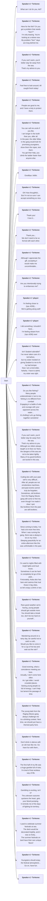

```mermaid
graph LR
Start -->1727314770217055[<b>Speaker 👉 Torleone:</b>
\nWhat can I do for you, kid?]
Start -->1727314770217057[<b>Speaker 👉 Torleone:</b>
\nHere for the fish? Or you got a problem that needs &quot;fixin'?&quot;
I'm only teasing. You're looking at a retiree now.
My problem &quot;fixin'&quot; days are long behind me.]
Start -->1727314770218083[<b>Speaker 👉 Torleone:</b>
\nIf you can't swim, you'd better stay far away from the sea.
That's my advice to you.]
Start -->1727314770218085[<b>Speaker 👉 Torleone:</b>
\nFeel free to look around. All caught fresh today!]
Start -->1727314770218087[<b>Speaker 👉 Torleone:</b>
\nPeople are good to me, and I have a duty to protect them.]
Start -->1727314770218089[<b>Speaker 👉 Torleone:</b>
\nYou can call me uncle if you like.
I am longer in the tooth than you, after all.\nIn the past, the older fellas in the gang would look for
promising youngsters, show them the ropes, test them.
You get their help, you climb the ladder faster than anyone else.]
Start -->1727315484267627[<b>Speaker 👉 Torleone:</b>
\nGoodbye, kiddo.]
Start -->1727315624140909[<b>Speaker 👉 Torleone:</b>
\nOh! How thoughtful...
But I'm not so sure I can accept something so nice.]
Start -->1727315624141935[<b>Speaker 👉 Torleone:</b>
\nThank you!
I love it...]
Start -->1727315624141937[<b>Speaker 👉 Torleone:</b>
\nThank you...
We don't need to be so formal with each other.]
Start -->1727315624141939[<b>Speaker 👉 Torleone:</b>
\nAlthough I appreciate the gift, accepting it
would make me uncomfortable...]
Start -->1727315624142965[<b>Speaker 👉 Torleone:</b>
\nAre you intentionally trying to embarrass me?]
Start -->1727315624142967[<b>Speaker 👉 player:</b>
\nI'm feeling closer to &lbrace;npc.4206&rbrace;...
We're getting along well!]
Start -->1727315624142969[<b>Speaker 👉 player:</b>
\nI did something I shouldn't have...
I'm feeling distant from &lbrace;npc.4206&rbrace; now!]
Start -->1727315788092541[<b>Speaker 👉 Torleone:</b>
\nIsn't Seabert adorable?
I've never taken care of a kid before, 
but my sister insisted on giving Seabert to me to fix my bad temper.\nNow I am a kind elder, hahaha. I have to admit, my sister was right.]
Start -->1727315788093569[<b>Speaker 👉 Torleone:</b>
\nDo you like fishing? 
Many people underestimate it, but to me, fishing is no different from combat!\nEngaging in a battle of wits and courage with your opponent across the water... 
It's thrilling! Let's go fishing together sometime!]
Start -->1757108606568673[<b>Speaker 👉 Torleone:</b>
\nIf you can't swim, you'd better stay far away from the sea.
That's my advice to you.\nAlthough our elders always taught us to face our fears, 
the dangers of the sea are not to be taken lightly. 
Many of my good brothers are buried in this sea.]
Start -->1757108860803302[<b>Speaker 👉 Torleone:</b>
\nCutting ties with your past self is very difficult... 
After all, people are not emotionless machines, 
and past events cannot truly be forgotten.\nSometimes, old brothers from the Raging Waves gang still come to find me, 
even though I've made it clear I quit. 
But brothers from the past are still brothers.]
Start -->1757109332396266[<b>Speaker 👉 Torleone:</b>
\nSince coming to Aoba, I've had a lot more free time. 
When I was running the gang, there was a always a lot on my mind.\nSleeping peacefully for an entire afternoon like this was unthinkable in the past.]
Start -->1757109419328749[<b>Speaker 👉 Torleone:</b>
\nI'm used to nights filled with bright lights and loud music. 
Sometimes It can be hard to completely let go of the past...\nFortunately, Aoba also has bars and casinos that rival those in big cities, 
so let's enjoy a drink or two.]
Start -->1757109614104816[<b>Speaker 👉 Torleone:</b>
\nRare good weather we're having, young people should get outside more. 
You should take a break too, don't be too hard on yourself...]
Start -->1757109684529395[<b>Speaker 👉 Torleone:</b>
\nWandering around on a rainy day, be careful not to catch a cold... 
Would you like to come in for a cup of hot tea and wait out the rain?]
Start -->1758006961589840[<b>Speaker 👉 Torleone:</b>
\nGood evening, what a coincidence meeting you here. 
Actually, I don't come here often.
As I get older, I avoid crowded places.\nSeeing young people so full of energy, I can't help but lament the passage of time.]
Start -->1758007060539986[<b>Speaker 👉 Torleone:</b>
\nThe young lads from the Raging Waves gang always challenge me 
to a drinking contest. Next time, we should just have a themed party here.]
Start -->1758007681235540[<b>Speaker 👉 Torleone:</b>
\nDon't drink in silence with an old man like me. Go have fun with them...]
Start -->1758165713182325[<b>Speaker 👉 Torleone:</b>
\nThe first half of my life was a huge gamble full of risks.
I'm tired of that reckless way of life.]
Start -->1758166261541495[<b>Speaker 👉 Torleone:</b>
\nGambling is exciting, isn't it? 
The unknown outcome quickens the heart, gets your blood pumping. 
It reminds me of the days of fighting for territory.]
Start -->1758257374056054[<b>Speaker 👉 Torleone:</b>
\nI used to celebrate summer festivals at sea. 
The deck would be decorated brightly, and it was so lively... 
The summer festivals on land have their own unique flavor!]
Start -->1758257458516600[<b>Speaker 👉 Torleone:</b>
\nYoungsters should enjoy the festival atmosphere... Go on, have fun.]
Start -->1773843566038357[<b>Speaker 👉 Torleone:</b>
\n]

```