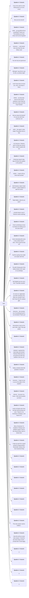

```mermaid
graph LR
Start -->1775462893572982[<b>Speaker 👉 Uozumi:</b>
\nIf you ever want to come fishing with me, let me know!]
Start -->1775462893572986[<b>Speaker 👉 Uozumi:</b>
\nSee you two around!]
Start -->1775462893572990[<b>Speaker 👉 Uozumi:</b>
\nAhhh... you got little old me something? Thank you! The kindness you have shown will not be forgotten!]
Start -->1775462893572994[<b>Speaker 👉 Uozumi:</b>
\nHmmmm.... I will cherish this more than the rare Seikyu carp!]
Start -->1775462893572998[<b>Speaker 👉 Uozumi:</b>
\nYou two truly are generous!]
Start -->1775462893573002[<b>Speaker 👉 Uozumi:</b>
\nAlthough I may find no use for this, my family might!]
Start -->1775462893573006[<b>Speaker 👉 Uozumi:</b>
\nI don't have time to humor you, sorry. Just leave it there!]
Start -->1775462893573010[<b>Speaker 👉 Uozumi:</b>
\nAhhhh... my favourate event on the annual calendar is here! May the two of you enjoy your first Carp Festival!]
Start -->1775462893573014[<b>Speaker 👉 Uozumi:</b>
\nDid you enjoy the festival? I'm sure you did! How could you not!]
Start -->1775462893573018[<b>Speaker 👉 Uozumi:</b>
\nAhhh... the water is calm today! The perfect time to fish!]
Start -->1775462893573022[<b>Speaker 👉 Uozumi:</b>
\nYui! Hmmmm, Torleone said Yui Oda was around here. I need to speak with her!]
Start -->1775462893573026[<b>Speaker 👉 Uozumi:</b>
\nFisherman doesn't take days off when the weather is this perfect!]
Start -->1775462893573030[<b>Speaker 👉 Uozumi:</b>
\nAhhhh... I need to fill up these bait buckets!]
Start -->1775462893573034[<b>Speaker 👉 Uozumi:</b>
\nDid Kinntarou make it back Shuten? I asked Seabert to walk him home!]
Start -->1775462893573038[<b>Speaker 👉 Uozumi:</b>
\nRight kiddos, what do you want?]
Start -->1775462893573042[<b>Speaker 👉 Uozumi:</b>
\nI should check to see if Torleone needs anything!]
Start -->1775462893573046[<b>Speaker 👉 Uozumi:</b>
\nI find it comforting to know my family are looking up at the same stars!]
Start -->1775462893573050[<b>Speaker 👉 Uozumi:</b>
\nSome interesting fish come to the surface when it rains. Time to get the boat out!]
Start -->1775462893573054[<b>Speaker 👉 Uozumi:</b>
\nMy life is going to be made a lot easier with this!]
Start -->1775462893573058[<b>Speaker 👉 Uozumi:</b>
\nThe gift of being part of the Seikyu family is all I need on my birthday!]
Start -->1775462893573062[<b>Speaker 👉 Uozumi:</b>
\nDid Seabert put you up to this? That little scoudrel!]
Start -->1775462893573066[<b>Speaker 👉 Uozumi:</b>
\nAs much as I appreciate you both coming by, the tides are coming in and I don't have time for useless gifts.]
Start -->1775462893573070[<b>Speaker 👉 Uozumi:</b>
\nMmmmm... this reminds me of something found in my homeland! Thank you!]
Start -->1775462893573074[<b>Speaker 👉 Uozumi:</b>
\nRemember to look out for each other, okay? Now get going!]
Start -->1775462893573078[<b>Speaker 👉 Uozumi:</b>
\n-]
Start -->1775462893573082[<b>Speaker 👉 Uozumi:</b>
\nHahaha! I capsized the boat today and dunked Torleone! What else are you gonna do when the weather's this hot, eh?]
Start -->1775462893573086[<b>Speaker 👉 Uozumi:</b>
\nSeikyu certainly looks like paradise in Autumn!]
Start -->1775462893573090[<b>Speaker 👉 Uozumi:</b>
\nHmmmm... I hope no one is out on the water in this weather!]
Start -->1775462893573094[<b>Speaker 👉 Uozumi:</b>
\nMmmm... the sea it my home. I feel most at peace out there!]
Start -->1775462893573098[<b>Speaker 👉 Uozumi:</b>
\nI wish my family were here, but they will be joining me soon. They're in my hometown of Shikoku, ever heard of it?]
Start -->1775462893573102[<b>Speaker 👉 Uozumi:</b>
\nMerry Christmas! I'm headed to Torleone and Seabert's place! They're the closest thing I have to family here!]
Start -->1775462893573106[<b>Speaker 👉 Uozumi:</b>
\nI hope you got Kon a good present &lbrace;c.playername&rbrace;! Remember, family is the most important thing!]
Start -->1775462893573110[<b>Speaker 👉 Uozumi:</b>
\n-]
Start -->1775462893573114[<b>Speaker 👉 Uozumi:</b>
\n-]
Start -->1775462893573118[<b>Speaker 👉 Uozumi:</b>
\n-]
Start -->1775462893572098[<b>Speaker 👉 Uozumi:</b>
\n-]
Start -->1775462893572102[<b>Speaker 👉 Uozumi:</b>
\n-]
Start -->1775462893572106[<b>Speaker 👉 Uozumi:</b>
\n-]
Start -->1775462893572110[<b>Speaker 👉 Uozumi:</b>
\nThis rainy season seems endless...]
Start -->1775462893572114[<b>Speaker 👉 Uozumi:</b>
\nI fear this will be my last rainy season. If only the rain were drops of wine... at least then I'd die happy.]
Start -->1775462893572118[<b>Speaker 👉 Uozumi:</b>
\n0]
Start -->1775462893572122[<b>Speaker 👉 Uozumi:</b>
\n-]
Start -->1775462893572126[<b>Speaker 👉 Uozumi:</b>
\n0]
Start -->1775462893572130[<b>Speaker 👉 Uozumi:</b>
\n0]

```