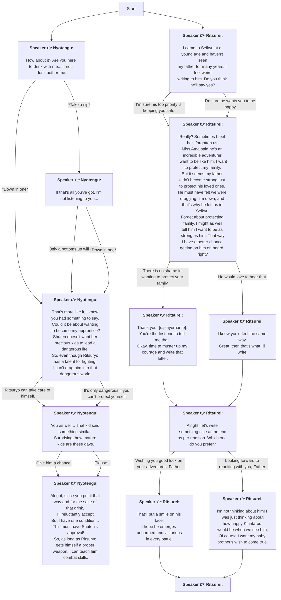

```mermaid
graph
Start -->1758605767331398[<b>Speaker 👉 Nyotengu:</b>
\nHow about it? Are you here to drink with me... If not, don't bother me.]
1758605767331398 -->|*Down in one*|1758606699736658[<b>Speaker 👉 Nyotengu:</b>
\nThat's more like it, I knew you had something to say. 
Could it be about wanting to become my apprentice?\nShuten doesn't want her precious kids to lead a dangerous life. 
So, even though Ritsuryo has a talent for fighting, 
I can't drag him into that dangerous world.]
1758605767331398 -->|*Take a sip*|1758605814728268[<b>Speaker 👉 Nyotengu:</b>
\nIf that's all you've got, I'm not listening to you...]
1758605814728268 -->|Only a bottoms up will do...|1758606699736658[<b>Speaker 👉 Nyotengu:</b>
\nThat's more like it, I knew you had something to say. 
Could it be about wanting to become my apprentice?\nShuten doesn't want her precious kids to lead a dangerous life. 
So, even though Ritsuryo has a talent for fighting, 
I can't drag him into that dangerous world.]
1758605814728268 -->|*Down in one*|1758606699736658[<b>Speaker 👉 Nyotengu:</b>
\nThat's more like it, I knew you had something to say. 
Could it be about wanting to become my apprentice?\nShuten doesn't want her precious kids to lead a dangerous life. 
So, even though Ritsuryo has a talent for fighting, 
I can't drag him into that dangerous world.]
1758606699736658 -->|Ritsuryo can take care of himself.|1758607314763352[<b>Speaker 👉 Nyotengu:</b>
\nYou as well... That kid said something similar. 
Surprising, how mature kids are these days.]
1758606699736658 -->|It's only dangerous if you can't protect yourself.|1758607314763352[<b>Speaker 👉 Nyotengu:</b>
\nYou as well... That kid said something similar. 
Surprising, how mature kids are these days.]
1758607314763352 -->|Give him a chance.|1758607472497246[<b>Speaker 👉 Nyotengu:</b>
\nAlright, since you put it that way and for the sake of that drink, 
I'll reluctantly accept.\nBut I have one condition... This must have Shuten's approval!\nSo, as long as Ritsuryo gets himself a proper weapon, I can teach him combat skills.]
1758607314763352 -->|Please...|1758607472497246[<b>Speaker 👉 Nyotengu:</b>
\nAlright, since you put it that way and for the sake of that drink, 
I'll reluctantly accept.\nBut I have one condition... This must have Shuten's approval!\nSo, as long as Ritsuryo gets himself a proper weapon, I can teach him combat skills.]
Start -->1761905278021897[<b>Speaker 👉 Ritsurei:</b>
\nI came to Seikyu at a young age and haven't seen
my father for many years. I feel weird
writing to him. Do you think he'll say yes?]
1761905278021897 -->|I'm sure his top priority is keeping you safe.|1761906724864272[<b>Speaker 👉 Ritsurei:</b>
\nReally? Sometimes I feel he's forgotten us.
Miss Ama said he's an incredible adventurer.
I want to be like him; I want to protect my family.\nBut it seems my father didn't become strong just 
to protect his loved ones. He must have felt we were 
dragging him down, and that's why he left us in Seikyu.\nForget about protecting family, I might as well
tell him I want to be as strong as him. That way
I have a better chance getting on him on board, right?]
1761905278021897 -->|I'm sure he wants you to be happy.|1761906724864272[<b>Speaker 👉 Ritsurei:</b>
\nReally? Sometimes I feel he's forgotten us.
Miss Ama said he's an incredible adventurer.
I want to be like him; I want to protect my family.\nBut it seems my father didn't become strong just 
to protect his loved ones. He must have felt we were 
dragging him down, and that's why he left us in Seikyu.\nForget about protecting family, I might as well
tell him I want to be as strong as him. That way
I have a better chance getting on him on board, right?]
1761906724864272 -->|He would love to hear that.|1761967869493942[<b>Speaker 👉 Ritsurei:</b>
\nI knew you'd feel the same way.
Great, then that's what I'll write.]
1761906724864272 -->|There is no shame in wanting to protect your family.|1761968607618743[<b>Speaker 👉 Ritsurei:</b>
\nThank you, &lbrace;c.playername&rbrace;. You're the first one to telll me that. 
Okay, time to muster up my courage and write that letter.]
1761968607618743 -->1761968904892088[<b>Speaker 👉 Ritsurei:</b>
\nAlright, let's write something nice at the end
as per tradition. Which one do you prefer?]
1761968904892088 -->|Looking forward to reuniting with you, Father.|1761972484847295[<b>Speaker 👉 Ritsurei:</b>
\nI'm not thinking about him! I was just thinking about
how happy Kinntarou would be when we see him.
Of course I want my baby brother's wish to come true.]
1761968904892088 -->|Wishing you good luck on your adventures, Father.|1761972478826174[<b>Speaker 👉 Ritsurei:</b>
\nThat'll put a smile on his face.
I hope he emerges unharmed and victorious
in every battle.]
1761972478826174 -->1761973301025472[<b>Speaker 👉 Ritsurei:</b>
]
1761972484847295 -->1761973301025472[<b>Speaker 👉 Ritsurei:</b>
]
1761967869493942 -->1761968904892088[<b>Speaker 👉 Ritsurei:</b>
\nAlright, let's write something nice at the end
as per tradition. Which one do you prefer?]

```