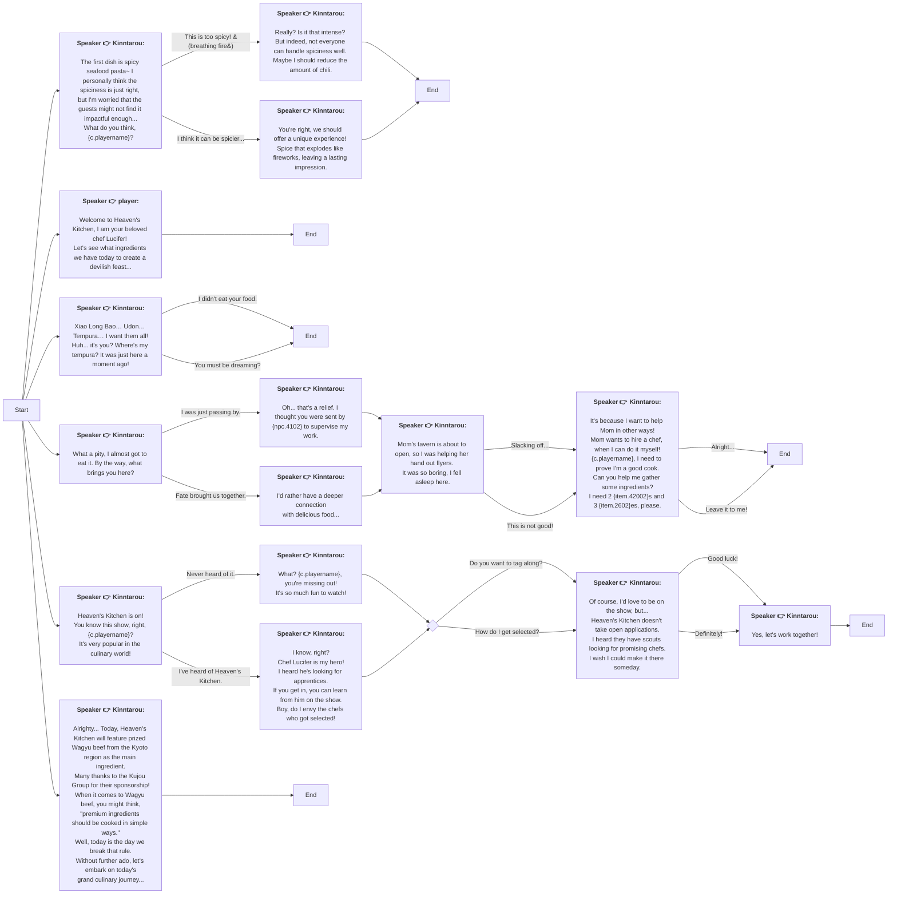

```mermaid
graph LR
Start -->1757655458919025[<b>Speaker 👉 Kinntarou:</b>
\nThe first dish is spicy seafood pasta~ I personally think the spiciness is just right, 
but I'm worried that the guests might not find it impactful enough...\nWhat do you think, &lbrace;c.playername&rbrace;?]
1757655458919025 -->|This is too spicy! &#40;breathing fire&#41;|1757656448902775[<b>Speaker 👉 Kinntarou:</b>
\nReally? Is it that intense? But indeed, not everyone can handle spiciness well. 
Maybe I should reduce the amount of chili.]
1757655458919025 -->|I think it can be spicier...|1757656589291128[<b>Speaker 👉 Kinntarou:</b>
\nYou're right, we should offer a unique experience! 
Spice that explodes like fireworks, leaving a lasting impression.]
1757656448902775 -->1758962451920574[End]
1757656589291128 -->1758962451920574[End]
Start -->1757657246957178[<b>Speaker 👉 player:</b>
\nWelcome to Heaven's Kitchen, I am your beloved chef Lucifer! 
Let's see what ingredients we have today to create a devilish feast...]
1757657246957178 -->1758962459651775[End]
Start -->1758891824335472[<b>Speaker 👉 Kinntarou:</b>
\nXiao Long Bao… Udon… Tempura… I want them all!\nHuh... it's you? Where's my tempura? It was just here a moment ago!]
1758891824335472 -->|I didn't eat your food.|1758892125002396[End]
1758891824335472 -->|You must be dreaming?|1758892125002396[End]
439414457979296 -->|Do you want to tag along?|1757658446446216[<b>Speaker 👉 Kinntarou:</b>
\nOf course, I'd love to be on the show, but...
Heaven's Kitchen doesn't take open applications.
I heard they have scouts looking for promising chefs.\nI wish I could make it there someday.]
439414457979296 -->|How do I get selected?|1757658446446216[<b>Speaker 👉 Kinntarou:</b>
\nOf course, I'd love to be on the show, but...
Heaven's Kitchen doesn't take open applications.
I heard they have scouts looking for promising chefs.\nI wish I could make it there someday.]
Start -->1758891824336501[<b>Speaker 👉 Kinntarou:</b>
\nWhat a pity, I almost got to eat it. By the way, what brings you here?]
1758891824336501 -->|I was just passing by.|1758891824336505[<b>Speaker 👉 Kinntarou:</b>
\nOh... that's a relief. I thought you were sent by &lbrace;npc.4102&rbrace; to supervise my work.]
1758891824336501 -->|Fate brought us together.|1758891824338563[<b>Speaker 👉 Kinntarou:</b>
\nI'd rather have a deeper connection
with delicious food...]
1758891824336505 -->1758891824337530[<b>Speaker 👉 Kinntarou:</b>
\nMom's tavern is about to open, so I was helping her hand out flyers. 
It was so boring, I fell asleep here.]
1758891824337530 -->|Slacking off...|1758891824337534[<b>Speaker 👉 Kinntarou:</b>
\nIt's because I want to help Mom in other ways!
Mom wants to hire a chef, when I can do it myself!\n&lbrace;c.playername&rbrace;, I need to prove I'm a good cook.
Can you help me gather some ingredients?
I need 2 &lbrace;item.42002&rbrace;s and 3 &lbrace;item.2602&rbrace;es, please.]
1758891824337530 -->|This is not good!|1758891824337534[<b>Speaker 👉 Kinntarou:</b>
\nIt's because I want to help Mom in other ways!
Mom wants to hire a chef, when I can do it myself!\n&lbrace;c.playername&rbrace;, I need to prove I'm a good cook.
Can you help me gather some ingredients?
I need 2 &lbrace;item.42002&rbrace;s and 3 &lbrace;item.2602&rbrace;es, please.]
1758891824337534 -->|Alright...|1758891824338562[End]
1758891824337534 -->|Leave it to me!|1758891824338562[End]
1758891824338563 -->1758891824337530[<b>Speaker 👉 Kinntarou:</b>
\nMom's tavern is about to open, so I was helping her hand out flyers. 
It was so boring, I fell asleep here.]
Start -->1757657625870971[<b>Speaker 👉 Kinntarou:</b>
\nHeaven's Kitchen is on!
You know this show, right, &lbrace;c.playername&rbrace;?
It's very popular in the culinary world!]
1757657625870971 -->|Never heard of it.|1757657831917185[<b>Speaker 👉 Kinntarou:</b>
\nWhat? &lbrace;c.playername&rbrace;, you're missing out!
It's so much fun to watch!]
1757657625870971 -->|I've heard of Heaven's Kitchen.|1757657837139586[<b>Speaker 👉 Kinntarou:</b>
\nI know, right?\nChef Lucifer is my hero!
I heard he's looking for apprentices.
If you get in, you can learn from him on the show.\nBoy, do I envy the chefs who got selected!]
1757657831917185 -->439414457979296{ }
1757658446446216 -->|Good luck!|1757658708194958[<b>Speaker 👉 Kinntarou:</b>
\nYes, let's work together!]
1757658446446216 -->|Definitely!|1757658708194958[<b>Speaker 👉 Kinntarou:</b>
\nYes, let's work together!]
1757658708194958 -->1758962481221313[End]
1757657837139586 -->439414457979296{ }
Start -->1758894263585440[<b>Speaker 👉 Kinntarou:</b>
\nAlrighty... Today, Heaven's Kitchen will feature prized 
Wagyu beef from the Kyoto region as the main ingredient.
Many thanks to the Kujou Group for their sponsorship!\nWhen it comes to Wagyu beef, you might think,
&quot;premium ingredients should be cooked in simple ways.&quot;
Well, today is the day we break that rule.\nWithout further ado, let's embark on today's
grand culinary journey...]
1758894263585440 -->1758962464800448[End]

```