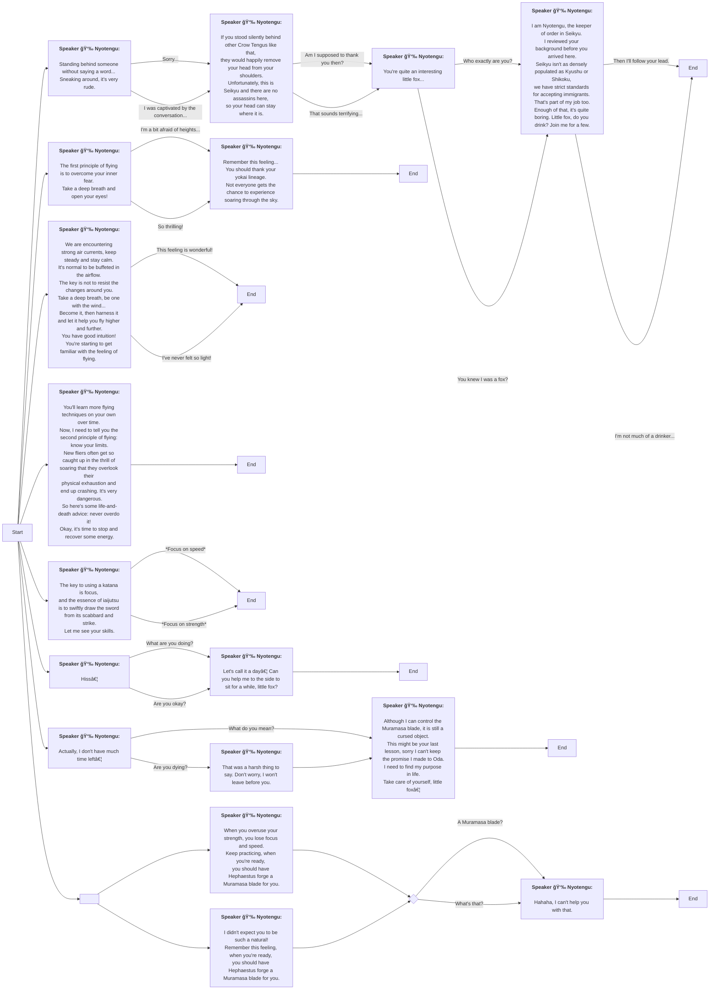

```mermaid
graph LR
Start -->1752689880679815[<b>Speaker 👉 Nyotengu:</b>
\nStanding behind someone without saying a word... 
Sneaking around, it's very rude.]
1752689880679815 -->|Sorry...|1752690924668679[<b>Speaker 👉 Nyotengu:</b>
\nIf you stood silently behind other Crow Tengus like that, 
they would happily remove your head from your shoulders.\nUnfortunately, this is Seikyu and there are no assassins here, 
so your head can stay where it is.]
1752689880679815 -->|I was captivated by the conversation...|1752690924668679[<b>Speaker 👉 Nyotengu:</b>
\nIf you stood silently behind other Crow Tengus like that, 
they would happily remove your head from your shoulders.\nUnfortunately, this is Seikyu and there are no assassins here, 
so your head can stay where it is.]
1752690924668679 -->|Am I supposed to thank you then?|1752691525420815[<b>Speaker 👉 Nyotengu:</b>
\nYou're quite an interesting little fox...]
1752690924668679 -->|That sounds terrifying...|1752691525420815[<b>Speaker 👉 Nyotengu:</b>
\nYou're quite an interesting little fox...]
1752691525420815 -->|Who exactly are you?|1752692182299414[<b>Speaker 👉 Nyotengu:</b>
\nI am Nyotengu, the keeper of order in Seikyu. 
I reviewed your background before you arrived here.\nSeikyu isn't as densely populated as Kyushu or Shikoku, 
we have strict standards for accepting immigrants. That's part of my job too.\nEnough of that, it's quite boring. Little fox, do you drink? Join me for a few.]
1752691525420815 -->|You knew I was a fox?|1752692182299414[<b>Speaker 👉 Nyotengu:</b>
\nI am Nyotengu, the keeper of order in Seikyu. 
I reviewed your background before you arrived here.\nSeikyu isn't as densely populated as Kyushu or Shikoku, 
we have strict standards for accepting immigrants. That's part of my job too.\nEnough of that, it's quite boring. Little fox, do you drink? Join me for a few.]
1752692182299414 -->|Then I'll follow your lead.|1752692411196189[End]
1752692182299414 -->|I'm not much of a drinker...|1752692411196189[End]
Start -->1753128694524304[<b>Speaker 👉 Nyotengu:</b>
\nThe first principle of flying is to overcome your inner fear. 
Take a deep breath and open your eyes!]
1753128694524304 -->|I'm a bit afraid of heights...|1753209835135381[<b>Speaker 👉 Nyotengu:</b>
\nRemember this feeling... You should thank your yokai lineage. 
Not everyone gets the chance to experience soaring through the sky.]
1753128694524304 -->|So thrilling!|1753209835135381[<b>Speaker 👉 Nyotengu:</b>
\nRemember this feeling... You should thank your yokai lineage. 
Not everyone gets the chance to experience soaring through the sky.]
1753209835135381 -->1763922599815915[End]
Start -->1753210064585111[<b>Speaker 👉 Nyotengu:</b>
\nWe are encountering strong air currents, keep steady and stay calm. 
It's normal to be buffeted in the airflow. 
The key is not to resist the changes around you.\nTake a deep breath, be one with the wind... 
Become it, then harness it and let it help you fly higher and further.\nYou have good intuition! You're starting to get familiar with the feeling of flying.]
1753210064585111 -->|This feeling is wonderful!|1763922611650284[End]
1753210064585111 -->|I've never felt so light!|1763922611650284[End]
Start -->1753211320104352[<b>Speaker 👉 Nyotengu:</b>
\nYou'll learn more flying techniques on your own over time. 
Now, I need to tell you the second principle of flying: know your limits.\nNew fliers often get so caught up in the thrill of soaring that they overlook their 
physical exhaustion and end up crashing. It's very dangerous.\nSo here's some life-and-death advice: never overdo it! 
Okay, it's time to stop and recover some energy.]
1753211320104352 -->1763922634703597[End]
Start -->1760142008622709[<b>Speaker 👉 Nyotengu:</b>
\nThe key to using a katana is focus, 
and the essence of iaijutsu is to swiftly draw the sword from its scabbard and strike.\nLet me see your skills.]
1760142008622709 -->|*Focus on speed*|1760225377338661[End]
1760142008622709 -->|*Focus on strength*|1760225377338661[End]
Start -->1760142135096959[<b>Speaker 👉 Nyotengu:</b>
\nHiss…]
1760142135096959 -->|What are you doing?|1760142179004038[<b>Speaker 👉 Nyotengu:</b>
\nLet's call it a day… Can you help me to the side to sit for a while, little fox?]
1760142135096959 -->|Are you okay?|1760142179004038[<b>Speaker 👉 Nyotengu:</b>
\nLet's call it a day… Can you help me to the side to sit for a while, little fox?]
1760142179004038 -->1760142197570183[End]
Start -->1760142220680841[<b>Speaker 👉 Nyotengu:</b>
\nActually, I don't have much time left…]
1760142220680841 -->|What do you mean?|1760142256587407[<b>Speaker 👉 Nyotengu:</b>
\nAlthough I can control the Muramasa blade, it is still a cursed object.\nThis might be your last lesson, sorry I can't keep the promise I made to Oda.\nI need to find my purpose in life.\nTake care of yourself, little fox…]
1760142220680841 -->|Are you dying?|1760142273960592[<b>Speaker 👉 Nyotengu:</b>
\nThat was a harsh thing to say. Don't worry, I won't leave before you.]
1760142256587407 -->1760142324214417[End]
1760142273960592 -->1760142256587407[<b>Speaker 👉 Nyotengu:</b>
\nAlthough I can control the Muramasa blade, it is still a cursed object.\nThis might be your last lesson, sorry I can't keep the promise I made to Oda.\nI need to find my purpose in life.\nTake care of yourself, little fox…]
Start -->1760225436925225[ ]
1760225436925225 -->1760225461618994[<b>Speaker 👉 Nyotengu:</b>
\nWhen you overuse your strength, you lose focus and speed.\nKeep practicing, when you're ready, 
you should have Hephaestus forge a Muramasa blade for you.]
1760225436925225 -->1760225114360095[<b>Speaker 👉 Nyotengu:</b>
\nI didn't expect you to be such a natural!\nRemember this feeling, when you're ready, 
you should have Hephaestus forge a Muramasa blade for you.]
1760225461618994 -->440056365404748{ }
1760142101932668 -->1760142122483325[End]
440056365404748 -->|A Muramasa blade?|1760142101932668[<b>Speaker 👉 Nyotengu:</b>
\nHahaha, I can't help you with that.]
440056365404748 -->|What's that?|1760142101932668[<b>Speaker 👉 Nyotengu:</b>
\nHahaha, I can't help you with that.]
1760225114360095 -->440056365404748{ }

```