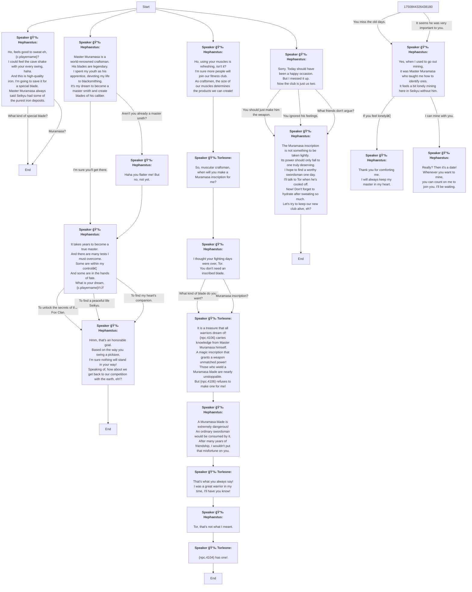

```mermaid
graph
Start -->1750843311597832[<b>Speaker 👉 Hephaestus:</b>
\nHo, feels good to sweat eh, &lbrace;c.playername&rbrace;? 
I could feel the cave shake with your every swing, haha.\nAnd this is high-quality iron. I'm going to save it for a special blade. 
Master Muramasa always said Seikyu had some of the purest iron deposits.]
1750843311597832 -->|What kind of special blade?|1750844368454949[End]
1750843311597832 -->|Muramasa?|1750844368454949[End]
Start -->1750843511057678[<b>Speaker 👉 Hephaestus:</b>
\nMaster Muramasa is a world-renowned craftsman. His blades are legendary. 
I spent my youth as his apprentice, devoting my life to blacksmithing.\nIt's my dream to become a master smith and create blades of his caliber.]
1750843511057678 -->|I'm sure you'll get there.|1771622814731466[<b>Speaker 👉 Hephaestus:</b>
\nIt takes years to become a true master. 
And there are many tests I must overcome.\nSome are within my control… 
And some are in the hands of fate.\nWhat is your dream, &lbrace;c.playername&rbrace;？]
1750843511057678 -->|Aren't you already a master smith?|1771622794595529[<b>Speaker 👉 Hephaestus:</b>
\n Haha you flatter me! But no, not yet.]
1771622794595529 -->1771622814731466[<b>Speaker 👉 Hephaestus:</b>
\nIt takes years to become a true master. 
And there are many tests I must overcome.\nSome are within my control… 
And some are in the hands of fate.\nWhat is your dream, &lbrace;c.playername&rbrace;？]
1771622814731466 -->|To unlock the secrets of the Fox Clan.|1771622940282067[<b>Speaker 👉 Hephaestus:</b>
\nHmm, that's an honorable goal.\nBased on the way you swing a pickaxe,
I'm sure nothing will stand in your way!\nSpeaking of, how about we get back to our competition with the earth, eh!?]
1771622814731466 -->|To find a peaceful life Seikyu.|1771622940282067[<b>Speaker 👉 Hephaestus:</b>
\nHmm, that's an honorable goal.\nBased on the way you swing a pickaxe,
I'm sure nothing will stand in your way!\nSpeaking of, how about we get back to our competition with the earth, eh!?]
1771622814731466 -->|To find my heart's companion.|1771622940282067[<b>Speaker 👉 Hephaestus:</b>
\nHmm, that's an honorable goal.\nBased on the way you swing a pickaxe,
I'm sure nothing will stand in your way!\nSpeaking of, how about we get back to our competition with the earth, eh!?]
1771622940282067 -->1771623004033236[End]
1750844326438180 -->|You miss the old days.|1750843556242708[<b>Speaker 👉 Hephaestus:</b>
\nYes, when I used to go out mining,
it was Master Muramasa who taught me how to identify ores.
It feels a bit lonely mining here in Seikyu without him.]
1750844326438180 -->|It seems he was very important to you.|1750843556242708[<b>Speaker 👉 Hephaestus:</b>
\nYes, when I used to go out mining,
it was Master Muramasa who taught me how to identify ores.
It feels a bit lonely mining here in Seikyu without him.]
1750843556242708 -->|If you feel lonely…|1750843645790490[<b>Speaker 👉 Hephaestus:</b>
\nThank you for comforting me.
I will always keep my master in my heart.]
1750843556242708 -->|I can mine with you.|1750843651490075[<b>Speaker 👉 Hephaestus:</b>
\nReally? Then it's a date!
Whenever you want to mine,
you can count on me to join you. I'll be waiting.]
Start -->1751366028817745[<b>Speaker 👉 Hephaestus:</b>
\nHo, using your muscles is refreshing, isn't it?
I'm sure more people will join our fitness club.\nAs craftsmen, the size of our muscles determines the products we can create!]
1751366028817745 -->1751366238300522[<b>Speaker 👉 Torleone:</b>
\nSo, muscular craftsman, when will you make a Muramasa inscription for me?]
1751366238300522 -->1751366272377195[<b>Speaker 👉 Hephaestus:</b>
\nI thought your fighting days were over, Tor. 
You don't need an inscribed blade.]
1751366272377195 -->|What kind of blade do you want?|1751366551144817[<b>Speaker 👉 Torleone:</b>
\nIt is a treasure that all warriors dream of!
&lbrace;npc.4106&rbrace; carries knowledge from Master Muramasa himself.
A magic inscription that grants a weapon unmatched power!\nThose who wield a Muramasa blade are nearly unstoppable. 
But &lbrace;npc.4106&rbrace; refuses to make one for me!]
1751366272377195 -->|Muramasa inscription?|1751366551144817[<b>Speaker 👉 Torleone:</b>
\nIt is a treasure that all warriors dream of!
&lbrace;npc.4106&rbrace; carries knowledge from Master Muramasa himself.
A magic inscription that grants a weapon unmatched power!\nThose who wield a Muramasa blade are nearly unstoppable. 
But &lbrace;npc.4106&rbrace; refuses to make one for me!]
1751366551144817 -->1751366797251954[<b>Speaker 👉 Hephaestus:</b>
\nA Muramasa blade is extremely dangerous!
An ordinary swordsman would be consumed by it. 
After many years of friendship, I wouldn't put that misfortune on you.]
1751366797251954 -->1751366826677619[<b>Speaker 👉 Torleone:</b>
\nThat's what you always say!
I was a great warrior in my time, I'll have you know!]
1751366826677619 -->1751366849399156[<b>Speaker 👉 Hephaestus:</b>
\nTor, that's not what I meant.]
1751366849399156 -->1751367042076021[<b>Speaker 👉 Torleone:</b>
\n&lbrace;npc.4104&rbrace; has one!]
1751367042076021 -->1751367060009334[End]
Start -->1751367195766136[<b>Speaker 👉 Hephaestus:</b>
\nSorry. Today should have been a happy occasion. 
But I messed it up. 
Now the club is just us two.]
1751367195766136 -->|You should just make him the weapon.|1751367543267712[<b>Speaker 👉 Hephaestus:</b>
\nThe Muramasa inscription is not something to be taken lightly. 
Its power should only fall to one truly deserving.
I hope to find a worthy swordsman one day.\nI'll talk to Tor when he's cooled off.\nNow! Don't forget to hydrate after sweating so much. 
Let's try to keep our new club alive, eh?]
1751367195766136 -->|You ignored his feelings.|1751367543267712[<b>Speaker 👉 Hephaestus:</b>
\nThe Muramasa inscription is not something to be taken lightly. 
Its power should only fall to one truly deserving.
I hope to find a worthy swordsman one day.\nI'll talk to Tor when he's cooled off.\nNow! Don't forget to hydrate after sweating so much. 
Let's try to keep our new club alive, eh?]
1751367195766136 -->|What friends don't argue?|1751367543267712[<b>Speaker 👉 Hephaestus:</b>
\nThe Muramasa inscription is not something to be taken lightly. 
Its power should only fall to one truly deserving.
I hope to find a worthy swordsman one day.\nI'll talk to Tor when he's cooled off.\nNow! Don't forget to hydrate after sweating so much. 
Let's try to keep our new club alive, eh?]
1751367543267712 -->1751367628238209[End]

```