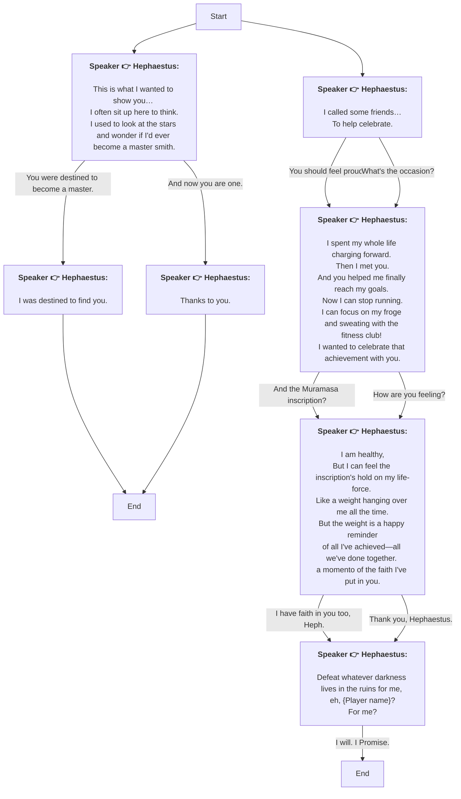

```mermaid
graph
Start -->1772520685667601[<b>Speaker 👉 Hephaestus:</b>
\nThis is what I wanted to show you… 
I often sit up here to think.
I used to look at the stars and wonder if I'd ever become a master smith.]
1772520685667601 -->|And now you are one.|1772520784533784[<b>Speaker 👉 Hephaestus:</b>
\nThanks to you.]
1772520685667601 -->|You were destined to become a master.|1772520763268375[<b>Speaker 👉 Hephaestus:</b>
\nI was destined to find you.]
1772520763268375 -->1772520812921113[End]
1772520784533784 -->1772520812921113[End]
Start -->1772520859172123[<b>Speaker 👉 Hephaestus:</b>
\nI called some friends…
To help celebrate.]
1772520859172123 -->|You should feel proud.|1772520953773345[<b>Speaker 👉 Hephaestus:</b>
\nI spent my whole life charging forward. 
Then I met you.\nAnd you helped me finally reach my goals. 
Now I can stop running.\nI can focus on my froge and sweating with the fitness club! 
I wanted to celebrate that achievement with you.]
1772520859172123 -->|What's the occasion?|1772520953773345[<b>Speaker 👉 Hephaestus:</b>
\nI spent my whole life charging forward. 
Then I met you.\nAnd you helped me finally reach my goals. 
Now I can stop running.\nI can focus on my froge and sweating with the fitness club! 
I wanted to celebrate that achievement with you.]
1772520953773345 -->|And the Muramasa inscription?|1772521038931239[<b>Speaker 👉 Hephaestus:</b>
\nI am healthy,
But I can feel the inscription's hold on my life-force. 
Like a weight hanging over me all the time.\nBut the weight is a happy reminder
of all I've achieved—all we've done together. 
a momento of the faith I've put in you.]
1772520953773345 -->|How are you feeling?|1772521038931239[<b>Speaker 👉 Hephaestus:</b>
\nI am healthy,
But I can feel the inscription's hold on my life-force. 
Like a weight hanging over me all the time.\nBut the weight is a happy reminder
of all I've achieved—all we've done together. 
a momento of the faith I've put in you.]
1772521038931239 -->|I have faith in you too, Heph.|1772521124128045[<b>Speaker 👉 Hephaestus:</b>
\nDefeat whatever darkness lives in the ruins for me, eh, &lbrace;Player name&rbrace;?
For me?]
1772521038931239 -->|Thank you, Hephaestus.|1772521124128045[<b>Speaker 👉 Hephaestus:</b>
\nDefeat whatever darkness lives in the ruins for me, eh, &lbrace;Player name&rbrace;?
For me?]
1772521124128045 -->|I will. I Promise.|1772521171464497[End]

```