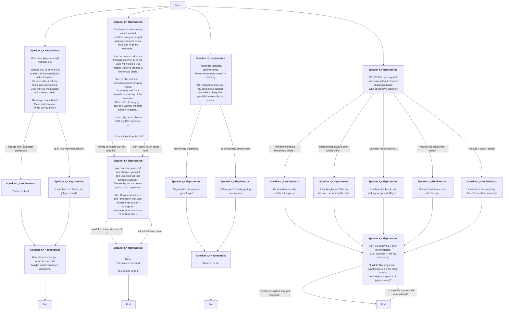

```mermaid
graph
Start -->1772236618104917[<b>Speaker 👉 Hephaestus:</b>
\nWelcome, &lbrace;playername&rbrace;!
Not bad, eh?
\nI wanted you to be the first to see it since you helped make it happen. 
So here's the anvil, my tools, and whetstones,
Over there is the furnace and smelting holds. 
\nThis forge rivals that of Master Muramasa. 
What do you think?
]
1772236618104917 -->|A forge fit for a master craftsman!  |1772236750704731[<b>Speaker 👉 Hephaestus:</b>
\nYou're too kind. 
]
1772236618104917 -->|Is all this really necessary? |1772236788055132[<b>Speaker 👉 Hephaestus:</b>
\nYou're hard to please, eh, &lbrace;playername&rbrace;?
]
1772236750704731 -->1772236835773535[<b>Speaker 👉 Hephaestus:</b>
\nHow about I show you what she can do?
Maybe you'll even learn something. 
]
1772236835773535 -->1772236859528288[End]
1772236788055132 -->1772236835773535[<b>Speaker 👉 Hephaestus:</b>
\nHow about I show you what she can do?
Maybe you'll even learn something. 
]
Start -->1772237475405913[<b>Speaker 👉 Hephaestus:</b>
\nI've always known exactly what I wanted,
and I've always charged right at my heart's desire. 
Take this forge for example…
\nI've become a craftsman through sheer force of will. 
But I will not be a true master until I've created a Muramasa blade. 
\nAnd for the first time, I cannot reach my dreams alone.
I can only wait for a swordsman worthy of the inscription. 
After a life of charging, I can only wait for the right person to appear. 
\nI must rely on another to fulfill my life's purpose. 
…

\nIt's much like love, isn't it? 
]
1772237475405913 -->|Relying on others can be beautiful.|1772237645806689[<b>Speaker 👉 Hephaestus:</b>
\nYou can hone your craft and sharpen yourself,
But you can't will that person to appear–
The worthy swordsman or your soul's companion– 
\nThe Muramasa blade is like romance in that way. 
Something you can't charge at. 
No matter how much your heart burns for it. 
]
1772237475405913 -->|I don't know much about love.|1772237645806689[<b>Speaker 👉 Hephaestus:</b>
\nYou can hone your craft and sharpen yourself,
But you can't will that person to appear–
The worthy swordsman or your soul's companion– 
\nThe Muramasa blade is like romance in that way. 
Something you can't charge at. 
No matter how much your heart burns for it. 
]
1772237645806689 -->|You'll find them, I'm sure of it.|1772237747101799[<b>Speaker 👉 Hephaestus:</b>
\n…
There.
The blade is finished. 
\nYou should keep it.  ]
1772237645806689 -->|I don't believe in love. |1772237747101799[<b>Speaker 👉 Hephaestus:</b>
\n…
There.
The blade is finished. 
\nYou should keep it.  ]
1772237747101799 -->1772237773735016[End]
Start -->1772237844652138[<b>Speaker 👉 Hephaestus:</b>
\nThanks for listening, &lbrace;playername&rbrace;.
My mind wanders when I'm smithing.
\nOh, I forgot to show you my special ore cabinet. 
It's where I keep the special iron we collected earlier.
]
1772237844652138 -->|You're very organized.  |1772237898399856[<b>Speaker 👉 Hephaestus:</b>
\n Organisation is key to a good forge!
]
1772237844652138 -->|You're awfully sentimental.  |1772237909386353[<b>Speaker 👉 Hephaestus:</b>
\nHAHA, you're finally getting to know me!
]
1772237898399856 -->1772237927302258[<b>Speaker 👉 Hephaestus:</b>
\nAaaand, ta da!]
1772237927302258 -->1772237938430067[End]
1772237909386353 -->1772237927302258[<b>Speaker 👉 Hephaestus:</b>
\nAaaand, ta da!]
Start -->1772237993578613[<b>Speaker 👉 Hephaestus:</b>
\nWhat!? The iron is gone! 
I was saving that to make a Muramasa blade.
Who could have stolen it?
]
1772237993578613 -->|Torleone wanted a Muramasa blade…|1772238056630401[<b>Speaker 👉 Hephaestus:</b>
\nHe would never. We patched things up!
]
1772237993578613 -->|Musashi has always been a little shifty… |1772238069699714[<b>Speaker 👉 Hephaestus:</b>
\nA cat burglar, eh? But he has no use for iron like that. 
]
1772237993578613 -->|I've seen Tanuki around… |1772238085957763[<b>Speaker 👉 Hephaestus:</b>
\nYou think the Tanuki are making weapons? Maybe… 
]
1772237993578613 -->|Maybe Oni snuck into town? |1772238100929668[<b>Speaker 👉 Hephaestus:</b>
\nOni wouldn't dare come into Seikyu.
]
1772237993578613 -->|I'm sure it wasn't stolen.  |1772238118720645[<b>Speaker 👉 Hephaestus:</b>
\nIt was here this morning. There's no other possibility. 
]
1772238056630401 -->1772238140445830[<b>Speaker 👉 Hephaestus:</b>
\nAgh! So annoying. I don't like mysteries. 
But I won't let it ruin my reopening! 
\nI'll talk to Nyotengu later. I want to focus on the forge for now. 
Let's keep an eye out ok, &lbrace;playername&rbrace;?
]
1772238140445830 -->|The thieves will be brought to justice! |1772238230793356[End]
1772238140445830 -->|I'm sure this mystery will unravel itself. |1772238230793356[End]
1772238069699714 -->1772238140445830[<b>Speaker 👉 Hephaestus:</b>
\nAgh! So annoying. I don't like mysteries. 
But I won't let it ruin my reopening! 
\nI'll talk to Nyotengu later. I want to focus on the forge for now. 
Let's keep an eye out ok, &lbrace;playername&rbrace;?
]
1772238085957763 -->1772238140445830[<b>Speaker 👉 Hephaestus:</b>
\nAgh! So annoying. I don't like mysteries. 
But I won't let it ruin my reopening! 
\nI'll talk to Nyotengu later. I want to focus on the forge for now. 
Let's keep an eye out ok, &lbrace;playername&rbrace;?
]
1772238100929668 -->1772238140445830[<b>Speaker 👉 Hephaestus:</b>
\nAgh! So annoying. I don't like mysteries. 
But I won't let it ruin my reopening! 
\nI'll talk to Nyotengu later. I want to focus on the forge for now. 
Let's keep an eye out ok, &lbrace;playername&rbrace;?
]
1772238118720645 -->1772238140445830[<b>Speaker 👉 Hephaestus:</b>
\nAgh! So annoying. I don't like mysteries. 
But I won't let it ruin my reopening! 
\nI'll talk to Nyotengu later. I want to focus on the forge for now. 
Let's keep an eye out ok, &lbrace;playername&rbrace;?
]

```