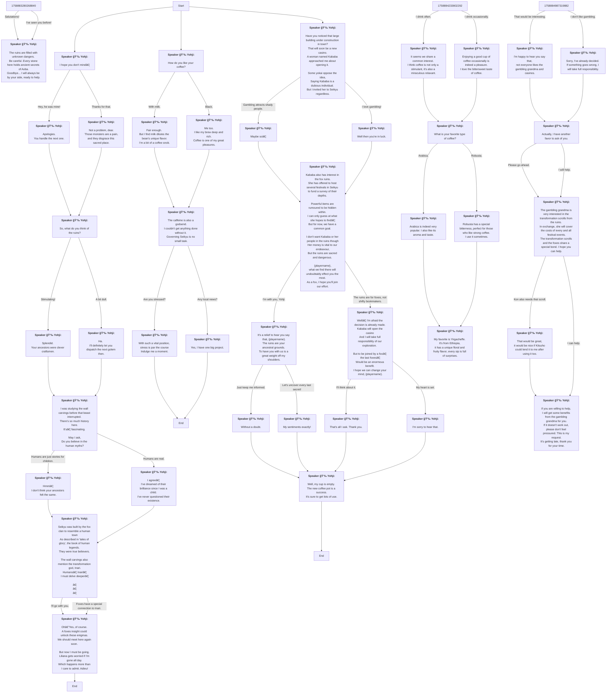

```mermaid
graph
Start -->1772864835218705[<b>Speaker 👉 Yohji:</b>
\nI hope you don't mind… ]
1772864835218705 -->|Hey, he was mine!|1772864878092567[<b>Speaker 👉 Yohji:</b>
\nApologies. 
You handle the next one.
]
1772864835218705 -->|Thanks for that. |1772864895442200[<b>Speaker 👉 Yohji:</b>
\nNot a problem, dear.
Those monsters are a pain,
and they disgrace this sacred place. 
]
1772864878092567 -->1772864921075993[<b>Speaker 👉 Yohji:</b>
\nSo, what do you think of the ruins? ]
1772864921075993 -->|Stimulating!|1772864962315551[<b>Speaker 👉 Yohji:</b>
\nSplendid. 
Your ancestors were clever craftsmen. 
]
1772864921075993 -->|A bit dull. |1772864985090336[<b>Speaker 👉 Yohji:</b>
\nHa.  
I'll definitely let you dispatch the next golem then. 
]
1772864962315551 -->1772865005611297[<b>Speaker 👉 Yohji:</b>
\nI was studying the wall carvings before that beast interrupted. 
There's so much history here.
It's… fascinating. 
\nMay I ask,
Do you believe in the human myths?
]
1772865005611297 -->|Humans are just stories for children.  |1772865138406697[<b>Speaker 👉 Yohji:</b>
\nHmm…
I don't think your ancestors felt the same. 
]
1772865005611297 -->|Humans are real. |1772865082715431[<b>Speaker 👉 Yohji:</b>
\nI agree… 
I've dreamed of their brilliance since I was a child. 
I've never questioned their existence.
]
1772865082715431 -->1772865159103786[<b>Speaker 👉 Yohji:</b>
\nSeikyu was built by the fox clan to resemble a human town
As described in 'tales of glory', the book of human legends. 
They were true believers. 
\nThe wall carvings also mention the transformation god, Inari.
Humans… Inari…
I must delve deeper…
\n…
…
…
]
1772865159103786 -->|I'll go with you. |1772865231638832[<b>Speaker 👉 Yohji:</b>
\nOh—Yes, of course. 
A foxes insight could unlock these enigmas. 
We should meet here again soon. 
\nBut now I must be going. 
Liliana gets worried if I'm gone all day. 
Which happens more than I care to admit. Adieu! 	
]
1772865159103786 -->|Foxes have a special connection to Inari. |1772865231638832[<b>Speaker 👉 Yohji:</b>
\nOh—Yes, of course. 
A foxes insight could unlock these enigmas. 
We should meet here again soon. 
\nBut now I must be going. 
Liliana gets worried if I'm gone all day. 
Which happens more than I care to admit. Adieu! 	
]
1772865231638832 -->1758884109455922[End]
1772865138406697 -->1772865159103786[<b>Speaker 👉 Yohji:</b>
\nSeikyu was built by the fox clan to resemble a human town
As described in 'tales of glory', the book of human legends. 
They were true believers. 
\nThe wall carvings also mention the transformation god, Inari.
Humans… Inari…
I must delve deeper…
\n…
…
…
]
1772864985090336 -->1772865005611297[<b>Speaker 👉 Yohji:</b>
\nI was studying the wall carvings before that beast interrupted. 
There's so much history here.
It's… fascinating. 
\nMay I ask,
Do you believe in the human myths?
]
1772864895442200 -->1772864921075993[<b>Speaker 👉 Yohji:</b>
\nSo, what do you think of the ruins? ]
1758883280268849 -->|Salutations!|1758884257319478[<b>Speaker 👉 Yohji:</b>
\nThe ruins are filled with unknown dangers. 
Be careful. Every stone here holds ancient secrets of Aoba.\nGoodbye... I will always be by your side, ready to help.]
1758883280268849 -->|I've seen you before!|1758884257319478[<b>Speaker 👉 Yohji:</b>
\nThe ruins are filled with unknown dangers. 
Be careful. Every stone here holds ancient secrets of Aoba.\nGoodbye... I will always be by your side, ready to help.]
Start -->1772873092835647[<b>Speaker 👉 Yohji:</b>
\nHow do you like your coffee? ]
1772873092835647 -->|With milk.|1772873165186374[<b>Speaker 👉 Yohji:</b>
\nFair enough. 
But I find milk dilutes the bean's unique flavor.
I'm a bit of a coffee snob. 
]
1772873092835647 -->|Black.|1772873302639948[<b>Speaker 👉 Yohji:</b>
\nMe too.
I like my brew deep and rich.
Coffee is one of my great pleasures. 
]
1772873302639948 -->1772873321662797[<b>Speaker 👉 Yohji:</b>
\nThe caffeine is also a godsend.
I couldn't get anything done without it. 
Governing Seikyu is no small task. 
]
1772873321662797 -->|Are you stressed? |1772873347523918[<b>Speaker 👉 Yohji:</b>
\nWith such a vital position, stress is par the course
Indulge me a moment. 
]
1772873321662797 -->|Any local news?|1772873365040463[<b>Speaker 👉 Yohji:</b>
\nYes, I have one big project. ]
1772873347523918 -->1758887035399783[End]
1772873365040463 -->1758887035399783[End]
1772873165186374 -->1772873321662797[<b>Speaker 👉 Yohji:</b>
\nThe caffeine is also a godsend.
I couldn't get anything done without it. 
Governing Seikyu is no small task. 
]
1758884233802292 -->|I drink often.|1758884667160128[<b>Speaker 👉 Yohji:</b>
\nIt seems we share a common interest. 
I think coffee is not only a stimulant, it's also a miraculous relaxant.]
1758884233802292 -->|I drink occasionally.|1758884671638081[<b>Speaker 👉 Yohji:</b>
\nEnjoying a good cup of coffee occasionally is indeed a pleasure. 
I love the bittersweet taste of coffee.]
1758884667160128 -->1758884728618567[<b>Speaker 👉 Yohji:</b>
\nWhat is your favorite type of coffee?]
1758884728618567 -->|Arabica.|1758886115369549[<b>Speaker 👉 Yohji:</b>
\nArabica is indeed very popular. I also like its aroma and taste.]
1758884728618567 -->|Robusta.|1758886129579598[<b>Speaker 👉 Yohji:</b>
\nRobusta has a special bitterness, perfect for those who like strong coffee. 
I use it sometimes.]
1758886115369549 -->1758886211370575[<b>Speaker 👉 Yohji:</b>
\nMy favorite is Yirgacheffe. It's from Ethiopia, 
it has a unique floral and fruity flavor, every sip is full of surprises.]
1758886129579598 -->1758886211370575[<b>Speaker 👉 Yohji:</b>
\nMy favorite is Yirgacheffe. It's from Ethiopia, 
it has a unique floral and fruity flavor, every sip is full of surprises.]
1758884671638081 -->1758884728618567[<b>Speaker 👉 Yohji:</b>
\nWhat is your favorite type of coffee?]
Start -->1772873380276561[<b>Speaker 👉 Yohji:</b>
\nHave you noticed that large building under construction in town?
That will soon be a new casino.
A woman named Kababa approached me about opening it. 
\nSome yokai oppose the idea,
Saying Kababa is a dubious individual. 
But I invited her to Seikyu regardless. 
]
1772873380276561 -->|Gambling attracts shady people. |1772873436073303[<b>Speaker 👉 Yohji:</b>
\nMaybe so…]
1772873380276561 -->|I love gambling!|1772873446368600[<b>Speaker 👉 Yohji:</b>
\nWell then you're in luck. ]
1772873436073303 -->1772873466546521[<b>Speaker 👉 Yohji:</b>
\nKababa also has interest in the fox ruins.
She has offered to host several festivals in Seikyu 
to fund a survey of their depths. 
\nPowerful items are rumoured to be hidden within. 
I can only guess at what she hopes to find…
But for now, we have a common goal. 
\nI don't want Kababa or her people in the ruins though
Her money is vital to our endeavour,
But the ruins are sacred and dangerous. 
\n&lbrace;playername&rbrace;,
what we find there will undoubtably effect you the most. 
As a fox, I hope you'll join our effort.
]
1772873466546521 -->|I'm with you, Yohji.|1772873555402079[<b>Speaker 👉 Yohji:</b>
\nIt's a relief to hear you say that, &lbrace;playername&rbrace;.
The ruins are your ancestral grounds. 
To have you with us is a great weight off my shoulders.
]
1772873466546521 -->|The ruins are for foxes, not shifty bookmakers. |1772873572184416[<b>Speaker 👉 Yohji:</b>
\nWell… I'm afraid the decision is already made. 
Kababa will open the casino 
And I will take full responsibility of our exploration.  
\nBut to be joined by a fox… the last foxes…
Would be an enormous benefit. 
I hope we can change your mind, &lbrace;playername&rbrace;.
]
1772873555402079 -->|Just keep me informed. |1772873649337707[<b>Speaker 👉 Yohji:</b>
\nWithout a doubt.]
1772873555402079 -->|Let's uncover every last secret!|1772873662337388[<b>Speaker 👉 Yohji:</b>
\nMy sentiments exactly! ]
1772873649337707 -->1772873703765359[<b>Speaker 👉 Yohji:</b>
\nWell, my cup is empty. 
The new coffee pot is a success.
It's sure to get lots of use. 
]
1772873703765359 -->1772873715788144[End]
1772873662337388 -->1772873703765359[<b>Speaker 👉 Yohji:</b>
\nWell, my cup is empty. 
The new coffee pot is a success.
It's sure to get lots of use. 
]
1772873572184416 -->|I'll think about it. |1772873674469741[<b>Speaker 👉 Yohji:</b>
\nThat's all I ask. Thank you. ]
1772873572184416 -->|My heart is set. |1772873685037422[<b>Speaker 👉 Yohji:</b>
\nI'm sorry to hear that. ]
1772873674469741 -->1772873703765359[<b>Speaker 👉 Yohji:</b>
\nWell, my cup is empty. 
The new coffee pot is a success.
It's sure to get lots of use. 
]
1772873685037422 -->1772873703765359[<b>Speaker 👉 Yohji:</b>
\nWell, my cup is empty. 
The new coffee pot is a success.
It's sure to get lots of use. 
]
1772873446368600 -->1772873466546521[<b>Speaker 👉 Yohji:</b>
\nKababa also has interest in the fox ruins.
She has offered to host several festivals in Seikyu 
to fund a survey of their depths. 
\nPowerful items are rumoured to be hidden within. 
I can only guess at what she hopes to find…
But for now, we have a common goal. 
\nI don't want Kababa or her people in the ruins though
Her money is vital to our endeavour,
But the ruins are sacred and dangerous. 
\n&lbrace;playername&rbrace;,
what we find there will undoubtably effect you the most. 
As a fox, I hope you'll join our effort.
]
1758884987319882 -->|That would be interesting.|1758886394263127[<b>Speaker 👉 Yohji:</b>
\nI'm happy to hear you say that, 
not everyone likes the gambling grandma and casinos.]
1758884987319882 -->|I don't like gambling.|1758886397992536[<b>Speaker 👉 Yohji:</b>
\nSorry, I've already decided. If something goes wrong, I will take full responsibility.]
1758886394263127 -->1758886525130329[<b>Speaker 👉 Yohji:</b>
\nActually, I have another favor to ask of you.]
1758886525130329 -->|Please go ahead.|1758886838010464[<b>Speaker 👉 Yohji:</b>
\nThe gambling grandma is very interested in the transformation scrolls from the ruins. 
In exchange, she will cover the costs of every and all festival events.\nThe transformation scrolls and the foxes share a special bond. I hope you can help.]
1758886525130329 -->|I will help.|1758886838010464[<b>Speaker 👉 Yohji:</b>
\nThe gambling grandma is very interested in the transformation scrolls from the ruins. 
In exchange, she will cover the costs of every and all festival events.\nThe transformation scrolls and the foxes share a special bond. I hope you can help.]
1758886838010464 -->|Kon also needs that scroll.|1758887038982760[<b>Speaker 👉 Yohji:</b>
\nThat would be great, 
it would be nice if Kitsuho could lend it to me after using it too.]
1758886838010464 -->|I can help.|1758887077784169[<b>Speaker 👉 Yohji:</b>
\nIf you are willing to help, 
I will get some benefits from the gambling grandma for you.\nIf it doesn't work out, please don't feel pressured. This is my request.\nIt's getting late, thank you for your time.]
1758887038982760 -->1758887077784169[<b>Speaker 👉 Yohji:</b>
\nIf you are willing to help, 
I will get some benefits from the gambling grandma for you.\nIf it doesn't work out, please don't feel pressured. This is my request.\nIt's getting late, thank you for your time.]
1758886397992536 -->1758886525130329[<b>Speaker 👉 Yohji:</b>
\nActually, I have another favor to ask of you.]

```