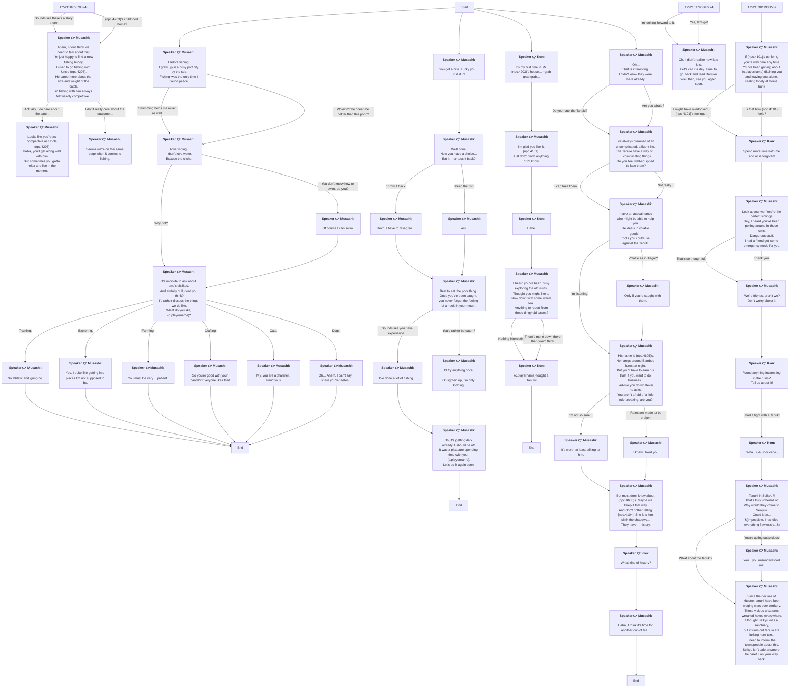

```mermaid
graph
Start -->1772879073207648[<b>Speaker 👉 Musashi:</b>
\nI adore fishing. 
I grew up in a busy port city by the sea.
Fishing was the only time I found peace.]
1772879073207648 -->|Swimming helps me relax as well.|1772879128190310[<b>Speaker 👉 Musashi:</b>
\nI love fishing…
I don't love water.
Excuse the cliche.]
1772879073207648 -->|Wouldn't the ocean be better than this pond?|1772879128190310[<b>Speaker 👉 Musashi:</b>
\nI love fishing…
I don't love water.
Excuse the cliche.]
1772879128190310 -->|Why not?|1772879207761261[<b>Speaker 👉 Musashi:</b>
\nIt's impolite to ask about one's dislikes. 
And awfully dull, don't you think?
I'd rather discuss the things we do like.\nWhat do you like, &lbrace;c.playername&rbrace;?]
1772879128190310 -->|You don't know how to swim, do you?|1772879170289004[<b>Speaker 👉 Musashi:</b>
\nOf course I can swim.]
1772879170289004 -->1772879207761261[<b>Speaker 👉 Musashi:</b>
\nIt's impolite to ask about one's dislikes. 
And awfully dull, don't you think?
I'd rather discuss the things we do like.\nWhat do you like, &lbrace;c.playername&rbrace;?]
1772879207761261 -->|Training.|1772879281482107[<b>Speaker 👉 Musashi:</b>
\nSo athletic and gung-ho.]
1772879207761261 -->|Exploring.|1772879305679228[<b>Speaker 👉 Musashi:</b>
\nYes, I quite like getting into places I'm not supposed to be.]
1772879207761261 -->|Farming.|1772879329708413[<b>Speaker 👉 Musashi:</b>
\nYou must be very… patient.]
1772879207761261 -->|Crafting.|1772879348279678[<b>Speaker 👉 Musashi:</b>
\nSo you're good with your hands? Everyone likes that.]
1772879207761261 -->|Cats.|1772879368840575[<b>Speaker 👉 Musashi:</b>
\nMy, you are a charmer, aren't you?]
1772879207761261 -->|Dogs.|1772879389115776[<b>Speaker 👉 Musashi:</b>
\nOh… Ahem, I can't say I share you're tastes…]
1772879281482107 -->1752151583964636[End]
1772879305679228 -->1752151583964636[End]
1772879329708413 -->1752151583964636[End]
1772879348279678 -->1752151583964636[End]
1772879368840575 -->1752151583964636[End]
1772879389115776 -->1752151583964636[End]
1752150768703946 -->|Sounds like there's a story there.|1752150972573138[<b>Speaker 👉 Musashi:</b>
\nAhem, I don't think we need to talk about that.
I'm just happy to find a new fishing buddy.\nI used to go fishing with Uncle &lbrace;npc.4206&rbrace;.
He cared more about the size and weight of the catch,
so fishing with him always felt weirdly competitive...]
1752150768703946 -->|&lbrace;npc.4203&rbrace;'s childhood home?|1752150972573138[<b>Speaker 👉 Musashi:</b>
\nAhem, I don't think we need to talk about that.
I'm just happy to find a new fishing buddy.\nI used to go fishing with Uncle &lbrace;npc.4206&rbrace;.
He cared more about the size and weight of the catch,
so fishing with him always felt weirdly competitive...]
1752150972573138 -->|Actually, I do care about the catch.|1752151514554843[<b>Speaker 👉 Musashi:</b>
\nLooks like you're as competitive as Uncle &lbrace;npc.4206&rbrace;!
Haha, you'll get along well with him.
But sometimes you gotta relax and live in the moment.]
1752150972573138 -->|I don't really care about the outcome…|1752151483876826[<b>Speaker 👉 Musashi:</b>
\nSeems we're on the same page when it comes to fishing.]
Start -->1772879472209281[<b>Speaker 👉 Musashi:</b>
\nYou got a bite. Lucky you…
Pull it in!]
1772879472209281 -->1772879508434306[<b>Speaker 👉 Musashi:</b>
\nWell done.
Now you have a choice…
Eat it… or toss it back?]
1772879508434306 -->|Throw it back.|1772879611500938[<b>Speaker 👉 Musashi:</b>
\nHmm, I have to disagree…]
1772879508434306 -->|Keep the fish.|1772879589331337[<b>Speaker 👉 Musashi:</b>
\nYes…]
1772879589331337 -->1772879640154507[<b>Speaker 👉 Musashi:</b>
\nBest to eat the poor thing. 
Once you've been caught, you never forget the feeling of a hook in your mouth.]
1772879640154507 -->|Sounds like you have experience…|1772879731170706[<b>Speaker 👉 Musashi:</b>
\nI've done a lot of fishing…]
1772879640154507 -->|You'd rather be eaten?|1772879698672017[<b>Speaker 👉 Musashi:</b>
\nI'll try anything once.
…\nOh lighten up, I'm only kidding.]
1772879698672017 -->1772879780944275[<b>Speaker 👉 Musashi:</b>
\nOh, it's getting dark already. I should be off.
It was a pleasure spending time with you, &lbrace;c.playername&rbrace;.
Let's do it again soon.]
1772879780944275 -->1752152968585587[End]
1772879731170706 -->1772879780944275[<b>Speaker 👉 Musashi:</b>
\nOh, it's getting dark already. I should be off.
It was a pleasure spending time with you, &lbrace;c.playername&rbrace;.
Let's do it again soon.]
1772879611500938 -->1772879640154507[<b>Speaker 👉 Musashi:</b>
\nBest to eat the poor thing. 
Once you've been caught, you never forget the feeling of a hook in your mouth.]
1752151796367724 -->|I'm looking forward to it.|1752152938692978[<b>Speaker 👉 Musashi:</b>
\nOh, I didn't realize how late it is.
Let's call it a day. Time to go back and feed Daifuku.
Well then, see you again soon.]
1752151796367724 -->|Yes, let's go!|1752152938692978[<b>Speaker 👉 Musashi:</b>
\nOh, I didn't realize how late it is.
Let's call it a day. Time to go back and feed Daifuku.
Well then, see you again soon.]
Start -->1772946414205676[<b>Speaker 👉 Kon:</b>
\nIt's my first time in Mr. &lbrace;npc.4203&rbrace;'s house… *grab grab grab…]
1772946414205676 -->1772946436415213[<b>Speaker 👉 Musashi:</b>
\nI'm glad you like it, &lbrace;npc.4101&rbrace;. 
Just don't pinch anything, or I'll know.]
1772946436415213 -->1772946464551662[<b>Speaker 👉 Kon:</b>
\nHehe.]
1772946464551662 -->1772946476130031[<b>Speaker 👉 Musashi:</b>
\nI heard you've been busy exploring the old ruins. 
Thought you might like to slow down with some warm tea. 
Anything to report from those dingy old caves?]
1772946476130031 -->|Nothing interesting.|1772946528485109[<b>Speaker 👉 Kon:</b>
\n&lbrace;c.playername&rbrace; fought a Tanuki!]
1772946476130031 -->|There's more down there than you'd think.|1772946528485109[<b>Speaker 👉 Kon:</b>
\n&lbrace;c.playername&rbrace; fought a Tanuki!]
1772946528485109 -->1752154590627221[End]
1752153011933557 -->1752153046167926[<b>Speaker 👉 Musashi:</b>
\nIf &lbrace;npc.4101&rbrace;'s up for it, you're welcome any time.
You've been griping about &lbrace;c.playername&rbrace; ditching you
and leaving you alone. Feeling lonely at home, huh?]
1752153046167926 -->|I might have overlooked &lbrace;npc.4101&rbrace;'s feelings.|1752153555967358[<b>Speaker 👉 Kon:</b>
\nSpend more time with me and all is forgiven!]
1752153046167926 -->|Is that how &lbrace;npc.4101&rbrace; feels?|1752153555967358[<b>Speaker 👉 Kon:</b>
\nSpend more time with me and all is forgiven!]
1752153555967358 -->1752153607355775[<b>Speaker 👉 Musashi:</b>
\nLook at you two. You're the perfect siblings.\nHey, I heard you've been poking around in those ruins.
Dangerous stuff.
I had a friend get some emergency meds for you.]
1752153607355775 -->|That's so thoughtful.|1752153832661383[<b>Speaker 👉 Musashi:</b>
\nWe're friends, aren't we?
Don't worry about it!]
1752153607355775 -->|Thank you.|1752153832661383[<b>Speaker 👉 Musashi:</b>
\nWe're friends, aren't we?
Don't worry about it!]
1752153832661383 -->1752153888458120[<b>Speaker 👉 Kon:</b>
\nFound anything interesting in the ruins?
Tell us about it!]
1752153888458120 -->|I had a fight with a tanuki!|1752153949910412[<b>Speaker 👉 Kon:</b>
\nWha...? &#40;Shocked&#41;]
1752153949910412 -->1752153997110669[<b>Speaker 👉 Musashi:</b>
\nTanuki in Seikyu?!
That's truly unheard of.\nWhy would they come to Seikyu?
Could it be...
&#40;Impossible. I handled everything flawlessly...&#41;]
1752153997110669 -->|What about the tanuki?|1752154327645588[<b>Speaker 👉 Musashi:</b>
\nSince the decline of kitsune, tanuki have been
waging wars over territory.
Those vicious creatures wreaked havoc everywhere.\nI thought Seikyu was a sanctuary,
but it turns out tanuki are lurking here too...\nI need to inform the townspeople about this.
Seikyu isn't safe anymore, be careful on your way back.]
1752153997110669 -->|You're acting suspicious!|1752154285366675[<b>Speaker 👉 Musashi:</b>
\nYou... you misunderstood me!]
1752154285366675 -->1752154327645588[<b>Speaker 👉 Musashi:</b>
\nSince the decline of kitsune, tanuki have been
waging wars over territory.
Those vicious creatures wreaked havoc everywhere.\nI thought Seikyu was a sanctuary,
but it turns out tanuki are lurking here too...\nI need to inform the townspeople about this.
Seikyu isn't safe anymore, be careful on your way back.]
Start -->1772946565514998[<b>Speaker 👉 Musashi:</b>
\nOh…
That is interesting. 
I didn't know they were here already.]
1772946565514998 -->|Do you hate the Tanuki?|1772946605032188[<b>Speaker 👉 Musashi:</b>
\nI've always dreamed of an uncomplicated, affluent life. 
The Tanuki have a way of…
…complicating things.\nDo you feel well-equipped to face them?]
1772946565514998 -->|Are you afraid?|1772946605032188[<b>Speaker 👉 Musashi:</b>
\nI've always dreamed of an uncomplicated, affluent life. 
The Tanuki have a way of…
…complicating things.\nDo you feel well-equipped to face them?]
1772946605032188 -->|I can take them.|1772946666990338[<b>Speaker 👉 Musashi:</b>
\nI have an acquaintance who might be able to help you. 
He deals in volatile goods….
Tools you could use against the Tanuki.]
1772946605032188 -->|Not really…|1772946666990338[<b>Speaker 👉 Musashi:</b>
\nI have an acquaintance who might be able to help you. 
He deals in volatile goods….
Tools you could use against the Tanuki.]
1772946666990338 -->|I'm listening.|1772946744224521[<b>Speaker 👉 Musashi:</b>
\nHis name is &lbrace;npc.4605&rbrace;s.
He hangs around Bamboo forest at night. 
But you'll have to earn his trust if you want to do business…\nI advise you do whatever he asks. 
You aren't afraid of a little rule-breaking, are you?]
1772946666990338 -->|Volatile as in illegal?|1772946721123080[<b>Speaker 👉 Musashi:</b>
\nOnly if you're caught with them.]
1772946721123080 -->1772946744224521[<b>Speaker 👉 Musashi:</b>
\nHis name is &lbrace;npc.4605&rbrace;s.
He hangs around Bamboo forest at night. 
But you'll have to earn his trust if you want to do business…\nI advise you do whatever he asks. 
You aren't afraid of a little rule-breaking, are you?]
1772946744224521 -->|I'm not so sure…|1772946887954192[<b>Speaker 👉 Musashi:</b>
\nIt's worth at least talking to him.]
1772946744224521 -->|Rules are made to be broken.|1772946866171663[<b>Speaker 👉 Musashi:</b>
\nI knew I liked you.]
1772946887954192 -->1772946923672338[<b>Speaker 👉 Musashi:</b>
\nBut most don't know about &lbrace;npc.4605&rbrace;s. Maybe we keep it that way.
And don't bother telling &lbrace;npc.4104&rbrace;. She lets him slink the shadows…
They have… history.]
1772946923672338 -->1772946962207507[<b>Speaker 👉 Kon:</b>
\nWhat kind of history?]
1772946962207507 -->1772946981642004[<b>Speaker 👉 Musashi:</b>
\nHaha, I think it's time for another cup of tea…]
1772946981642004 -->1752155401022872[End]
1772946866171663 -->1772946923672338[<b>Speaker 👉 Musashi:</b>
\nBut most don't know about &lbrace;npc.4605&rbrace;s. Maybe we keep it that way.
And don't bother telling &lbrace;npc.4104&rbrace;. She lets him slink the shadows…
They have… history.]

```