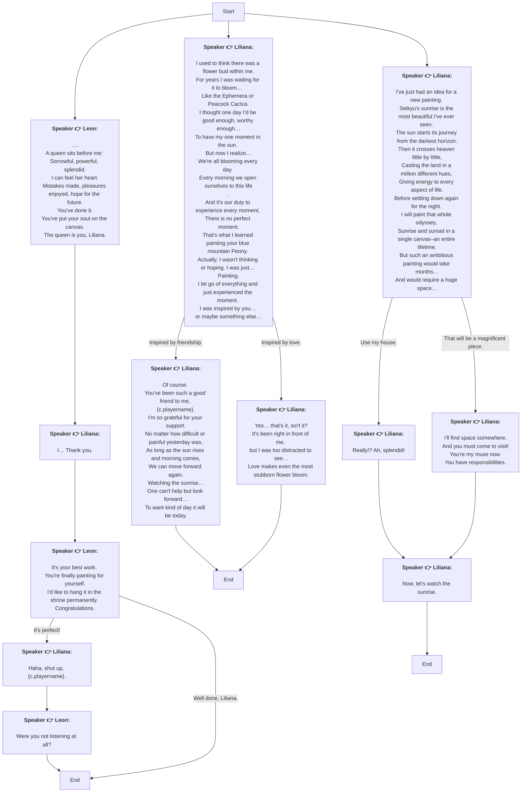

```mermaid
graph
Start -->1768792328505231[<b>Speaker 👉 Leon:</b>
\n….
A queen sits before me: Sorrowful, powerful, splendid.
I can feel her heart.\nMistakes made, pleasures enjoyed, hope for the future.\nYou've done it.
You've put your soul on the canvas.
The queen is you, Liliana.]
1768792328505231 -->1768792455003024[<b>Speaker 👉 Liliana:</b>
\nI… Thank you.]
1768792455003024 -->1768792464139153[<b>Speaker 👉 Leon:</b>
\nIt's your best work. 
You're finally painting for yourself.\nI'd like to hang it in the shrine permanently. 
Congratulations.]
1768792464139153 -->|It's perfect!|1768792520710041[<b>Speaker 👉 Liliana:</b>
\nHaha, shut up, &lbrace;c.playername&rbrace;.]
1768792464139153 -->|Well done, Liliana.|1768792549674906[End]
1768792520710041 -->1768792553789339[<b>Speaker 👉 Leon:</b>
\nWere you not listening at all?]
1768792553789339 -->1768792549674906[End]
Start -->1768792609518508[<b>Speaker 👉 Liliana:</b>
\nI used to think there was a flower bud within me.
For years I was waiting for it to bloom…  
Like the Ephemera or Peacock Cactus.\nI thought one day I'd be good enough, worthy enough…
To have my one moment in the sun. 
But now I realize…\nWe're all blooming every day. 
Every morning we open ourselves to this life
.\nAnd it's our duty to experience every moment, 
There is no perfect moment.\nThat's what I learned painting your blue mountain Peony. 
Actually, I wasn't thinking or hoping. I was just… 
Painting.\nI let go of everything and just experienced the moment. 
I was inspired by you… 
or maybe something else…]
1768792609518508 -->|Inspired by friendship.|1768792704609202[<b>Speaker 👉 Liliana:</b>
\nOf course. 
You've been such a good friend to me, &lbrace;c.playername&rbrace;.
I'm so grateful for your support.\nNo matter how difficult or painful yesterday was,
As long as the sun rises and morning comes,
We can move forward again.\nWatching the sunrise…
One can't help but look forward…
To want kind of day it will be today.]
1768792609518508 -->|Inspired by love.|1768792953770940[<b>Speaker 👉 Liliana:</b>
\nYes… that's it, isn't it?
It's been right in front of me, 
but I was too distracted to see…\nLove makes even the most stubborn flower bloom.]
1768792704609202 -->1768793030228925[End]
1768792953770940 -->1768793030228925[End]
Start -->1768793673282495[<b>Speaker 👉 Liliana:</b>
\nI've just had an idea for a new painting. 
Seikyu's sunrise is the most beautiful I've ever seen. 
The sun starts its journey from the darkest horizon.\nThen it crosses heaven little by little,
Casting the land in a million different hues, 
Giving energy to every aspect of life.\nBefore settling down again for the night. 
I will paint that whole odyssey, 
Sunrise and sunset in a single canvas–an entire lifetime.\nBut such an ambitious painting would take months…
And would require a huge space…]
1768793673282495 -->|Use my house.|1768793781685193[<b>Speaker 👉 Liliana:</b>
\nReally!? Ah, splendid!]
1768793673282495 -->|That will be a magnificent piece.|1768793911423946[<b>Speaker 👉 Liliana:</b>
\nI'll find space somewhere. 
And you must come to visit!\nYou're my muse now. 
You have responsibilities.]
1768793781685193 -->1768793937511371[<b>Speaker 👉 Liliana:</b>
\nNow, let's watch the sunrise.]
1768793937511371 -->1768793951442892[End]
1768793911423946 -->1768793937511371[<b>Speaker 👉 Liliana:</b>
\nNow, let's watch the sunrise.]

```