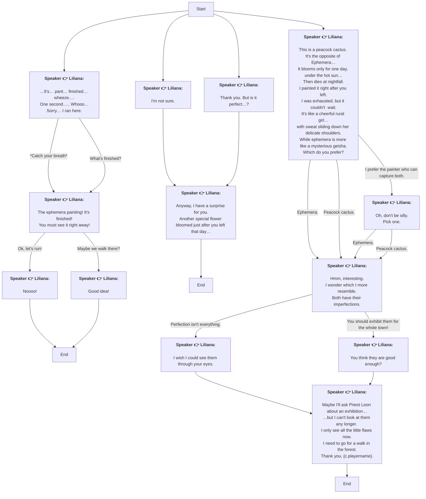

```mermaid
graph
Start -->1768789456595545[<b>Speaker 👉 Liliana:</b>
\n…It's… pant… finished… wheeze….
One second….. Whooo…
Sorry… I ran here.]
1768789456595545 -->|*Catch your breath*|1768789510087263[<b>Speaker 👉 Liliana:</b>
\nThe ephemera painting! It's finished!
You must see it right away!]
1768789456595545 -->|What's finished?|1768789510087263[<b>Speaker 👉 Liliana:</b>
\nThe ephemera painting! It's finished!
You must see it right away!]
1768789510087263 -->|Ok, let's run!|1768789555074661[<b>Speaker 👉 Liliana:</b>
\nNoooo!]
1768789510087263 -->|Maybe we walk there?|1768789563720294[<b>Speaker 👉 Liliana:</b>
\nGood idea!]
1768789555074661 -->1768789571012199[End]
1768789563720294 -->1768789571012199[End]
Start -->1768789629735536[<b>Speaker 👉 Liliana:</b>
\nI'm not sure.]
Start -->1768789637396081[<b>Speaker 👉 Liliana:</b>
\nThank you. But is it perfect…?]
1768789629735536 -->1768789648189042[<b>Speaker 👉 Liliana:</b>
\nAnyway, I have a surprise for you.
Another special flower bloomed just after you left that day…]
1768789648189042 -->1768789667948147[End]
1768789637396081 -->1768789648189042[<b>Speaker 👉 Liliana:</b>
\nAnyway, I have a surprise for you.
Another special flower bloomed just after you left that day…]
Start -->1768789682103925[<b>Speaker 👉 Liliana:</b>
\nThis is a peacock cactus. 
It's the opposite of Ephemera…\nIt blooms only for one day, 
under the hot sun…\nThen dies at nightfall.
I painted it right after you left.
I was exhausted, but it couldn't  wait.\nIt's like a cheerful rural girl…
with sweat sliding down her delicate shoulders.
While ephemera is more like a mysterious geisha.\nWhich do you prefer?]
1768789682103925 -->|I prefer the painter who can capture both.|1768789777376911[<b>Speaker 👉 Liliana:</b>
\nOh, don't be silly. 
Pick one.]
1768789682103925 -->|Ephemera.|1768789854508697[<b>Speaker 👉 Liliana:</b>
\nHmm, interesting.\nI wonder which I more resemble.
Both have their imperfections.]
1768789682103925 -->|Peacock cactus.|1768789854508697[<b>Speaker 👉 Liliana:</b>
\nHmm, interesting.\nI wonder which I more resemble.
Both have their imperfections.]
1768789777376911 -->|Ephemera.|1768789854508697[<b>Speaker 👉 Liliana:</b>
\nHmm, interesting.\nI wonder which I more resemble.
Both have their imperfections.]
1768789777376911 -->|Peacock cactus.|1768789854508697[<b>Speaker 👉 Liliana:</b>
\nHmm, interesting.\nI wonder which I more resemble.
Both have their imperfections.]
1768789854508697 -->|Perfection isn't everything.|1768789897873055[<b>Speaker 👉 Liliana:</b>
\nI wish I could see them through your eyes.]
1768789854508697 -->|You should exhibit them for the whole town!|1768789909116576[<b>Speaker 👉 Liliana:</b>
\nYou think they are good enough?]
1768789897873055 -->1768789917893281[<b>Speaker 👉 Liliana:</b>
\nMaybe I'll ask Priest Leon about an exhibition…
…but I can't look at them any longer. 
I only see all the little flaws now.\nI need to go for a walk in the forest.
Thank you, &lbrace;c.playername&rbrace;.]
1768789917893281 -->1768789958068898[End]
1768789909116576 -->1768789917893281[<b>Speaker 👉 Liliana:</b>
\nMaybe I'll ask Priest Leon about an exhibition…
…but I can't look at them any longer. 
I only see all the little flaws now.\nI need to go for a walk in the forest.
Thank you, &lbrace;c.playername&rbrace;.]

```