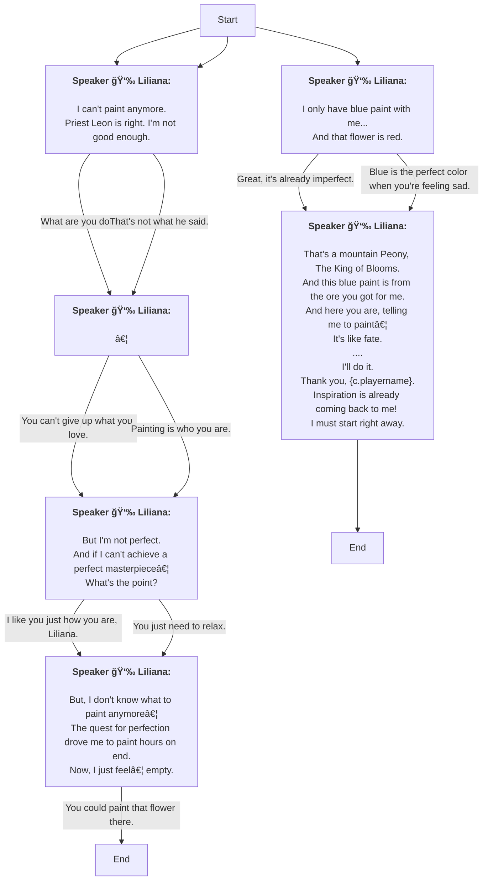

```mermaid
graph
Start -->1768791756312373[<b>Speaker 👉 Liliana:</b>
\nI can't paint anymore.
Priest Leon is right. I'm not good enough.]
Start -->1768791756312373[<b>Speaker 👉 Liliana:</b>
\nI can't paint anymore.
Priest Leon is right. I'm not good enough.]
1768791756312373 -->|What are you doing?|1768791807972160[<b>Speaker 👉 Liliana:</b>
\n…]
1768791756312373 -->|That's not what he said.|1768791807972160[<b>Speaker 👉 Liliana:</b>
\n…]
1768791807972160 -->|You can't give up what you love.|1768791859148614[<b>Speaker 👉 Liliana:</b>
\nBut I'm not perfect.
And if I can't achieve a perfect masterpiece…
What's the point?]
1768791807972160 -->|Painting is who you are.|1768791859148614[<b>Speaker 👉 Liliana:</b>
\nBut I'm not perfect.
And if I can't achieve a perfect masterpiece…
What's the point?]
1768791859148614 -->|I like you just how you are, Liliana.|1768791909076813[<b>Speaker 👉 Liliana:</b>
\nBut, I don't know what to paint anymore…
The quest for perfection drove me to paint hours on end.\nNow, I just feel… empty.]
1768791859148614 -->|You just need to relax.|1768791909076813[<b>Speaker 👉 Liliana:</b>
\nBut, I don't know what to paint anymore…
The quest for perfection drove me to paint hours on end.\nNow, I just feel… empty.]
1768791909076813 -->|You could paint that flower there.|1768791947847506[End]
Start -->1768791963679572[<b>Speaker 👉 Liliana:</b>
\nI only have blue paint with me...
And that flower is red.]
1768791963679572 -->|Great, it's already imperfect.|1768791991924570[<b>Speaker 👉 Liliana:</b>
\nThat's a mountain Peony, 
The King of Blooms.\nAnd this blue paint is from the ore you got for me.
And here you are, telling me to paint…\nIt's like fate.
....\nI'll do it.
Thank you, &lbrace;c.playername&rbrace;.\nInspiration is already coming back to me! 
I must start right away.]
1768791963679572 -->|Blue is the perfect color when you're feeling sad.|1768791991924570[<b>Speaker 👉 Liliana:</b>
\nThat's a mountain Peony, 
The King of Blooms.\nAnd this blue paint is from the ore you got for me.
And here you are, telling me to paint…\nIt's like fate.
....\nI'll do it.
Thank you, &lbrace;c.playername&rbrace;.\nInspiration is already coming back to me! 
I must start right away.]
1768791991924570 -->1768792200010587[End]

```