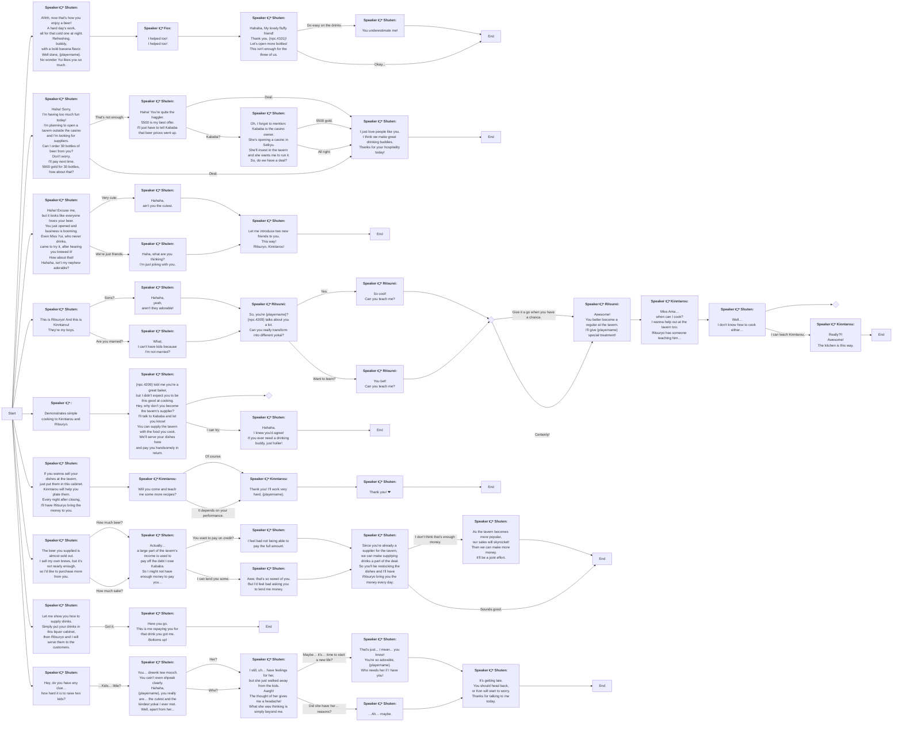

```mermaid
graph LR
Start -->1754550494868988[<b>Speaker 👉 Shuten:</b>
\nAhhh, now that's how you enjoy a beer!
A hard day's work,
all for that cold one at night.\nRefreshing,
bubbly,
with a bold banana flavor.\nWell done, &lbrace;playername&rbrace;.
No wonder Yui likes you so much.]
1754550494868988 -->1754550535630334[<b>Speaker 👉 Fox:</b>
\nI helped too!
I helped too!]
1754550535630334 -->1754550553625087[<b>Speaker 👉 Shuten:</b>
\nHahaha, My lovely fluffy friend!
Thank you, &lbrace;npc.4101&rbrace;!\nLet's open more bottles!
This isn't enough for the three of us.]
1754550553625087 -->|Go easy on the drinks.|1754550618077700[<b>Speaker 👉 Shuten:</b>
\nYou underestimate me!]
1754550553625087 -->|Okay...|1754550622817797[End]
1754550618077700 -->1754550622817797[End]
Start -->1754550648041991[<b>Speaker 👉 Shuten:</b>
\nHaha! Sorry,
I'm having too much fun today!\nI'm planning to open a tavern outside the casino
and I'm looking for suppliers.
Can I order 30 bottles of beer from you?\nDon't worry,
I'll pay next time.
5000 gold for 30 bottles, how about that?]
1754550648041991 -->|That's not enough.|1754550881346065[<b>Speaker 👉 Shuten:</b>
\nHaha! You're quite the haggler.
5500 is my best offer.
I'll just have to tell Kababa that beer prices went up.]
1754550648041991 -->|Deal.|1754550923920914[<b>Speaker 👉 Shuten:</b>
\nI just love people like you.
I think we make great drinking buddies.\nThanks for your hospitality today!]
1754550881346065 -->|Deal.|1754550923920914[<b>Speaker 👉 Shuten:</b>
\nI just love people like you.
I think we make great drinking buddies.\nThanks for your hospitality today!]
1754550881346065 -->|Kababa?|1754551086543384[<b>Speaker 👉 Shuten:</b>
\nOh, I forgot to mention: Kababa is the casino owner.
She's opening a casino in Seikyu.
She'll invest in the tavern and she wants me to run it.\nSo, do we have a deal?]
1754550923920914 -->1754551202824732[End]
1754551086543384 -->|5500 gold.|1754550923920914[<b>Speaker 👉 Shuten:</b>
\nI just love people like you.
I think we make great drinking buddies.\nThanks for your hospitality today!]
1754551086543384 -->|All right.|1754550923920914[<b>Speaker 👉 Shuten:</b>
\nI just love people like you.
I think we make great drinking buddies.\nThanks for your hospitality today!]
Start -->1754552137266725[<b>Speaker 👉 Shuten:</b>
\nHaha! Excuse me,
but it looks like everyone loves your beer.
You just opened and business is booming.\nEven Miss Yui, who never drinks,
came to try it, after hearing you brewed it!\nHow about that!
Hahaha, isn't my nephew adorable?]
1754552137266725 -->|Very cute.|1754552494205500[<b>Speaker 👉 Shuten:</b>
\nHahaha,
ain't you the cutest.]
1754552137266725 -->|We're just friends.|1754552491706939[<b>Speaker 👉 Shuten:</b>
\nHaha, what are you thinking?
I'm just joking with you.]
1754552494205500 -->1754552538530365[<b>Speaker 👉 Shuten:</b>
\nLet me introduce two new friends to you.
This way!
Ritsuryo, Kinntarou!]
1754552538530365 -->1754552566220370[End]
1754552491706939 -->1754552538530365[<b>Speaker 👉 Shuten:</b>
\nLet me introduce two new friends to you.
This way!
Ritsuryo, Kinntarou!]
Start -->1754552658763348[<b>Speaker 👉 Shuten:</b>
\nThis is Ritsuryo! And this is Kinntarou!
They're my boys.]
1754552658763348 -->|Sons?|1754552713897562[<b>Speaker 👉 Shuten:</b>
\nHahaha,
yeah,
aren't they adorable!]
1754552658763348 -->|Are you married?|1754552720900699[<b>Speaker 👉 Shuten:</b>
\nWhat,
I can't have kids because I'm not married?]
1754552713897562 -->1754552782559836[<b>Speaker 👉 Ritsurei:</b>
\nSo, you're &lbrace;playername&rbrace;?
&lbrace;npc.4209&rbrace; talks about you a lot.
Can you really transform into different yokai?]
1754552782559836 -->|Yes.|1754552862078562[<b>Speaker 👉 Ritsurei:</b>
\nSo cool!
Can you teach me?]
1754552782559836 -->|Want to learn?|1754552867669603[<b>Speaker 👉 Ritsurei:</b>
\nYou bet!
Can you teach me?]
1754552862078562 -->438638215519640{ }
1754553000530537 -->1754553083090541[<b>Speaker 👉 Kinntarou:</b>
\nMiss Ama…
when can I cook?
I wanna help out at the tavern too.\nRitsuryo has someone teaching him…]
1754553083090541 -->1754553386020462[<b>Speaker 👉 Shuten:</b>
\nWell…
I don't know how to cook either…]
1754553386020462 -->1754555186528885{ }
1754553386020462 -->|I can teach Kinntarou.|1754555165427316[<b>Speaker 👉 Kinntarou:</b>
\nReally?!!
Awesome!
The kitchen is this way.]
1754555165427316 -->1754553076615788[End]
1754552867669603 -->438638215519640{ }
1754552720900699 -->1754552782559836[<b>Speaker 👉 Ritsurei:</b>
\nSo, you're &lbrace;playername&rbrace;?
&lbrace;npc.4209&rbrace; talks about you a lot.
Can you really transform into different yokai?]
Start -->1754555437256311[<b>Speaker 👉 :</b>
\nDemonstrates simple cooking to Kinntarou and Ritsuryo.]
1754555437256311 -->1754555950098040[<b>Speaker 👉 Shuten:</b>
\n&lbrace;npc.4209&rbrace; told me you're a great baker,
but I didn't expect you to be this good at cooking.\nHey, why don't you become the tavern's supplier?
I'll talk to Kababa and let you know!\nYou can supply the tavern with the food you cook.
We'll serve your dishes here
and pay you handsomely in return.]
1754555950098040 -->1754556433173194{ }
1754555950098040 -->|I can try.|1754556184598143[<b>Speaker 👉 Shuten:</b>
\nHahaha,
I knew you'd agree!
If you ever need a drinking buddy, just holler!]
438638215519640 -->|Give it a go when you have a chance.|1754553000530537[<b>Speaker 👉 Ritsurei:</b>
\nAwesome!
You better become a regular at the tavern.
I'll give &lbrace;playername&rbrace; special treatment!]
438638215519640 -->|Certainly!|1754553000530537[<b>Speaker 👉 Ritsurei:</b>
\nAwesome!
You better become a regular at the tavern.
I'll give &lbrace;playername&rbrace; special treatment!]
1754556184598143 -->1754556211012264[End]
Start -->1754556226805418[<b>Speaker 👉 Shuten:</b>
\nIf you wanna sell your dishes at the tavern,
just put them in this cabinet.
Kinntarou will help you plate them.\nEvery night after closing,
I'll have Ritsuryo bring the money to you.]
1754556226805418 -->1754556338437830[<b>Speaker 👉 Kinntarou:</b>
\nWill you come and teach me some more recipes?]
1754556338437830 -->|Of course.|1754556367405767[<b>Speaker 👉 Kinntarou:</b>
\nThank you! I'll work very hard, &lbrace;playername&rbrace;.]
1754556338437830 -->|It depends on your performance.|1754556367405767[<b>Speaker 👉 Kinntarou:</b>
\nThank you! I'll work very hard, &lbrace;playername&rbrace;.]
1754556367405767 -->1754556403067592[<b>Speaker 👉 Shuten:</b>
\nThank you! ❤]
1754556403067592 -->1754556407528137[End]
Start -->1754556971967180[<b>Speaker 👉 Shuten:</b>
\nThe beer you supplied is almost sold out.
I sell my own brews, but it's not nearly enough,
so I'd like to purchase more from you.]
1754556971967180 -->|How much beer?|1754557185048274[<b>Speaker 👉 Shuten:</b>
\nActually…
a large part of the tavern's income is used to
pay off the debt I owe Kababa.\nSo I might not have enough money to pay you…]
1754556971967180 -->|How much sake?|1754557185048274[<b>Speaker 👉 Shuten:</b>
\nActually…
a large part of the tavern's income is used to
pay off the debt I owe Kababa.\nSo I might not have enough money to pay you…]
1754557185048274 -->|You want to pay on credit?|1754557253421784[<b>Speaker 👉 Shuten:</b>
\nI feel bad not being able to pay the full amount.]
1754557185048274 -->|I can lend you some.|1754557262025433[<b>Speaker 👉 Shuten:</b>
\nAww, that's so sweet of you.
But I'd feel bad asking you to lend me money.]
1754557253421784 -->1754557294541530[<b>Speaker 👉 Shuten:</b>
\nSince you're already a supplier for the tavern,
we can make supplying drinks a part of the deal.\nSo you'll be restocking the dishes and I'll have
Ritsuryo bring you the money every day.]
1754557294541530 -->|I don't think that's enough money.|1754557925670624[<b>Speaker 👉 Shuten:</b>
\nAs the tavern becomes more popular,
our sales will skyrocket!\nThen we can make more money.
It'll be a joint effort.]
1754557294541530 -->|Sounds good.|1754557951685345[End]
1754557925670624 -->1754557951685345[End]
1754557262025433 -->1754557294541530[<b>Speaker 👉 Shuten:</b>
\nSince you're already a supplier for the tavern,
we can make supplying drinks a part of the deal.\nSo you'll be restocking the dishes and I'll have
Ritsuryo bring you the money every day.]
Start -->1754558012130019[<b>Speaker 👉 Shuten:</b>
\nLet me show you how to supply drinks.
Simply put your drinks in this liquor cabinet,
then Ritsuryo and I will serve them to the customers.]
1754558012130019 -->|Got it.|1754558107545320[<b>Speaker 👉 Shuten:</b>
\nHere you go.
This is me repaying you for that drink you got me.
Bottoms up!]
1754558107545320 -->1754558016016100[End]
Start -->1754562196723434[<b>Speaker 👉 Shuten:</b>
\nHey, do you have any clue…
how hard it is to raise two kids?]
1754562196723434 -->|…Kids… little?|1754562243246832[<b>Speaker 👉 Shuten:</b>
\nYou… dreenk tew mooch.
You cain't even shpeak claarly.\nHahaha,
&lbrace;playername&rbrace;, you really are… the cutest and the
kindest yokai I ever met. Well, apart from her...]
1754562243246832 -->|Her?|1754562426443510[<b>Speaker 👉 Shuten:</b>
\nI still, uh… have feelings for her,
but she just walked away from the kids.\nAargh!
The thought of her gives me a headache!
What she was thinking is simply beyond me.]
1754562243246832 -->|Who?|1754562426443510[<b>Speaker 👉 Shuten:</b>
\nI still, uh… have feelings for her,
but she just walked away from the kids.\nAargh!
The thought of her gives me a headache!
What she was thinking is simply beyond me.]
1754562426443510 -->|Maybe… it's… time to start a new life?|1754562500335356[<b>Speaker 👉 Shuten:</b>
\nThat's just... I mean... you know!
You're so adorable, &lbrace;playername&rbrace;.
Who needs her if I have you!]
1754562426443510 -->|Did she have her… reasons?|1754562504491773[<b>Speaker 👉 Shuten:</b>
\n…Ah… maybe.]
1754562500335356 -->1754562551441150[<b>Speaker 👉 Shuten:</b>
\nIt's getting late.
You should head back,
or Kon will start to worry.\nThanks for talking to me today.]
1754562551441150 -->1754562581019391[End]
1754562504491773 -->1754562551441150[<b>Speaker 👉 Shuten:</b>
\nIt's getting late.
You should head back,
or Kon will start to worry.\nThanks for talking to me today.]

```