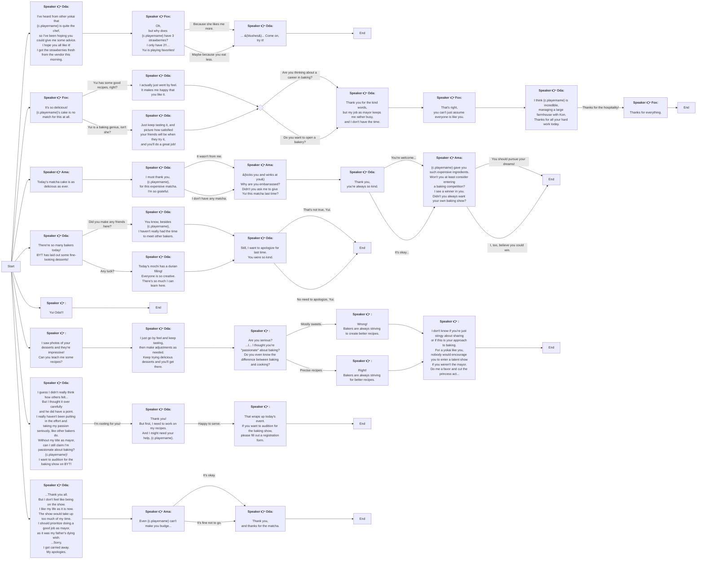

```mermaid
graph LR
Start -->1754287120283058[<b>Speaker 👉 Oda:</b>
\nI've heard from other yokai that
&lbrace;c.playername&rbrace; is quite the chef,
so I've been hoping you could give me some advice.\nI hope you all like it!
I got the strawberries fresh from the vendor this morning.]
1754287120283058 -->1754287230031284[<b>Speaker 👉 Fox:</b>
\nOh,
but why does &lbrace;c.playername&rbrace; have 3 strawberries?\nI only have 2!!…
Yui is playing favorites!]
1754287230031284 -->|Because she likes me more.|1754287295587765[<b>Speaker 👉 Oda:</b>
\n... &#40;blushes&#41;... Come on, try it!]
1754287230031284 -->|Maybe because you eat less.|1754287295587765[<b>Speaker 👉 Oda:</b>
\n... &#40;blushes&#41;... Come on, try it!]
1754287295587765 -->1754287444895165[End]
Start -->1754287450993086[<b>Speaker 👉 Fox:</b>
\nIt's so delicious!
&lbrace;c.playername&rbrace;'s cake is no match for this at all.]
1754287450993086 -->|Yui has some good recipes, right?|1754287547494853[<b>Speaker 👉 Oda:</b>
\nI actually just went by feel.
It makes me happy that you like it.]
1754287450993086 -->|Yui is a baking genius, isn't she?|1754287540595140[<b>Speaker 👉 Oda:</b>
\nJust keep tasting it, and picture how satisfied
your friends will be when they try it,
and you'll do a great job!]
1754287547494853 -->438571886873713{ }
1754287665596876 -->1754287697788365[<b>Speaker 👉 Fox:</b>
\nThat's right,
you can't just assume everyone is like you.]
1754287697788365 -->1754287714958798[<b>Speaker 👉 Oda:</b>
\nI think &lbrace;c.playername&rbrace; is incredible,
managing a large farmhouse with Kon.
Thanks for all your hard work today.]
1754287714958798 -->|Thanks for the hospitality!|1754287754202578[<b>Speaker 👉 Fox:</b>
\nThanks for everything.]
1754287754202578 -->1754287768394195[End]
1754287540595140 -->438571886873713{ }
Start -->1754287829837269[<b>Speaker 👉 Ama:</b>
\nToday's matcha cake is as delicious as ever.]
1754287829837269 -->1754287843310038[<b>Speaker 👉 Oda:</b>
\nI must thank you, &lbrace;c.playername&rbrace;,
for this expensive matcha.
I'm so grateful.]
1754287843310038 -->|It wasn't from me.|1754287903146460[<b>Speaker 👉 Ama:</b>
\n&#40;kicks you and winks at you&#41;\nWhy are you embarrassed?
Didn't you ask me to give Yui this matcha last time?]
1754287843310038 -->|I don't have any matcha.|1754287903146460[<b>Speaker 👉 Ama:</b>
\n&#40;kicks you and winks at you&#41;\nWhy are you embarrassed?
Didn't you ask me to give Yui this matcha last time?]
1754287903146460 -->1754288180745693[<b>Speaker 👉 Oda:</b>
\nThank you,
you're always so kind.]
1754288180745693 -->|You're welcome...|1754288572797414[<b>Speaker 👉 Ama:</b>
\n&lbrace;c.playername&rbrace; gave you such expensive ingredients.
Won't you at least consider entering
a baking competition?\nI see a winner in you.
Didn't you always want your own baking show?]
1754288180745693 -->|It's okay...|1754288572797414[<b>Speaker 👉 Ama:</b>
\n&lbrace;c.playername&rbrace; gave you such expensive ingredients.
Won't you at least consider entering
a baking competition?\nI see a winner in you.
Didn't you always want your own baking show?]
438571886873713 -->|Are you thinking about a career in baking?|1754287665596876[<b>Speaker 👉 Oda:</b>
\nThank you for the kind words,
but my job as mayor keeps me rather busy,
and I don't have the time.]
438571886873713 -->|Do you want to open a bakery?|1754287665596876[<b>Speaker 👉 Oda:</b>
\nThank you for the kind words,
but my job as mayor keeps me rather busy,
and I don't have the time.]
1754288572797414 -->|You should pursue your dreams!|1754456339646997[End]
1754288572797414 -->|I, too, believe you could win.|1754456339646997[End]
Start -->1754289240414771[<b>Speaker 👉 Oda:</b>
\nThere're so many bakers today!
BYT has laid out some fine-looking desserts!]
1754289240414771 -->|Did you make any friends here?|1754289546133050[<b>Speaker 👉 Oda:</b>
\nYou know, besides &lbrace;c.playername&rbrace;,
I haven't really had the time to meet other bakers.]
1754289240414771 -->|Any luck?|1754289543642681[<b>Speaker 👉 Oda:</b>
\nToday's mochi has a durian filling!
Everyone is so creative.
There's so much I can learn here.]
1754289546133050 -->1754289817857595[<b>Speaker 👉 Oda:</b>
\nStill, I want to apologize for last time.
You were so kind.]
1754289817857595 -->|That's not true, Yui.|1754290966527651[End]
1754289817857595 -->|No need to apologize, Yui.|1754290966527651[End]
1754289543642681 -->1754289817857595[<b>Speaker 👉 Oda:</b>
\nStill, I want to apologize for last time.
You were so kind.]
Start -->1754290592069224[<b>Speaker 👉 :</b>
\nYui Oda!!!]
1754290592069224 -->1754290949294754[End]
Start -->1754291354234535[<b>Speaker 👉 :</b>
\nI saw photos of your desserts and they're impressive!
Can you teach me some recipes?]
1754291354234535 -->1754291405643432[<b>Speaker 👉 Oda:</b>
\nI just go by feel and keep tasting,
then make adjustments as needed.
Keep trying delicious desserts and you'll get there.]
1754291405643432 -->1754291430154921[<b>Speaker 👉 :</b>
\nAre you serious?
...I... I thought you're &quot;passionate&quot; about baking?
Do you even know the difference between baking and cooking?]
1754291430154921 -->|Mostly sweets.|1754291899223727[<b>Speaker 👉 :</b>
\nWrong!
Bakers are always striving to create better recipes.]
1754291430154921 -->|Precise recipes.|1754291952030384[<b>Speaker 👉 :</b>
\nRight!
Bakers are always striving for better recipes.]
1754291899223727 -->1754291963434673[<b>Speaker 👉 :</b>
\nI don't know if you're just stingy about sharing
or if this is your approach to baking.\nFor a yokai like you,
nobody would encourage you to enter a talent show
if you weren't the mayor.\nDo me a favor and cut the princess act...]
1754291963434673 -->1754292002983644[End]
1754291952030384 -->1754291963434673[<b>Speaker 👉 :</b>
\nI don't know if you're just stingy about sharing
or if this is your approach to baking.\nFor a yokai like you,
nobody would encourage you to enter a talent show
if you weren't the mayor.\nDo me a favor and cut the princess act...]
Start -->1754292750697182[<b>Speaker 👉 Oda:</b>
\nI guess I didn't really think how others felt...\nBut I thought it over carefully
and he did have a point.\nI really haven't been putting in the effort and 
taking my passion seriously, like other bakers do.\nWithout my title as mayor,
can I still claim I'm passionate about baking?\n&lbrace;c.playername&rbrace;!
I want to audition for the baking show on BYT!]
1754292750697182 -->|I'm rooting for you!|1754293813300962[<b>Speaker 👉 Oda:</b>
\nThank you!
But first, I need to work on my recipes.
And I might need your help, &lbrace;c.playername&rbrace;.]
1754293813300962 -->|Happy to serve.|1754293822837475[<b>Speaker 👉 :</b>
\nThat wraps up today's event.
If you want to audition for the baking show,
please fill out a registration form.]
1754293822837475 -->1754293901431527[End]
Start -->1754288640162284[<b>Speaker 👉 Oda:</b>
\n...Thank you all.\nBut I don't feel like being on the show.
I like my life as it is now.\nThe show would take up too much of my time.
I should prioritize doing a good job as mayor,
as it was my father's dying wish.\n...Sorry,
I got carried away.
My apologies.]
1754288640162284 -->1754288712254988[<b>Speaker 👉 Ama:</b>
\nEven &lbrace;c.playername&rbrace; can't make you budge...]
1754288712254988 -->|It's okay.|1754288776160786[<b>Speaker 👉 Oda:</b>
\nThank you,
and thanks for the matcha.]
1754288712254988 -->|It's fine not to go.|1754288776160786[<b>Speaker 👉 Oda:</b>
\nThank you,
and thanks for the matcha.]
1754288776160786 -->1754288798171697[End]

```