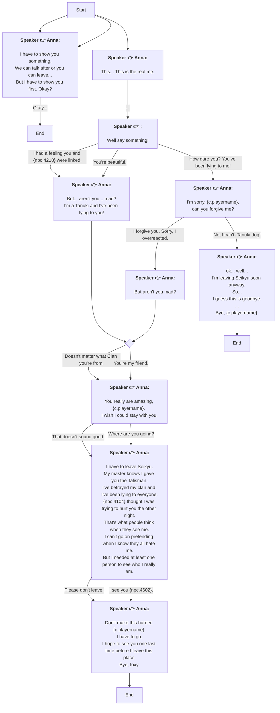

```mermaid
graph
Start -->1766672157337891[<b>Speaker 👉 Anna:</b>
\nI have to show you something.\nWe can talk after or you can leave...\nBut I have to show you first. Okay?]
Start -->1766672157337891[<b>Speaker 👉 Anna:</b>
\nI have to show you something.\nWe can talk after or you can leave...\nBut I have to show you first. Okay?]
1766672157337891 -->|Okay...|1766681055228200[End]
Start -->1766681208037674[<b>Speaker 👉 Anna:</b>
\nThis... This is the real me.]
1766681208037674 -->|...|1766683664729456[<b>Speaker 👉 :</b>
\nWell say something!]
1766683664729456 -->|I had a feeling you and &lbrace;npc.4218&rbrace; were linked.|1766683755688306[<b>Speaker 👉 Anna:</b>
\nBut... aren't you... mad?\nI'm a Tanuki and I've been lying to you!]
1766683664729456 -->|How dare you? You've been lying to me!|1766683789556083[<b>Speaker 👉 Anna:</b>
\n I'm sorry, &lbrace;c.playername&rbrace;, can you forgive me?]
1766683664729456 -->|You're beautiful.|1766683755688306[<b>Speaker 👉 Anna:</b>
\nBut... aren't you... mad?\nI'm a Tanuki and I've been lying to you!]
1766683755688306 -->441670938922076{ }
1766685693769091 -->|That doesn't sound good.|1766685732531593[<b>Speaker 👉 Anna:</b>
\nI have to leave Seikyu.\nMy master knows I gave you the Talisman.\nI've betrayed my clan and I've been lying to everyone.\n&lbrace;npc.4104&rbrace; thought I was trying to hurt you the other night.\nThat's what people think when they see me.\nI can't go on pretending when I know they all hate me.\nBut I needed at least one person to see who I really am.]
1766685693769091 -->|Where are you going?|1766685732531593[<b>Speaker 👉 Anna:</b>
\nI have to leave Seikyu.\nMy master knows I gave you the Talisman.\nI've betrayed my clan and I've been lying to everyone.\n&lbrace;npc.4104&rbrace; thought I was trying to hurt you the other night.\nThat's what people think when they see me.\nI can't go on pretending when I know they all hate me.\nBut I needed at least one person to see who I really am.]
1766685732531593 -->|Please don't leave.|1766685833229711[<b>Speaker 👉 Anna:</b>
\nDon't make this harder, &lbrace;c.playername&rbrace;.\nI have to go.\nI hope to see you one last time before I leave this place.\nBye, foxy.]
1766685732531593 -->|I see you &lbrace;npc.4602&rbrace;.|1766685833229711[<b>Speaker 👉 Anna:</b>
\nDon't make this harder, &lbrace;c.playername&rbrace;.\nI have to go.\nI hope to see you one last time before I leave this place.\nBye, foxy.]
1766685833229711 -->1766685840648592[End]
1766683789556083 -->|I forgive you. Sorry, I overreacted.|1766685230215547[<b>Speaker 👉 Anna:</b>
\nBut aren't you mad?]
1766683789556083 -->|No, I can't. Tanuki dog!|1766685169377657[<b>Speaker 👉 Anna:</b>
\nok... well...\nI'm leaving Seikyu soon anyway.\nSo...\nI guess this is goodbye.\n...\nBye, &lbrace;c.playername&rbrace;.]
1766685169377657 -->1766685341910398[End]
441670938922076 -->|Doesn't matter what Clan you're from.|1766685693769091[<b>Speaker 👉 Anna:</b>
\nYou really are amazing, &lbrace;c.playername&rbrace;. 
I wish I could stay with you.]
441670938922076 -->|You're my friend.|1766685693769091[<b>Speaker 👉 Anna:</b>
\nYou really are amazing, &lbrace;c.playername&rbrace;. 
I wish I could stay with you.]
1766685230215547 -->441670938922076{ }

```